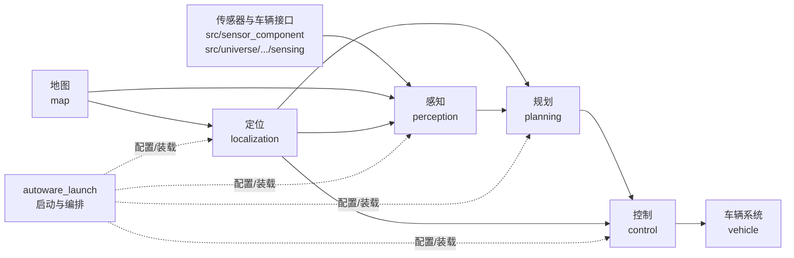

# Autoware 代码架构导读

本文面向刚接触 Autoware 的工程师，基于本仓库当前版本的目录和启动文件，说明代码如何组织、感知/定位/规划/控制如何串联，以及 ROS 2 节点如何通信。

> 建议先把本文当作代码地图，而不是接口规范。具体 topic、参数和模块开关应以对应 package 的 launch 文件、参数文件和消息定义为准。

## 1. 总体视图

Autoware 可以从三个角度理解：

1. **仓库分层**：多个独立 Git 仓库通过 `repositories/*.repos` 组装成一个 colcon 工作区。
2. **功能流水线**：传感器和地图数据经过感知、定位、规划、控制，最终形成车辆控制指令。
3. **运行时通信**：每个功能通常由一个或多个 ROS 2 node 提供，node 通过 topic、service、parameter 和 TF 交换数据。



这里的箭头表示主要数据依赖，不代表每个模块只有一条 topic，也不表示所有节点都运行在同一个进程中。

## 2. 顶层仓库划分

### 2.1 根目录：工作区与构建/运行环境

```text
autoware-1.7.1/
├── repositories/       # vcs 导入的仓库清单和固定版本
├── src/                # ROS 2 工作区源码
├── docker/             # 开发/运行镜像、组件化容器和启动脚本
├── ansible/            # ROS 2、开发工具、RMW 等环境安装角色
├── setup-dev-env.sh    # 开发环境入口
├── amd64*.env          # 不同架构/ROS 发行版的环境变量
└── README.md           # 根仓库使用说明
```

根仓库本身主要承担**组合和环境管理**，核心算法大多位于 `src/` 下的子仓库。

### 2.2 `repositories/`：源码组成和版本边界

主要文件是 [`repositories/autoware.repos`](../repositories/autoware.repos)。它把源码划分为：

```text
core/                  # Autoware Core：稳定消息、接口、通用库和基础能力
universe/              # Autoware Universe：大量具体算法和运行模块
launcher/              # autoware_launch：顶层 launch 编排
sensor_component/      # 传感器驱动、传输和 socket CAN 等
middleware/            # 中间件扩展，例如 Agnocast
```

`.repos` 文件中的 `version` 是重要的版本边界。排查接口不一致时，应先确认源码是否由同一份 `.repos` 导入，而不是只看目录名称。

### 2.3 `src/core/`：跨模块契约与通用能力

```text
src/core/
├── autoware_msgs/             # 对外共享的领域消息、服务
├── autoware_adapi_msgs/       # Autoware API 相关消息/服务
├── autoware_internal_msgs/    # 内部模块消息/服务
├── autoware_core/             # Core 算法/接口基础库
├── autoware_utils/            # 通用 C++ 工具
├── autoware_cmake/            # CMake 构建辅助
├── autoware_lanelet2_extension/# Lanelet2 地图扩展
└── autoware_rviz_plugins/     # RViz 可视化插件
```

新人阅读功能模块前，优先查看 `autoware_msgs` 中对应领域的消息。例如：

- `autoware_perception_msgs/msg/DetectedObjects.msg`：检测对象集合。
- `autoware_perception_msgs/msg/PredictedObjects.msg`：带预测信息的对象集合。
- `autoware_planning_msgs/msg/Trajectory.msg`：规划轨迹。
- `autoware_control_msgs/msg/Control.msg`：控制指令。
- `autoware_vehicle_msgs/msg/*Command.msg`：档位、转向灯、危险报警灯等车辆指令。

### 2.4 `src/universe/autoware_universe/`：按功能域组织的实现

```text
src/universe/autoware_universe/
├── sensing/          # 传感器数据预处理和传感器相关模块
├── perception/       # 检测、跟踪、融合、预测、交通灯、占据栅格等
├── localization/     # 位姿、速度、融合、定位监测等
├── map/              # 地图加载和地图相关工具
├── planning/         # 任务规划、行为规划、运动规划、轨迹处理
├── control/          # 横向/纵向控制、指令门控和安全检查
├── vehicle/          # 车辆接口、命令转换和车辆相关状态
├── system/           # 系统状态、诊断、故障安全和运行模式
├── launch/           # Universe 内部 launch 组织
├── common/            # 跨功能域共用包
├── simulator/        # 仿真适配
├── evaluator/        # 在线/离线评估器
├── visualization/    # RViz 插件和可视化包
└── tools/             # 分析、调试和辅助工具
```

Universe 的目录是“功能域入口”，真正的 ROS 2 package 通常是其下的第二层目录，例如 `perception/autoware_lidar_centerpoint`。

### 2.5 `src/launcher/autoware_launch/`：系统装配层

重点位置：

```text
src/launcher/autoware_launch/
├── autoware_launch/launch/autoware.launch.xml
├── autoware_launch/launch/components/
├── tier4_universe_launch/tier4_perception_launch/
├── tier4_universe_launch/tier4_localization_launch/
├── tier4_universe_launch/tier4_planning_launch/
├── tier4_universe_launch/tier4_control_launch/
├── tier4_universe_launch/tier4_map_launch/
├── tier4_universe_launch/tier4_vehicle_launch/
└── sensor_kit/       # 不同传感器套件的 launch 和配置
```

[`autoware.launch.xml`](../src/launcher/autoware_launch/autoware_launch/launch/autoware.launch.xml) 是总入口。它根据参数选择 vehicle、system、map、sensing、localization、perception、planning、control 和 API，并统一传递 `vehicle_model`、`sensor_model`、`use_sim_time` 等参数。

### 2.6 `docker/`、`ansible/`、`src/middleware/`：运行边界

- `docker/` 把功能域组织成可单独运行的镜像，例如 `universe-sensing-perception`、`universe-localization-mapping` 和 `universe-planning-control`。这说明功能域既可以在同一工作区运行，也可以跨容器通过 ROS 2 通信。
- `docker/docker-compose.yaml` 用 `network_mode: host`、`ROS_DOMAIN_ID` 和 `RMW_IMPLEMENTATION` 让多个容器加入同一个 ROS 2 图。
- `ansible/roles/rmw_implementation` 负责 RMW 实现安装和选择。
- `src/middleware/external/agnocast` 提供面向低拷贝/零拷贝场景的中间件扩展；是否使用取决于运行环境和模块配置。

## 3. 四大核心功能模块

### 3.1 感知：从原始传感器数据到环境模型

代码入口：[`src/universe/autoware_universe/perception`](../src/universe/autoware_universe/perception)

典型分层如下：

```text
perception/
├── 检测 detector          # LiDAR、camera、radar 和深度学习检测器
├── 分割 segmentation      # 地面/障碍物分割
├── 融合 fusion             # camera-LiDAR-radar 等多传感器融合
├── 跟踪 tracking           # 多目标跟踪和对象合并
├── 预测 prediction        # 目标未来轨迹/行为预测
├── 交通灯 traffic light   # 交通灯检测、分类、融合和遮挡预测
├── 占据栅格 occupancy grid # 障碍物栅格表示
└── common/utils            # 感知通用算法和工具
```

可追踪的代表包：

- `autoware_lidar_centerpoint`：LiDAR 深度学习检测器之一。
- `autoware_euclidean_cluster`、`autoware_ground_segmentation`：传统点云检测/分割链路。
- `autoware_multi_object_tracker`：多目标跟踪。
- `autoware_map_based_prediction`、`autoware_simpl_prediction`：预测模块。
- `autoware_traffic_light_classifier`、`autoware_traffic_light_arbiter`：交通灯识别链路。

感知通常由多个阶段组成，而不是一个“大感知节点”：原始点云/图像先经过 `sensing` 预处理，再由检测器产生对象，随后进行过滤、融合、跟踪和预测，最后向规划发布环境对象与交通灯状态。

启动编排可从 [`tier4_perception_component.launch.xml`](../src/launcher/autoware_launch/autoware_launch/launch/components/tier4_perception_component.launch.xml) 和 `tier4_perception_launch/launch/perception.launch.xml` 开始阅读。

### 3.2 定位：估计车辆在地图中的状态

代码入口：[`src/universe/autoware_universe/localization`](../src/universe/autoware_universe/localization)

定位的主要职责是输出车辆的位姿、速度、加速度和相关状态，供感知、规划、控制共同使用。常见组成包括：

```text
传感器输入（GNSS/IMU/LiDAR/视觉）
        ↓
位姿估计与地图匹配
        ↓
位姿/速度融合与质量监测
        ↓
/localization/kinematic_state 等状态 topic
```

代表目录或包包括：

- `autoware_pose2twist`：从位姿变化估计速度相关信息。
- `autoware_pose_estimator_arbiter`：在多个位姿来源之间进行仲裁。
- `autoware_localization_error_monitor`：定位质量和误差监测。
- `tier4_localization_launch`：把 NDT、Eagleye、融合滤波器等定位方案按参数装配起来。

定位初始化通常不是单纯的 topic 发布，还会使用初始化服务；例如 `autoware_localization_msgs/srv/InitializeLocalization.srv` 和 `autoware_internal_localization_msgs/srv/InitializeLocalization.srv`。

### 3.3 规划：从目标和环境状态到可执行轨迹

代码入口：[`src/universe/autoware_universe/planning`](../src/universe/autoware_universe/planning)

规划可以按决策粒度理解为：

```text
任务规划 mission planning
    ↓ 选择路线/任务目标
场景/行为规划 scenario / behavior planning
    ↓ 决定车道、跟车、变道、避障等行为
运动规划 motion planning
    ↓ 生成带速度的候选轨迹
轨迹处理与安全校验
    ↓
/planning/trajectory
```

代表目录或包包括：

- `autoware_mission_planner_universe`：任务/路线层规划。
- `scenario_planning`、`behavior_path_planner`、`behavior_velocity_planner`：场景和行为决策。
- `autoware_freespace_planner`：无车道自由空间规划。
- `autoware_path_optimizer`、`autoware_trajectory_optimizer`、`autoware_trajectory_safety_filter`：轨迹优化和安全处理。
- `planning_validator`：对输出轨迹进行延迟、轨迹、碰撞等检查。

[`planning.launch.xml`](../src/launcher/autoware_launch/tier4_universe_launch/tier4_planning_launch/launch/planning.launch.xml) 展示了规划的命名空间层次：`planning/mission_planning`、`planning/scenario_planning`，以及最终的规划验证器。顶层 launch 还将最终轨迹暂时 relay 到 `/planning/scenario_planning/trajectory`，这是迁移兼容逻辑，调试时应留意 topic 是否处于过渡状态。

### 3.4 控制：把轨迹转换为车辆指令

代码入口：[`src/universe/autoware_universe/control`](../src/universe/autoware_universe/control)

控制链路通常是：

```text
/planning/trajectory + /localization/kinematic_state
        ↓
横向控制器 + 纵向控制器
        ↓
轨迹跟随控制指令
        ↓
档位决策、指令门控、紧急制动和碰撞检查
        ↓
/control/command/control_cmd
/control/command/gear_cmd
/control/command/turn_indicators_cmd
/control/command/hazard_lights_cmd
        ↓
vehicle 接口/命令转换
```

代表包包括：

- `autoware_mpc_lateral_controller`、`autoware_pure_pursuit`：横向控制器。
- `autoware_pid_longitudinal_controller`：纵向控制器。
- `autoware_trajectory_follower_node`：轨迹跟随节点和控制器装配。
- `autoware_vehicle_cmd_gate`、`autoware_control_command_gate`：在自动、外部、紧急等指令来源之间做门控。
- `autoware_shift_decider`：档位决策。
- `autoware_autonomous_emergency_braking`、`autoware_collision_detector`：安全检查。

[`control.launch.xml`](../src/launcher/autoware_launch/tier4_universe_launch/tier4_control_launch/launch/control.launch.xml) 是理解控制装配的关键文件。它把多个 composable node 放入 `control_container`，并通过 remap 明确列出输入、输出和 API 服务。

## 4. ROS 2 节点通信机制

### 4.1 Node、package 和 launch 的关系

在 Autoware 中可以按以下顺序追代码：

```text
package.xml
  ↓ 声明依赖和包边界
CMakeLists.txt / setup.py
  ↓ 声明可执行文件、组件插件、消息生成
src/*.cpp 或 *.py
  ↓ 实现 Node、publisher、subscription、service、parameter
launch/*.launch.xml 或 *.launch.py
  ↓ 选择节点、传参数、设置 namespace、remap topic、装载 component
autoware.launch.xml
  ↓ 组合成整车系统
```

不要只按可执行文件名搜索。一个包可能提供普通 executable，也可能只提供 composable node plugin，由 launch 文件通过 `component_container` 动态装载。

### 4.2 Topic：高频数据流的主通道

Topic 适合连续数据和状态流，发布者与订阅者通过消息类型解耦。典型数据类别如下：

| 数据类别 | 典型作用                      | 常见命名示例                                                      |
| -------- | ----------------------------- | ----------------------------------------------------------------- |
| 传感器   | 点云、图像、IMU、GNSS         | `/sensing/...`                                                  |
| 定位     | 车辆位姿、速度、加速度        | `/localization/kinematic_state`、`/localization/acceleration` |
| 感知     | 检测对象、预测对象、交通灯    | `/perception/...`                                               |
| 规划     | 路线、候选轨迹、最终轨迹      | `/planning/...`                                                 |
| 控制     | 控制、档位、转向灯和危险灯    | `/control/command/...`                                          |
| 车辆状态 | 档位、转向、控制模式          | `/vehicle/status/...`                                           |
| 系统/API | Autoware 状态、运行模式、诊断 | `/autoware/...`、`/system/...`、`/api/...`                  |

topic 的最终名称经常由三部分共同决定：节点内的相对名称、launch 推入的 namespace、launch 中的 remap。排查“收不到数据”时，应同时看这三处，而不能只看 C++ 中的相对 topic 名。

### 4.3 Service：初始化、切换和控制类请求

Service 是请求-响应模型，适合一次性操作或状态切换，例如：

- 初始化定位：`InitializeLocalization.srv`。
- 设置/清除路线：`SetLaneletRoute.srv`、`ClearRoute.srv`。
- 控制模式切换：`ControlModeCommand.srv`。
- 控制门控的 engage、紧急状态设置/清除：在控制 launch 中可以看到对应 remap。

Service 不应被当成高频传感器数据通道；高频状态仍应使用 topic。

### 4.4 Parameter：决定算法变体和运行配置

参数通常来自 `.param.yaml`，由 launch 通过 `<param from="..."/>` 注入。常见参数包括车辆模型、传感器模型、地图路径、模型路径、控制器选择和模块开关。

顶层 [`autoware.launch.xml`](../src/launcher/autoware_launch/autoware_launch/launch/autoware.launch.xml) 中的参数负责系统级选择；具体功能域 launch 再把参数传给每个 package。修改算法行为时，先确认参数文件的归属和 launch 的传递链。

### 4.5 TF：坐标系关系

TF 不替代业务 topic，而是提供坐标系之间的时变变换。传感器数据、地图、车辆本体和规划轨迹通常需要在不同 frame 之间转换。阅读感知或定位代码时，重点关注 message header 的 `frame_id`、时间戳和 TF 查询，否则即使 topic 连接成功，空间结果也可能错误。

### 4.6 Composable node、容器和进程边界

ROS 2 component 允许多个 node plugin 被装载进同一个 `rclcpp_components` container：

- 降低进程数量和启动开销。
- 在启用 intra-process communication 时，减少同进程节点之间的序列化/拷贝。
- 需要通过 launch 的 `remap`、`extra_arg` 和 container 配置理解真实运行关系。

本仓库的典型例子是 `control.launch.xml` 中的 `control_container`，以及顶层 launch 中的 `pointcloud_container`。这与跨容器/跨进程通信不同：跨容器仍依赖 DDS/RMW 网络通信，不能假设天然具有进程内零拷贝语义。

### 4.7 RMW、DDS 和跨容器通信

Autoware 使用 ROS  2 的 RMW 抽象层。运行时常见环境变量是：

```text
RMW_IMPLEMENTATION=rmw_cyclonedds_cpp
ROS_DOMAIN_ID=<同一通信域中的编号>
```

在 [`docker/docker-compose.yaml`](../docker/docker-compose.yaml) 中，各功能容器共享 host network，并设置相同的 `ROS_DOMAIN_ID` 和 RMW 实现，因此 map、localization、planning、control 等容器可以发现彼此的 topic/service。遇到跨容器通信问题时，优先检查：

1. 所有进程的 `ROS_DOMAIN_ID` 是否一致。
2. RMW 实现和 DDS 配置是否一致且已安装。
3. topic 的完整名称和消息类型是否一致。
4. `use_sim_time`、时间戳和 TF 是否一致。
5. 容器网络模式、防火墙和共享内存配置是否满足当前部署方式。

## 5. 推荐的阅读路径

### 5.1 从系统启动向下追

1. 阅读 [`autoware.launch.xml`](../src/launcher/autoware_launch/autoware_launch/launch/autoware.launch.xml)，记住各功能域的 include 关系。
2. 选择一个域，例如感知，进入 `tier4_perception_component.launch.xml`。
3. 继续进入 `tier4_perception_launch/launch/perception.launch.xml`，看模块开关、参数和 namespace。
4. 找一个具体 package，例如 `autoware_lidar_centerpoint`，阅读 `package.xml`、`CMakeLists.txt` 和 `src/`。
5. 回到消息包，确认输入输出消息的字段和 frame/timestamp 语义。

### 5.2 从一个 topic 反向追

以 `/planning/trajectory` 为例：

1. 在 launch 文件中搜索该完整名称，确认发布者、remap 和 relay。
2. 阅读 `planning_validator` 的输入/输出配置。
3. 查看 `autoware_planning_msgs/msg/Trajectory.msg` 和 `TrajectoryPoint.msg`。
4. 继续追踪 control launch 对 `/planning/trajectory` 的订阅。
5. 最后检查车辆接口把控制输出转换成何种底层车辆命令。

### 5.3 实际排查时的最小工具集

```bash
ros2 node list
ros2 topic list
ros2 topic info /planning/trajectory
ros2 topic echo /localization/kinematic_state
ros2 service list
ros2 interface show autoware_planning_msgs/msg/Trajectory
```

这些命令回答的是“运行时图是什么样”；源码中的 launch 和 remap 则回答“为什么会是这样”。两者应结合使用。

## 6. 一句话记忆

**`core` 定义跨模块契约，`universe` 实现具体能力，`autoware_launch` 负责组装运行图，ROS 2 topic/service/parameter/TF 负责让各节点在进程内、进程间或容器间协同工作。**
