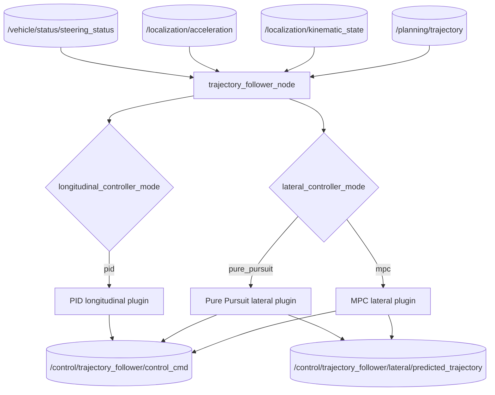
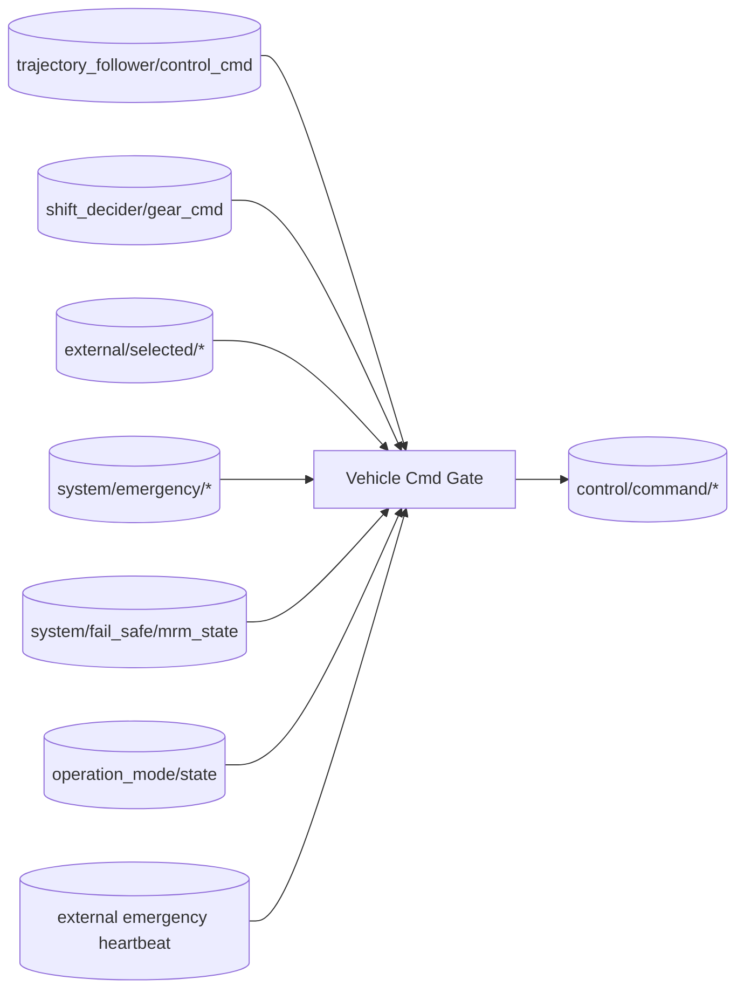
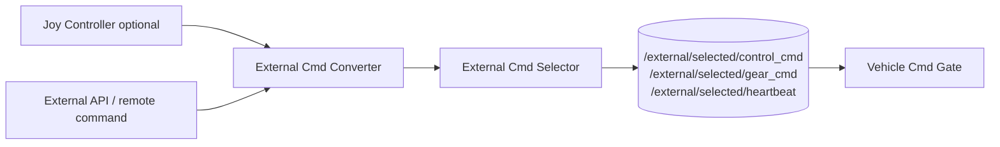
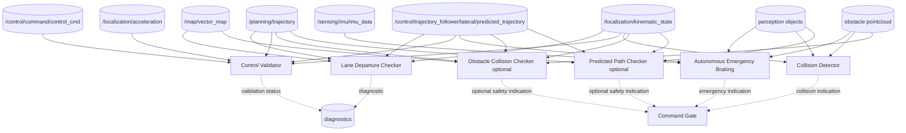
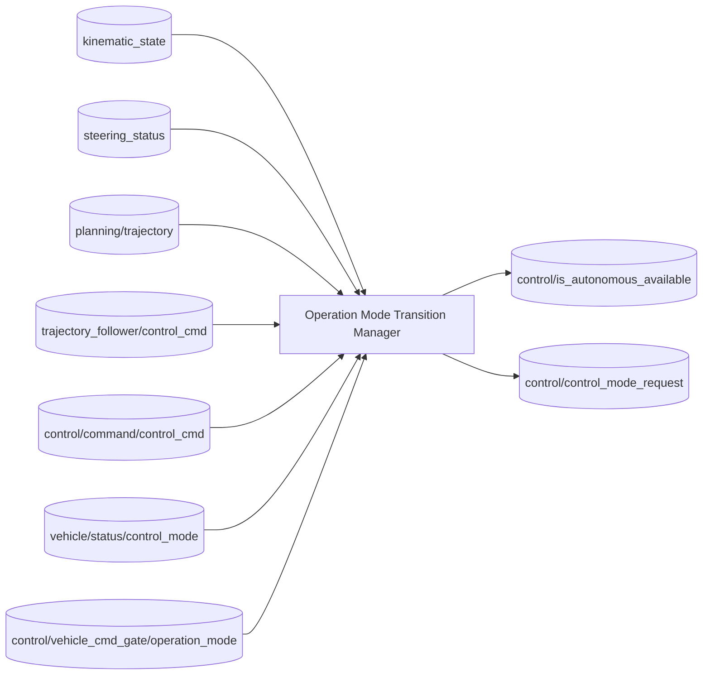
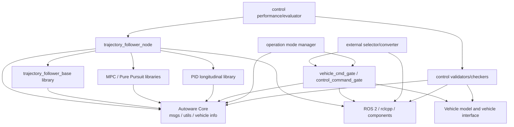
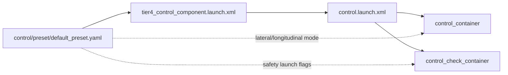

# Autoware Control 完整数据流与运行时依赖图

本文基于当前工作区 `src/universe/autoware_universe/control`、`tier4_control_launch/launch/control.launch.xml`、`tier4_control_component.launch.xml` 和 Control 参数 preset，整理 Control 包的完整数据流、运行时容器、控制器插件、安全检查和车辆命令边界。

## 1. 图例和运行边界

| 表示 | 含义 |
| --- | --- |
| 实线箭头 | ROS topic/消息数据流 |
| 虚线箭头 | 安全覆盖、模式仲裁、诊断或配置关系 |
| `optional` | 由 control preset/launch 参数决定 |
| `plugin` | 主节点内部动态加载或作为 controller mode 选择，不一定是独立 node |
| `library` | 编译/算法库，不直接代表 ROS topic |

Control 的主要责任是：

```text
/planning/trajectory + localization/vehicle status
  -> lateral control + longitudinal control
  -> trajectory follower control command
  -> gear/shift decision
  -> auto/external/emergency command arbitration
  -> control command validation and emergency checks
  -> /control/command/*
  -> vehicle interface
```

## 2. 完整 Control 运行时数据流

```mermaid
flowchart TD
    TRAJ[( /planning/trajectory )]
    ODO[( /localization/kinematic_state )]
    ACC[( /localization/acceleration )]
    STEER[( /vehicle/status/steering_status )]
    GEAR[( /vehicle/status/gear_status )]
    VEL[( /vehicle/status/velocity_status )]
    MODE[( /system/operation_mode/state )]
    STATE[( /autoware/state )]
    OBJ[( perception objects )]
    PCL[( obstacle pointcloud )]
    IMU[( /sensing/imu/imu_data )]
    MAP[( /map/vector_map )]

    subgraph FOLLOWER[Trajectory Following]
      TF[TrajectoryFollowerNode]
      LAT[Lateral controller plugin\nMPC / Pure Pursuit]
      LON[Longitudinal controller plugin\nPID]
      SMART[Smart MPC follower optional]
      PRED[( lateral/predicted_trajectory )]
      FCMD[( trajectory_follower/control_cmd )]
    end

    TRAJ --> TF
    ODO --> TF
    STEER --> TF
    ACC --> TF
    MODE --> TF
    TF --> LAT
    TF --> LON
    LAT --> FCMD
    LON --> FCMD
    LAT --> PRED
    SMART -. alternative follower .-> FCMD

    subgraph ARBITRATION[Command Arbitration]
      SHIFT[Shift Decider]
      EXTSEL[External Cmd Selector optional]
      EXTCONV[External Cmd Converter\nvehicle-side package]
      GATE[Vehicle Cmd Gate]
      NEWGATE[Control Command Gate optional migration]
      STOP[Stop Mode Operator optional]
    end
    FCMD --> SHIFT
    GEAR --> SHIFT
    STATE --> SHIFT
    SHIFT --> GEARCMD[( /control/shift_decider/gear_cmd )]
    EXTCONV --> EXTSEL
    EXTSEL --> GATE
    FCMD --> GATE
    GEARCMD --> GATE
    MODE --> GATE
    ODO --> GATE
    ACC --> GATE
    EXTSEL --> GATE
    EMERG[( /system/emergency/* )] --> GATE
    MRM[( /system/fail_safe/mrm_state )] --> GATE
    GATE --> CONTROL[( /control/command/control_cmd )]
    GATE --> GEAROUT[( /control/command/gear_cmd )]
    GATE --> TURNOUT[( /control/command/turn_indicators_cmd )]
    GATE --> HAZOUT[( /control/command/hazard_lights_cmd )]
    NEWGATE -. replaces gate .-> CONTROL
    STOP -. stop mode .-> NEWGATE

    subgraph CHECKS[Control Safety and Diagnostics]
      LANE[Lane Departure Checker]
      CV[Control Validator]
      AEB[Autonomous Emergency Braking]
      CD[Collision Detector]
      OCC[Obstacle Collision Checker optional]
      PPC[Predicted Path Checker optional]
      OPM[Operation Mode Transition Manager]
      EVA[Control Performance Analysis/Evaluator]
    end
    TRAJ --> LANE
    MAP --> LANE
    ODO --> LANE
    PRED --> LANE
    CONTROL --> CV
    TRAJ --> CV
    ODO --> CV
    ACC --> CV
    PRED --> CV
    OBJ --> AEB
    PCL --> AEB
    IMU --> AEB
    VEL --> AEB
    PRED --> AEB
    TRAJ --> OCC
    MAP --> OCC
    PCL --> OCC
    ODO --> OCC
    OBJ --> PPC
    TRAJ --> PPC
    PRED --> PPC
    ODO --> PPC
    CONTROL --> OPM
    TRAJ --> OPM
    ODO --> OPM
    STEER --> OPM
    MODE --> OPM
    CONTROL --> EVA

    AEB -. emergency command/diagnostic .-> GATE
    CD -. collision diagnostic .-> GATE
    LANE -. diagnostic .-> GATE
    CV -. validation status .-> GATE
    OPM -. autonomous availability/mode request .-> MODE
    EVA -. metrics .-> EVAOUT[(control evaluation)]

    CONTROL --> VEH[Vehicle interface / raw cmd converter]
    GEAROUT --> VEH
    TURNOUT --> VEH
    HAZOUT --> VEH
```



## 3. 默认 Control 主链

当前 `tier4_control_component.launch.xml` 默认选择：

```text
lateral_controller_mode = mpc
longitudinal_controller_mode = pid
trajectory_follower_mode = trajectory_follower_node
use_control_command_gate = false
```

```mermaid
flowchart LR
    T[/planning/trajectory]
    O[/localization/kinematic_state]
    A[/localization/acceleration]
    S[/vehicle/status/steering_status]
    F[TrajectoryFollowerNode]
    MPC[MPC Lateral Controller]
    PID[PID Longitudinal Controller]
    C[/control/trajectory_follower/control_cmd]
    SD[Shift Decider]
    G[/control/shift_decider/gear_cmd]
    GATE[Vehicle Cmd Gate]
    OUT[/control/command/control_cmd]
    GO[/control/command/gear_cmd]
    T --> F
    O --> F
    A --> F
    S --> F
    F --> MPC --> C
    F --> PID --> C
    C --> SD
    SD --> G
    C --> GATE
    G --> GATE
    GATE --> OUT
    GATE --> GO
```

控制器输出的是跟踪命令，不是直接的车辆总线命令。Vehicle Cmd Gate 还需要 operation mode、external command、emergency command、MRM state、heartbeat 等信息进行最终仲裁。

## 4. Trajectory Follower 数据流

### 4.1 主包和公共库

| 包 | 角色 |
| --- | --- |
| `autoware_trajectory_follower_node` | ROS 组件，连接 trajectory、vehicle state 和控制器插件 |
| `autoware_trajectory_follower_base` | lateral/longitudinal controller 公共接口和基础库 |
| `autoware_mpc_lateral_controller` | MPC 横向控制器 |
| `autoware_pure_pursuit` | Pure Pursuit 横向控制器 |
| `autoware_pid_longitudinal_controller` | PID 纵向控制器 |
| `autoware_smart_mpc_trajectory_follower` | Smart MPC 可选/开发中 follower |

### 4.2 运行时控制器选择



### 4.3 控制数学边界

横向控制主要以 trajectory tracking error 为输入：

```text
lateral error + yaw error + curvature + vehicle state
  -> steering command
```

MPC 可抽象为有限预测窗口上的优化：

$$
\min_{u_0,\ldots,u_{N-1}}
\sum_{k=0}^{N}
\left(x_k^TQx_k+u_k^TRu_k\right)
$$

约束包括车辆运动学、转角和转角变化率。Pure Pursuit 则根据前视点几何关系计算曲率/转向：

$$
\delta=\arctan\left(\frac{2L\sin\alpha}{L_d}\right)
$$

纵向 PID 以速度误差为主：

$$
 e_v=v_{ref}-v_{current}
$$

$$
 u=K_pe_v+K_i\int e_vdt+K_d\frac{de_v}{dt}
$$

实际输出还会受限幅、斜率限制、车辆状态和安全门控影响。

## 5. Command Arbitration 主链

### 5.1 Shift Decider

`autoware_shift_decider` 根据 trajectory follower control command、当前 gear 和 Autoware state 决定换挡命令：

```text
trajectory_follower/control_cmd
  + vehicle/status/gear_status
  + autoware/state
  -> /control/shift_decider/gear_cmd
```

它把控制器的运动意图与当前车辆档位状态连接起来，避免直接由横纵向控制器输出 gear。

### 5.2 Vehicle Cmd Gate

默认 `use_control_command_gate=false` 时，使用 `autoware_vehicle_cmd_gate`。它合并：

- 自动驾驶控制：`/control/trajectory_follower/control_cmd`。
- 自动驾驶灯光命令：planning/turn/hazard commands。
- 外部控制：`/external/selected/*`。
- 系统紧急命令：`/system/emergency/*`。
- MRM 状态：`/system/fail_safe/mrm_state`。
- gate mode command。
- operation mode、engage、heartbeat 和车辆状态。



### 5.3 Control Command Gate 迁移分支

`use_control_command_gate=true` 时，launch 会启动 `autoware_control_command_gate` 和 `autoware_stop_mode_operator`，作为 Vehicle Cmd Gate 的迁移替代路径。两者不能简单理解为同时串联；它们是不同的 command gating 配置分支。

## 6. External Command 分支

| 包 | 作用 |
| --- | --- |
| `autoware_external_cmd_selector` | 在多个外部控制源中选择当前外部命令 |
| `autoware_external_cmd_converter` | 将外部 API/控制格式转换为 Autoware control/gear/indicator 命令 |
| `autoware_joy_controller` | 手柄/遥控输入控制源，可选 |



外部命令不是绕过 Vehicle Cmd Gate 直接下发；Gate 仍需根据 gate mode、operation mode、heartbeat 和 emergency 状态决定是否输出。

## 7. Control 安全检查和并行诊断

### 7.1 control_check_container

以下模块通常加载到 `control_check_container`：

| 包 | 主要输入 | 主要作用 |
| --- | --- | --- |
| `autoware_lane_departure_checker` | route、map、planning trajectory、predicted trajectory、odometry | 检查车辆/预测轨迹是否偏离车道 |
| `autoware_control_validator` | control command、trajectory、odometry、acceleration、predicted trajectory | 检查控制指令和跟踪状态 |
| `autoware_autonomous_emergency_braking` | pointcloud、objects、IMU、velocity、predicted trajectory | 紧急制动判断 |
| `autoware_collision_detector` | odometry、pointcloud、objects | 碰撞风险检测 |
| `autoware_obstacle_collision_checker` | map、pointcloud、reference trajectory、predicted trajectory、odometry | 轨迹与障碍物碰撞检查，可选 |
| `autoware_predicted_path_checker` | objects、reference trajectory、acceleration、odometry、predicted trajectory | 预测路径风险检查，可选 |



### 7.2 安全检查与最终命令的关系

安全检查模块大多发布 diagnostics/status，而不直接替代正常 trajectory follower 命令。AEB、collision detector 等紧急路径可以通过 system emergency/control command 影响 Gate；实际车辆是否进入紧急输出，应沿 Gate 的输入和参数确认。

## 8. Operation Mode Transition Manager

`autoware_operation_mode_transition_manager` 是控制模式转换的协调器，连接：

```text
localization + steering status + planning trajectory
+ follower command + vehicle control mode + gate operation mode
  -> autonomous availability
  -> control mode request
```



这意味着“控制器已经能产生 control_cmd”不等于“系统允许进入 autonomous control”；模式转换管理器还会检查轨迹、转向、车辆控制模式和 Gate 状态。

## 9. Control 包完整清单

| 功能包 | 类别 | 运行时角色 |
| --- | --- | --- |
| `autoware_trajectory_follower_node` | Controller | 轨迹跟踪 ROS node/component |
| `autoware_trajectory_follower_base` | Controller | 控制器公共接口 library |
| `autoware_mpc_lateral_controller` | Controller | MPC lateral controller plugin/library |
| `autoware_pure_pursuit` | Controller | Pure Pursuit lateral controller |
| `autoware_pid_longitudinal_controller` | Controller | PID longitudinal controller |
| `autoware_smart_mpc_trajectory_follower` | Controller | Smart MPC alternative, under development |
| `autoware_shift_decider` | Command | gear/shift command decision |
| `autoware_vehicle_cmd_gate` | Command | auto/external/emergency command gate |
| `autoware_control_command_gate` | Command | migration alternative gate |
| `autoware_stop_mode_operator` | Command | stop mode support for new gate |
| `autoware_external_cmd_selector` | External | external command selection |
| `autoware_joy_controller` | External | joystick/remote command source |
| `autoware_operation_mode_transition_manager` | Mode | autonomous/control-mode transition |
| `autoware_lane_departure_checker` | Safety | lane departure check |
| `autoware_control_validator` | Safety | command and tracking validation |
| `autoware_autonomous_emergency_braking` | Safety | AEB |
| `autoware_collision_detector` | Safety | collision detection |
| `autoware_obstacle_collision_checker` | Safety | obstacle/trajectory collision checker, optional |
| `autoware_predicted_path_checker` | Safety | predicted path risk checker, optional |
| `autoware_spheric_collision_detector` | Safety/library | spherical collision detection support |
| `autoware_control_performance_analysis` | Evaluation | controller performance analysis |

## 10. 包/库编译依赖图



编译依赖不表示所有 controller 都同时运行。当前 launch 由 `lateral_controller_mode`、`longitudinal_controller_mode` 和 `trajectory_follower_mode` 选择实际控制器。

## 11. 配置和启用关系



关键开关：

| 配置 | 作用 |
| --- | --- |
| `trajectory_follower_mode` | `trajectory_follower_node` 或 `smart_mpc_trajectory_follower` |
| `lateral_controller_mode` | `mpc` 或 `pure_pursuit` |
| `longitudinal_controller_mode` | `pid` |
| `launch_external_cmd_selector` | 启动外部命令选择 |
| `launch_external_cmd_converter` | 启动外部命令转换 |
| `launch_lane_departure_checker` | 车道偏离检查 |
| `launch_control_validator` | 控制验证 |
| `launch_autonomous_emergency_braking` | AEB |
| `launch_collision_detector` | collision detector |
| `launch_obstacle_collision_checker` | 可选障碍物碰撞检查 |
| `launch_predicted_path_checker` | 可选预测路径检查 |
| `use_control_command_gate` | 切换到新的 control command gate |
| `use_multithread` | 选择单线程/多线程 component container |
| `use_intra_process` | 是否使用 intra-process communication |

## 12. 关键 topic 边界

| 边界 | 上游 | 下游 | 数据 |
| --- | --- | --- | --- |
| Planning -> Control | Planning Validator | Trajectory Follower | `/planning/trajectory` |
| Localization -> Control | Localization | follower/gate/checkers | `/localization/kinematic_state` |
| Follower -> Gate | Trajectory Follower | Shift Decider/Gate | `/control/trajectory_follower/control_cmd` |
| Follower -> Safety | Follower | lane departure/AEB/checkers | predicted trajectory/diagnostics |
| Shift -> Gate | Shift Decider | Vehicle Cmd Gate | `/control/shift_decider/gear_cmd` |
| External -> Gate | External selector/converter | Vehicle Cmd Gate | `/external/selected/*` |
| Emergency -> Gate | AEB/system | Vehicle Cmd Gate | `/system/emergency/*` |
| Gate -> Vehicle | Vehicle Cmd Gate | vehicle interface | `/control/command/*` |
| Mode -> Control | Operation Mode Manager | Gate/vehicle API | mode request/availability |

## 13. 运行时核验命令

### 13.1 节点和组件

```bash
ros2 node list | grep -E 'control|trajectory|cmd|emergency|validator|checker'
ros2 component list
```

### 13.2 控制器输入输出

```bash
ros2 topic info /planning/trajectory -v
ros2 topic info /control/trajectory_follower/control_cmd -v
ros2 topic echo /control/trajectory_follower/control_cmd --once
ros2 topic echo /control/trajectory_follower/lateral/predicted_trajectory --once
ros2 topic echo /control/shift_decider/gear_cmd --once
```

### 13.3 Gate 和最终命令

```bash
ros2 topic info /control/command/control_cmd -v
ros2 topic echo /control/command/control_cmd --once
ros2 topic echo /control/command/gear_cmd --once
ros2 topic echo /control/current_gate_mode --once
ros2 topic echo /control/is_autonomous_available --once
ros2 topic echo /control/control_mode_request --once
```

### 13.4 安全和诊断

```bash
ros2 topic echo /diagnostics --once
ros2 topic list | grep -E 'aeb|collision|departure|validator|performance'
ros2 param list /control/control_container
ros2 param list /control/control_check_container
```

## 14. 结论

Autoware Control 的完整运行时链可以概括为：

```text
/planning/trajectory
  -> trajectory follower
  -> lateral MPC/Pure Pursuit + longitudinal PID
  -> follower control command
  -> shift decider
  -> auto/external/emergency command gate
  -> /control/command/control_cmd + gear + indicators
  -> vehicle interface
```

并行安全链为：

```text
trajectory + predicted trajectory + objects + pointcloud + IMU
  -> lane departure / control validation / AEB / collision checks
  -> diagnostics 或 emergency influence
  -> command gate
```

当前工作区同时支持：

1. 默认 `MPC + PID + Vehicle Cmd Gate` 主链。
2. `Pure Pursuit` lateral controller 替代分支。
3. Smart MPC follower 开发分支。
4. `Control Command Gate + Stop Mode Operator` 迁移分支。
5. 外部控制、手柄控制和系统紧急命令分支。
6. 多个可选安全检查与性能评估模块。

排查 Control 问题时，应沿“planning trajectory -> follower command -> shift/gate -> final command -> vehicle interface”顺序核对，并把安全 checker、operation mode 和 Gate 状态作为并行条件检查，而不能只观察控制器本身的输出。
