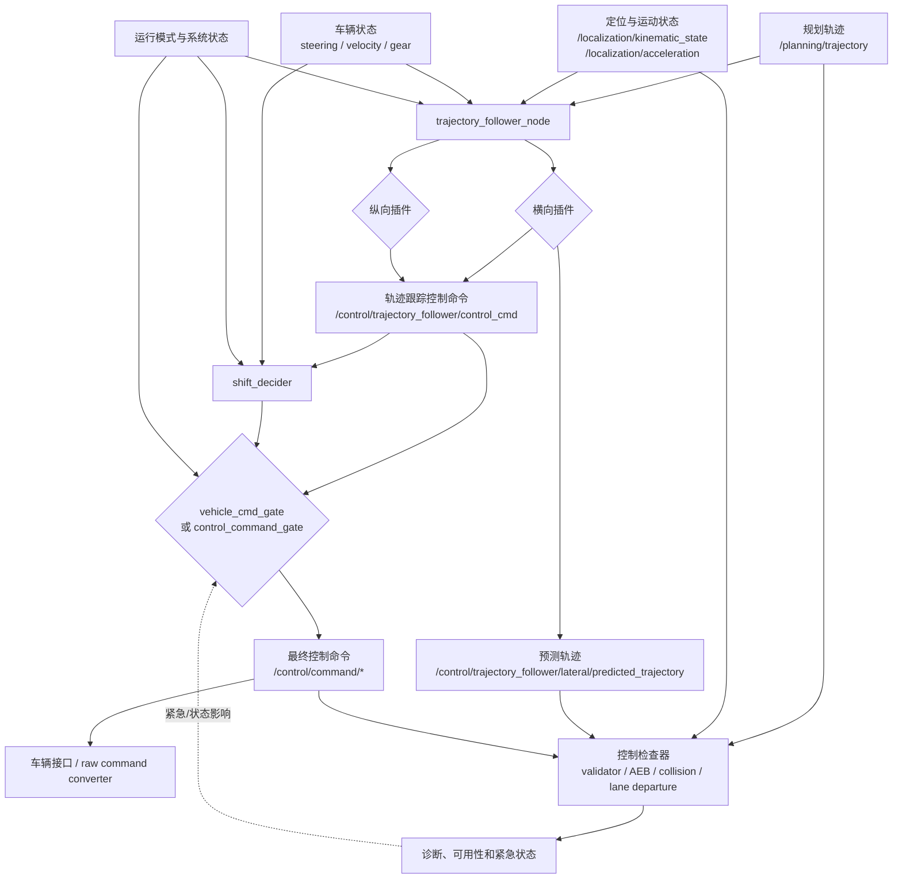

# Autoware 控制算法架构分析

本文基于当前工作区 `src/core`、`src/universe/autoware_universe/control` 和
`src/launcher/autoware_launch/tier4_universe_launch/tier4_control_launch` 的实现进行分析。
文中的“控制”从规划轨迹进入轨迹跟踪器开始，到车辆接口接收最终车辆命令为止；定位、规划和底层执行器只描述它们与控制的接口。

## 1. 控制系统要解决什么问题

Autoware 控制层不是单个 PID 节点，而是一条分层链路：

1. **轨迹跟踪**：根据规划轨迹和车辆当前状态，计算转向、速度和加速度命令。
2. **运动意图补全**：根据控制结果、当前档位和 Autoware 状态决定档位。
3. **命令仲裁**：在自动驾驶、外部控制、紧急命令和内置停车命令之间选择唯一输出。
4. **安全约束**：检查超速、偏航、轨迹偏差、横向 jerk、超越停车点等异常，并在门控阶段施加最终限幅。
5. **车辆适配**：把统一的 Autoware 控制消息转换成具体车辆的转向、油门、制动、档位或总线协议。

核心原则是：**控制器生成“应该怎么开”的命令，门控模块决定“当前允许哪类命令通过”，车辆接口负责“如何驱动车辆实现它”。**

## 2. 总体架构



默认启动路径由 `tier4_control_launch/launch/control.launch.xml` 控制。默认配置通常是：

```text
trajectory_follower_mode = trajectory_follower_node
lateral_controller_mode  = mpc
longitudinal_controller_mode = pid
use_control_command_gate = false
```

`use_control_command_gate=true` 时，新的 `autoware_control_command_gate` 和
`autoware_stop_mode_operator` 参与输出；否则使用 `autoware_vehicle_cmd_gate`。
这是一条正在迁移中的边界，排查实际系统时必须先确认 launch 参数，而不能只看包名。

## 3. 主要组件与职责

| 层次 | 组件/包 | 主要职责 | 典型输入 | 典型输出 |
| --- | --- | --- | --- | --- |
| 轨迹跟踪编排 | `autoware_trajectory_follower_node` | 组装输入、加载插件、检查数据时效、同步横纵向结果并发布控制命令 | trajectory、odometry、steering、acceleration、operation mode | `Control`、诊断、预测轨迹 |
| 公共接口 | `autoware_trajectory_follower_base` | 定义 `LateralControllerBase`、`LongitudinalControllerBase` 和同步数据接口 | `InputData` | `LateralOutput`、`LongitudinalOutput` |
| 横向控制 | `autoware_mpc_lateral_controller` | 基于车辆模型和预测窗口求解转向命令 | 轨迹、位姿、速度、当前转角 | steering angle/rate、预测轨迹 |
| 横向控制 | `autoware_pure_pursuit` | 基于前视点几何关系计算曲率和转角 | 轨迹、位姿、速度 | steering angle |
| 纵向控制 | `autoware_pid_longitudinal_controller` | 速度跟踪、加速度前馈、PID 反馈、坡度和时延补偿、停车状态机 | trajectory、odometry | target velocity/acceleration |
| 档位决策 | `autoware_shift_decider` | 把轨迹跟踪结果和当前档位转换为档位命令 | control、gear status、Autoware state | gear command |
| 命令选择 | `autoware_vehicle_cmd_gate` | 自动/外部/紧急命令选择，心跳检查和最终限幅 | 多源 control/gear/light、operation mode、MRM | `/control/command/*` |
| 新门控 | `autoware_control_command_gate` | 以命令源为单位选择四类命令，并支持内置停车和超时回退 | 多源命令 | 最终命令 |
| 控制验证 | `autoware_control_validator` | 检查最终控制的运动学和跟踪合理性 | 最终 control、轨迹、预测轨迹、车辆状态 | validation status、diagnostics |
| 紧急检查 | `autoware_autonomous_emergency_braking`、`autoware_collision_detector` | 根据障碍物、点云、速度和预测轨迹识别碰撞风险 | perception、pointcloud、IMU、predicted trajectory | 紧急状态/诊断 |
| 轨迹安全检查 | `autoware_lane_departure_checker` 等 | 检查偏离车道、障碍物冲突和预测路径风险 | map、route、轨迹、定位、障碍物 | 诊断/状态 |
| 车辆边界 | vehicle interface、vehicle command converter | 将统一控制命令映射为具体车辆执行器接口 | `/control/command/*` | CAN、ROS vehicle command 或线控指令 |

## 4. 一次控制周期的工作流程

### 4.1 输入收集和有效性判断

`trajectory_follower_node` 的定时回调首先构造 `InputData`，主要包括：

- 规划输出的 `autoware_planning_msgs/Trajectory`；
- 当前 `nav_msgs/Odometry`，包含位置、姿态和速度；
- 当前 `SteeringReport`；
- 当前加速度和运行模式。

若轨迹、定位或车辆状态缺失、时间戳超出 `timeout_thr_sec`，或者控制器自身尚未 ready，本周期不发布有效控制命令。这样可以避免用旧状态继续驱动车辆。

### 4.2 横向与纵向并行计算

节点分别调用横向和纵向插件的 `isReady()` 与 `run()`：

```text
InputData
  -> lateral_controller.run()
  -> longitudinal_controller.run()
  -> sync(lateral_sync_data, longitudinal_sync_data)
  -> autoware_control_msgs/Control
```

两者共享同一控制周期，但不是简单地把两个独立输出拼接。横向输出包含转角收敛信息，纵向控制器可以据此在停车时保持车辆不动，直到转向已经收敛；这避免车辆在方向尚未稳定时提前起步。

控制消息由 `autoware_control_msgs/Control` 封装：

```text
Control
├── stamp / control_time
├── lateral
└── longitudinal
```

`ControlHorizon` 可以携带未来一段控制序列，但在当前轨迹跟踪节点中默认不发布。

### 4.3 档位决策

`shift_decider` 接收轨迹跟踪命令、当前车辆档位和 Autoware 状态，单独发布档位命令。档位不是由 MPC 或 PID 直接决定的，因此分析车辆倒车、停车或前进切换时，应先看：

```text
/control/trajectory_follower/control_cmd
+ /vehicle/status/gear_status
+ /autoware/state
-> /control/shift_decider/gear_cmd
```

### 4.4 命令仲裁和最终限幅

门控模块把以下命令源统一到车辆输出边界：

- 自动驾驶轨迹跟踪命令；
- 外部控制器命令；
- 系统紧急命令；
- 内置停止命令或停止模式。

门控同时考虑 operation mode、engage、心跳、MRM 状态和车辆运动状态。自动模式下，最终命令还会受到速度、加速度、jerk、转角、转角速率以及相对当前转角变化量的限制。

门控限幅是最后一道安全边界，不是用于改善舒适性的低通滤波器。如果它频繁激活，优先检查上游控制器、轨迹平滑和车辆参数，而不是单纯放宽门控限制。

### 4.5 车辆执行

最终的 `/control/command/control_cmd`、`gear_cmd`、转向灯和危险警告灯命令进入车辆接口。不同车辆可能需要进一步转换：

```text
target velocity / acceleration / steering
    -> vehicle-specific converter
    -> throttle / brake / steering actuator or CAN
```

PID 输出的目标加速度只有在后续接口能够正确实现时才成立。若车辆只接受油门和制动踏板，必须由车辆侧转换器完成加速度到执行器的映射。

## 5. 关键控制算法

### 5.1 线性 MPC 横向控制

当前默认横向控制器是 `autoware_mpc_lateral_controller`。它先把车辆相对于参考轨迹的状态表示成误差，例如横向误差、航向误差、曲率相关项和当前转向状态，再用车辆模型预测未来状态。

车辆模型包括：

- `kinematics`：带一阶转向延迟的自行车运动学模型；
- `kinematics_no_delay`：不带转向延迟的运动学模型；
- `dynamics`：考虑侧偏角的车辆动力学模型，当前属于更谨慎使用的路径。

在线优化通常可抽象为：

$$
\min_{u_0,\ldots,u_{N-1}}
\sum_{k=0}^{N-1}
\left(x_k^T Q x_k + u_k^T R u_k\right) + x_N^T Q_N x_N
$$

其中 $x_k$ 是预测误差状态，$u_k$ 是转向输入。转角、转角速率、车辆模型和预测状态构成约束。实现上将问题转成 QP，并支持快速无约束求解或 OSQP 求解器。

控制链还包括：

1. 轨迹重采样、延长和曲率处理；
2. 对横向误差、航向误差使用 Butterworth 滤波；
3. 对输出转角进行滤波和限幅；
4. 发布 MPC 预测轨迹供 RViz 和检查器使用；
5. 偏差过大时进入异常路径，预测轨迹可能为空。

调参顺序建议是：先确认轴距、最大转角、转向传感器零点、速度和时延，再调 `weight_lat_error` 与 `weight_steering_input` 的平衡，最后处理预测时域、滤波和转角速率限制。输入偏置没有解决前，调权重通常只能掩盖问题。

### 5.2 Pure Pursuit 横向控制

Pure Pursuit 选择参考轨迹上的前视点，计算车辆当前位置到目标点的几何关系，再转换为期望曲率和转角。简化形式为：

$$
\delta = \arctan\left(\frac{2L\sin\alpha}{L_d}\right)
$$

其中 $L$ 是轴距，$\alpha$ 是车辆航向与目标点方向的夹角，$L_d$ 是前视距离。

前视距离越大，控制更平滑但弯道跟踪更迟钝；前视距离越小，跟踪更积极但更容易放大定位噪声。Pure Pursuit 适合作为结构简单、计算开销低的横向插件，也适合用来与 MPC 做基线对比。

### 5.3 PID 纵向控制

PID 纵向控制器以轨迹中的目标速度和目标加速度为基础，采用前馈加反馈：

$$
e_v = v_{ref} - v_{ego}
$$

$$
a_{cmd} = a_{ff} + K_p e_v + K_i\int e_v\,dt + K_d\frac{d e_v}{dt}
$$

其中 $a_{ff}$ 可来自轨迹目标加速度和坡度补偿。实现中对 P/I/D 各项以及最终加速度、jerk 做限幅，并可使用时延补偿预测延迟后的自车速度和目标速度。

纵向控制器有四个主要状态：

| 状态 | 行为 |
| --- | --- |
| `DRIVE` | 正常速度跟踪，执行前馈、PID、坡度补偿和时延补偿 |
| `STOPPING` | 接近停车点时使用强减速到弱减速的平滑停车策略 |
| `STOPPED` | 车辆停止后保持刹车，防止溜车 |
| `EMERGENCY` | 越过停车点、轨迹搜索失败或其他严重条件下使用紧急减速 |

停车阶段还可以等待横向转角收敛。需要特别注意：轨迹中的目标速度应已经平滑；控制器不会把阶跃式速度命令自动变成舒适曲线。

坡度补偿可以来自自车姿态 pitch，也可以来自轨迹前后轮位置的 z 高差。只有当后续车辆接口把该输出当作合适的前馈量时，坡度补偿才与低层执行器兼容；若底层已经有加速度闭环，重复补偿可能造成错误。

## 6. 控制检查与安全链路

控制检查器通常不替代控制器计算，而是独立观察控制结果。它们的职责不同：

| 检查器 | 关注点 | 典型依赖 |
| --- | --- | --- |
| `control_validator` | 反向速度、超速、停车点超越、横向 jerk、轨迹与预测轨迹偏差、航向偏差 | 最终 control、参考轨迹、预测轨迹、定位、加速度 |
| `lane_departure_checker` | 预测车辆是否偏离车道或参考路径 | lanelet map、route、定位、参考/预测轨迹 |
| `autonomous_emergency_braking` | 预测轨迹与障碍物/点云冲突 | objects、pointcloud、IMU、速度、预测轨迹 |
| `collision_detector` | 当前运动状态与障碍物的碰撞风险 | odometry、objects、pointcloud |
| `obstacle_collision_checker` | 参考轨迹、地图和障碍物的冲突 | vector map、pointcloud、参考轨迹 |
| `predicted_path_checker` | 障碍物与自车预测路径关系 | objects、参考/预测路径 |

这些模块的结果通常先表现为 diagnostics、validation status 或系统状态，再由紧急处理、MRM 或门控选择影响最终命令。调试时要区分两种情况：

- **控制器算错了**：轨迹跟踪命令本身已经异常；
- **控制器算对但被拦截了**：命令在门控或紧急链路被限幅、替换或切换。

## 7. 关键话题和排查顺序

### 7.1 最小观测集合

```text
/planning/trajectory
/localization/kinematic_state
/localization/acceleration
/vehicle/status/steering_status
/vehicle/status/velocity_status
/vehicle/status/gear_status
/system/operation_mode/state
/control/trajectory_follower/control_cmd
/control/trajectory_follower/lateral/predicted_trajectory
/control/shift_decider/gear_cmd
/control/command/control_cmd
/control/command/gear_cmd
/diagnostics
```

### 7.2 推荐排查顺序

1. **先看输入是否新鲜**：轨迹和定位时间戳是否持续更新，坐标系、速度符号和单位是否正确。
2. **再看轨迹几何**：自车是否在轨迹起点之后，轨迹是否包含平滑速度、加速度和有效曲率。
3. **比较跟踪器输出**：检查 `/control/trajectory_follower/control_cmd` 与 MPC 预测轨迹，判断横向或纵向先出问题。
4. **检查同步和停车状态**：转角未收敛时，纵向控制器可能有意保持停车。
5. **检查档位与门控**：比较 `shift_decider` 输出和最终 `/control/command/*`，确认是否发生 AUTO/EXTERNAL/EMERGENCY 切换。
6. **最后看安全诊断**：定位 `control_validator`、AEB、碰撞检查器或门控 filter 是否触发。

### 7.3 常见现象到可能原因

| 现象 | 优先检查 |
| --- | --- |
| 不发布控制命令 | 输入超时、controller `isReady()`、轨迹/定位时间戳、组件是否加载 |
| 横向左右摆动 | MPC 横向误差权重、转向零点、轴距、速度偏差、输入/输出滤波和延迟 |
| 弯道切入迟缓 | 转向延迟/时间常数、前视距离或 MPC 预测参数、轨迹曲率质量 |
| 速度跟踪有持续偏差 | 速度符号、PID 积分限制、坡度补偿、车辆接口是否真正实现目标加速度 |
| 到停车点仍在移动 | 目标轨迹速度/加速度、STOPPING 参数、时延、制动能力和停车点位置 |
| 车辆突然被限制或停车 | gate mode、heartbeat、MRM、AEB、validator、final guard |
| 档位不符合预期 | 当前 gear、Autoware state、shift_decider 输入和规划轨迹方向 |

## 8. 配置、启动与修改入口

### 启动层

主要入口是：

```text
src/launcher/autoware_launch/tier4_universe_launch/
  tier4_control_launch/launch/control.launch.xml
```

该文件决定是否启动外部命令选择器、控制检查器、AEB、碰撞检测、控制评估器，以及采用哪一种门控实现。

### 算法层

控制器参数通常由 launch 传入的参数文件提供：

```text
trajectory_follower_node_param_path
lat_controller_param_path
lon_controller_param_path
vehicle_param_file
nearest_search_param_path
```

更换算法时，应优先检查 `lateral_controller_mode`、`longitudinal_controller_mode` 和对应插件是否支持相同的消息接口；不要直接修改门控输出话题来绕过控制器。

### 车辆层

修改车辆时，至少要重新确认：轴距、轮胎转角与方向盘角的比例、转向零点、最大转角、转向延迟、车辆速度符号、加速度/制动约定和 gear 映射。这些参数同时影响 MPC、PID、门控约束和车辆接口，不能只在单一模块中修正。

## 9. 设计上的关键交互

### 9.1 横向收敛与纵向起步

横向控制器通过同步数据报告转角是否收敛；纵向控制器可配置为在转角未收敛时继续保持停止。这是一个跨控制器的明确协作点，说明两个控制器虽然并行运行，但最终车辆行为依赖它们的同步协议。

### 9.2 预测轨迹与验证器

MPC/Pure Pursuit 输出的预测轨迹不是仅用于可视化。它被 lane departure checker、control validator、AEB 和其他碰撞检查模块使用，因而预测轨迹的坐标系、时间戳和空轨迹语义会影响安全判断。

### 9.3 运行模式与门控

operation mode 不只是 UI 状态：它影响控制器是否工作、门控选择哪一类命令、门控使用哪组限制、是否允许自动驾驶，以及模式转换期间的过渡保护。出现“算法输出正常但车辆不动”时，运行模式和门控状态应与算法输出同等优先级排查。

### 9.4 控制边界与车辆能力

控制器输出的是抽象的目标运动量，车辆接口必须保证这些目标能够被执行。若车辆执行器存在明显延迟、饱和、死区或非线性，应通过车辆模型、延迟补偿或车辆侧转换处理；不能期待门控滤波器修复执行器建模错误。

## 10. 小结

Autoware 控制架构可以压缩为以下闭环：

```text
planning trajectory
  -> trajectory follower (MPC/Pure Pursuit + PID)
  -> shift decider
  -> command gate / safety limits
  -> vehicle interface
  -> vehicle state feedback
  -> control validators and emergency checks
```

阅读或修改代码时，最重要的边界判断是：

- 轨迹跟踪器负责误差反馈和运动控制；
- shift decider 负责档位，不负责横纵向跟踪；
- command gate 负责命令源选择、模式过渡和最后约束；
- validator 和碰撞检查器负责检测风险，不等同于主控制器；
- vehicle interface 负责把抽象命令落实到具体执行器。

掌握这五个边界后，可以沿着“输入新鲜度 -> 控制器输出 -> 档位 -> 门控 -> 车辆执行 -> 诊断”的顺序快速定位控制问题。

## 参考代码入口

- [控制启动文件](../src/launcher/autoware_launch/tier4_universe_launch/tier4_control_launch/launch/control.launch.xml)
- [轨迹跟踪节点](../src/universe/autoware_universe/control/autoware_trajectory_follower_node/README.md)
- [MPC 横向控制器](../src/universe/autoware_universe/control/autoware_mpc_lateral_controller/README.md)
- [Pure Pursuit 横向控制器](../src/universe/autoware_universe/control/autoware_pure_pursuit/README.md)
- [PID 纵向控制器](../src/universe/autoware_universe/control/autoware_pid_longitudinal_controller/README.md)
- [车辆命令门控](../src/universe/autoware_universe/control/autoware_vehicle_cmd_gate/README.md)
- [控制命令门控](../src/universe/autoware_universe/control/autoware_control_command_gate/README.md)
- [控制验证器](../src/universe/autoware_universe/control/autoware_control_validator/README.md)
- [控制消息定义](../src/core/autoware_msgs/autoware_control_msgs/msg/Control.msg)