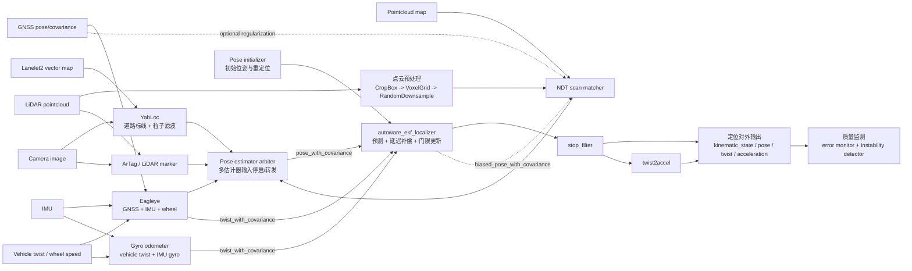

# Autoware 定位算法架构分析

本文基于当前工作区（Autoware 1.7.1）的启动文件、定位包 README、消息接口和参数目录整理。重点回答四个问题：定位由哪些层组成、一次定位周期如何流动、不同算法解决什么问题、出现定位异常时应如何验证。

## 1. 定位的职责与边界

Autoware 的定位不是单一算法，而是一组可以替换和组合的估计器：

- **位姿估计器（pose estimator）**：估计车辆在 `map` 坐标系中的位置和姿态，常见来源是 LiDAR-NDT、视觉 YabLoc、GNSS/IMU Eagleye、视觉标记物和 LiDAR 标记物。
- **速度估计器（twist estimator）**：估计车辆的线速度和角速度，常见来源是 Eagleye 或 gyro odometer。
- **融合滤波器**：使用扩展卡尔曼滤波器（EKF）融合位姿和速度，补偿延迟、平滑输出并拒绝统计意义上的异常观测。
- **后处理与质量管理**：停车状态下抑制速度噪声、由 twist 派生加速度、检测姿态不稳定和协方差过大。
- **初始化与重定位**：通过 GNSS、用户初始位姿或 NDT Monte Carlo 服务建立初始状态。

定位输出被规划、控制、感知和系统状态机共同使用。因此定位的核心契约不仅是“有 pose”，还包括：时间戳正确、frame 正确、协方差可信、速度与位姿变化一致、初始化状态可判断。

## 2. 总体架构

### 2.1 代码入口

- [定位功能包目录](../src/universe/autoware_universe/localization)
- [定位总启动文件](../src/launcher/autoware_launch/tier4_universe_launch/tier4_localization_launch/launch/localization.launch.xml)
- [pose/twist 估计器编排](../src/launcher/autoware_launch/tier4_universe_launch/tier4_localization_launch/launch/pose_twist_estimator/pose_twist_estimator.launch.xml)
- [EKF、停车滤波和加速度链路](../src/launcher/autoware_launch/tier4_universe_launch/tier4_localization_launch/launch/pose_twist_fusion_filter/pose_twist_fusion_filter.launch.xml)
- [定位错误监测启动文件](../src/launcher/autoware_launch/tier4_universe_launch/tier4_localization_launch/launch/localization_error_monitor/localization_error_monitor.launch.xml)

### 2.2 数据流



### 2.3 一个重要的组合规则

启动器通过 `pose_source` 选择位姿估计器，通过 `twist_source` 选择速度估计器：

```text
pose_source:  ndt | yabloc | eagleye | artag | lidar-marker
twist_source: eagleye | gyro_odom
```

`pose_source:=ndt_yabloc` 会启用多个位姿来源，但不表示它们被简单平均。多来源时启动 `autoware_pose_estimator_arbiter`，由 stopper/relay 控制输入或输出，之后仍由 EKF 接收统一的 `pose_with_covariance`。当前 arbiter 默认的 `enable_all_rule` 会启用所有估计器；更复杂的按质量自动切换规则需要额外实现。

YabLoc README 明确说明不建议同时运行 YabLoc 和 NDT：两者都消耗较多计算资源，而且当前 YabLoc 不估计 roll/pitch。因此多估计器模式应当有明确的资源和质量策略，而不能仅靠增加 `pose_source` 解决所有场景。

## 3. 主要组件与算法

### 3.1 点云预处理

NDT 前端在定位专用组件容器中运行，处理顺序是：

1. `CropBoxFilterComponent`：按测量范围裁剪点云。
2. `VoxelGridDownsampleFilterComponent`：体素降采样，降低匹配计算量并均衡点密度。
3. `RandomDownsampleFilterComponent`：进一步控制输入规模。

默认输入是 `/sensing/lidar/concatenated/pointcloud`，输出是 `/localization/util/downsample/pointcloud`。这条链路的作用是控制 NDT 的实时性和点云分布，不负责给出位姿。参数入口在 [localization 配置目录](../src/launcher/autoware_launch/autoware_launch/config/localization) 下的 `ndt_scan_matcher/pointcloud_preprocessor`。

### 3.2 NDT scan matcher：地图约束的主位姿估计器

实现包：[autoware_ndt_scan_matcher](../src/core/autoware_core/localization/autoware_ndt_scan_matcher)。NDT 将地图点云划分为体素，并以每个体素的统计分布表达地图；输入扫描点经过当前位姿变换后，通过优化使其与地图体素分布的匹配代价最小。

一次 NDT 更新的关键输入是：

- 预处理后的 LiDAR 点云；
- 上一时刻 EKF 的 `biased_pose_with_covariance`，作为迭代初值；
- 点云地图，标准方式由 map 载入，亦可使用 differential map loading；
- 可选的 GNSS/base pose 正则项。

输出包含位姿、位姿协方差、匹配分数、迭代次数和对齐点云等诊断信息。匹配分数、迭代次数和 `initial_to_result_distance` 是判断“收敛但收敛错了”的关键证据，不能只观察最终 pose。

#### NDT 的初始化与重定位

NDT 可以通过 `ndt_align_srv` 使用 Monte Carlo 方法估计初始位姿。正常跟踪时，它依赖 EKF 的上一状态作为局部初值；当初值离真实位置过远、地图特征不足或点云时间错位时，局部优化可能收敛到错误极小值。

#### GNSS 正则化

可选正则项只约束车辆纵向误差，将 GNSS 或其他 base pose 加入 NDT 目标函数。它适合桥梁、高速等点云特征少但 GNSS 可用的场景；在隧道、室内或高楼峡谷中，错误 GNSS 反而会把 NDT 拉向错误位置，因此默认关闭。低频 base pose 还会导致线性插值不可靠。

#### 动态地图加载

启用后 NDT 通过 `/map/get_differential_pointcloud_map` 请求车辆附近的点云地图，只保留局部地图，减少大地图的内存压力。地图应预先切分为较小网格；动态加载不是定位算法本身，但会直接影响 NDT 是否拥有正确的匹配区域。

### 3.3 YabLoc：基于道路标线和矢量地图的视觉定位

实现目录：[yabloc](../src/universe/autoware_universe/localization/yabloc)。它不依赖点云地图和 LiDAR，主要流程为：

1. 对相机图像进行畸变处理和图像/道路区域分割。
2. 提取道路表面标线线段。
3. 从 Lanelet2 矢量地图生成道路代价图。
4. 将线段按粒子位姿投影到地图，计算匹配权重。
5. 粒子滤波预测并根据图像匹配结果校正，发布带协方差的 pose。

适用场景是没有 LiDAR 或没有点云地图的车辆。主要限制是：道路标线稀少的路口依赖 GNSS、IMU 和轮速；Lanelet2 未包含道路边界或标线时容易失败；当前不估计 roll/pitch，且多相机支持有限。调试时可查看粒子分布、cost map、投影匹配图和 Lanelet2 overlay，而不是只看最终轨迹。

### 3.4 Eagleye：GNSS、IMU 和轮速的时序融合

实现目录：[eagleye](../src/universe/external/eagleye)。Eagleye 是独立的 GNSS/IMU/车辆速度时序估计链路，默认配置中 GNSS 约 5 Hz、IMU 约 50 Hz。它可作为 pose estimator、twist estimator，或两者同时使用：

- 作为 pose estimator，输出 `/localization/pose_estimator/pose_with_covariance`；
- 作为 twist estimator，输出 `/localization/twist_estimator/twist_with_covariance`。

它的工程前提是传感器 TF、GNSS 坐标转换、IMU 与轮速时间戳和协方差均正确。Eagleye 的全局定位能力可以帮助初始化或在点云特征不足时提供约束，但 GNSS 多路径、遮挡和跳变仍可能产生错误观测，后续 EKF 的协方差和门限设置必须与之匹配。

### 3.5 gyro odometer：速度和角速度估计

实现包：[autoware_gyro_odometer](../src/core/autoware_core/localization/autoware_gyro_odometer)。它将车辆提供的纵向速度与 IMU 角速度结合：

- 对 IMU 队列和车辆 twist 队列按时间同步；
- 使用 TF 将 IMU 角速度转换到 `base_link`；
- 对同步数据求均值并传播协方差；
- 静止时抑制 IMU 偏置造成的角速度噪声；
- 对无法可靠估计的横向、竖向速度给出较大的协方差。

因此它适合提供 EKF 的 twist 观测，但不能替代全局 pose。输入 twist 的 `frame_id` 必须是 `base_link`，否则角速度和车辆运动模型会发生坐标系错误。

### 3.6 ArTag 和 LiDAR marker

ArTag 和 LiDAR marker 属于地标重定位源。它们在车辆看到已知标记物时提供绝对位姿，可用于初始化、局部恢复或多源定位实验。其有效性取决于标记物地图、检测质量、相机/雷达内外参和标记物坐标系；不应把短时检测不到标记物理解为车辆停止或定位失败，需交给 EKF 的协方差和观测门限处理。

### 3.7 Pose estimator arbiter：多位姿源的编排

实现包：[autoware_pose_estimator_arbiter](../src/universe/autoware_universe/localization/autoware_pose_estimator_arbiter)。它的核心不是融合数学，而是管理多个估计器的输入/输出：

- NDT stopper 在点云预处理前转发输入；
- YabLoc stopper 在图像预处理前转发输入，并可通过服务暂停/恢复粒子处理；
- Eagleye stopper 在其估计后端转发输出，以保留 Eagleye 的内部时序处理；
- ArTag stopper 在图像前端转发输入。

当前默认规则是全部启用，且 README 明确指出多估计器进入 EKF 时会暴露多个 yaw bias，而当前 EKF 只建模一个 yaw bias，这是一个需要注意的设计限制。若需要按匹配分数、GNSS 状态或环境自动切换，应新增 switching rule 并定义切换时的协方差和状态连续性策略。

### 3.8 EKF：统一状态估计与时间对齐

实现包：[autoware_ekf_localizer](../src/core/autoware_core/localization/autoware_ekf_localizer)。启动器将以下输入接入 EKF：

```text
/localization/pose_estimator/pose_with_covariance
/localization/twist_estimator/twist_with_covariance
/initialpose3d
```

EKF 采用二维车辆运动模型，核心状态可理解为平面位置、速度、航向、角速度相关项和 yaw bias，并将测量延迟作为扩展状态处理。每个预测周期执行：

1. 使用运动模型预测状态和协方差。
2. 根据消息 header 时间戳补偿测量延迟。
3. 对 pose/twist 观测计算 Mahalanobis 距离。
4. 超过 `pose_gate_dist` 或 `twist_gate_dist` 的观测被拒绝。
5. 对通过门限的观测做平滑更新，而不是让低频测量瞬间跳变。
6. 根据 pitch 计算垂向修正，避免仅有 3 DoF 模型在坡道上出现明显埋地/浮起效果。

主要输出包括：

- `kinematic_state`：`nav_msgs/msg/Odometry`，供规划和控制使用；
- `pose`、`pose_with_covariance`：融合后的 pose；
- `twist`、`twist_with_covariance`：融合后的速度；
- `biased_pose`：包含 yaw bias 的内部/调试结果；
- diagnostics：观测未更新、时间延迟超限、协方差过大等状态。

协方差不是装饰字段。EKF 用它决定观测可信度，后续 error monitor 也用它判断置信椭圆大小；若某传感器发布了过小但不真实的协方差，异常观测可能错误地压制其他来源。

### 3.9 停车滤波、加速度和质量监测

EKF 输出先经过 `autoware_stop_filter`，形成最终的 `/localization/kinematic_state`。停车时它抑制由 IMU、轮速和数值误差引起的微小速度，使控制器看到稳定的零速状态。

随后 `autoware_twist2accel` 使用最终 odometry 和 twist 估计 `/localization/acceleration`。加速度是从速度状态派生的结果，调试急刹、速度抖动和 jerk 时，应同时检查 `kinematic_state`、`twist_with_covariance` 和 `acceleration`。

质量检查分为两类：

- `autoware_pose_instability_detector`：结合 odometry 和 twist 检测姿态/运动不稳定；
- `autoware_localization_error_monitor`：根据 pose 协方差计算置信椭圆长轴和车体横向方向半径，发布 diagnostics 和 RViz marker。

## 4. 一次完整定位周期

### 4.1 启动阶段

1. 外层 Autoware launch 读取 `pose_source`、`twist_source`、车辆/传感器模型和地图路径。
2. 定位总启动器在 `localization` namespace 下加载估计器、融合滤波器和错误监测器。
3. 估计器读取对应参数文件；NDT 额外加载点云预处理参数。
4. pose initializer 根据用户给定的 7 元初始位姿、GNSS 或手动初始化建立 EKF 初始状态。
5. `system_run_mode=online` 时，初始化器还会检查车辆是否停止；logging simulation 下该检查被关闭。

### 4.2 跟踪阶段

```text
传感器消息
  -> 时间戳/TF 对齐
  -> 点云或图像预处理
  -> 局部/全局位姿估计
  -> 位姿与速度带协方差
  -> EKF 预测和观测更新
  -> 停车滤波
  -> kinematic_state / acceleration
  -> 规划、控制、感知
```

NDT 下一周期使用 EKF 的 `biased_pose_with_covariance` 作为初值，形成“估计器给测量、EKF 给连续状态、连续状态再帮助下一次匹配”的闭环。这个闭环也解释了为什么一次错误匹配可能持续影响后续周期：错误 pose 会成为下一次 NDT 的初始点，直到新的观测或重新初始化将其拉回。

### 4.3 重定位阶段

重定位至少要区分三件事：

- **初始化状态**：EKF 是否接受过有效 `initialpose3d` 或自动初始化结果；
- **局部跟踪**：NDT/YabLoc 是否能在当前初值附近稳定收敛；
- **全局恢复**：Monte Carlo、GNSS、ArTag 等能否把状态带到正确地图区域。

只重启 EKF 通常不能解决全局初值错误；只提高 NDT 迭代次数也不能解决地图 frame、GNSS 跳变或点云时间戳错误。

## 5. 坐标系、时间和协方差的关键约束

### 5.1 坐标系

常见关系可以抽象为：

```text
map  ->  base_link  ->  sensor frame
```

- `map`：地图和全局定位参考坐标系；
- `base_link`：车辆运动模型和车辆速度的参考坐标系；
- LiDAR、IMU、camera：各自传感器坐标系，必须有正确 TF。

NDT 的 pose 应表达车辆在 map 中的位姿，gyro odometer 的输入 twist 应表达在 `base_link` 中。排查“数值看起来合理但地图上整体偏移/旋转”的问题时，优先检查 `frame_id` 和 TF，而不是先调滤波噪声。

### 5.2 时间戳

EKF 依赖 message header 时间戳进行延迟补偿。需要检查：

- 传感器时间是否使用同一时钟源；
- rosbag/仿真是否正确使用 `use_sim_time`；
- GNSS、IMU、点云和 wheel twist 是否存在固定偏移；
- 消息是否在转发节点中丢失或重写了原始时间；
- TF 是否在消息时间点可查询。

时间错位通常表现为高速时误差变大、转弯时 yaw/横向误差明显、EKF 频繁拒绝观测或 NDT 匹配分数下降。

### 5.3 协方差

协方差需要与实际误差量级一致：过小会让滤波器过度相信坏观测，过大会让观测几乎不起作用。调参时应同时观察输入协方差、EKF 输出协方差、Mahalanobis gate 和 error monitor 的置信椭圆，不能只改一个参数直到轨迹“看起来平滑”。

## 6. 关键接口速查

| 阶段 | 典型接口 | 作用 |
| --- | --- | --- |
| 点云输入 | `/sensing/lidar/concatenated/pointcloud` | NDT 的原始拼接点云 |
| NDT 点云 | `/localization/util/downsample/pointcloud` | 裁剪和降采样后的点云 |
| 位姿观测 | `/localization/pose_estimator/pose_with_covariance` | NDT/YabLoc/Eagleye 等统一 pose 观测 |
| 速度观测 | `/localization/twist_estimator/twist_with_covariance` | Eagleye 或 gyro odometer 的 twist 观测 |
| 初始位姿 | `/initialpose3d` | 初始化/重置 EKF |
| 融合状态 | `/localization/pose_twist_fusion_filter/kinematic_state` | EKF 原始 odometry |
| 对外状态 | `/localization/kinematic_state` | 停车滤波后的最终 odometry |
| 最终加速度 | `/localization/acceleration` | 由最终 twist 派生的加速度 |
| NDT 重定位服务 | `ndt_align_srv` | Monte Carlo 初始位姿估计 |
| 动态地图服务 | `/map/get_differential_pointcloud_map` | 请求局部点云地图 |
| 质量诊断 | `/diagnostics` | EKF、NDT、错误监测器等诊断汇总 |

实际系统中 topic 可能因 namespace 或启动参数重映射而变化，调试时以 `ros2 node info` 和 `ros2 topic info -v` 的现场结果为准。

## 7. 可操作的启动与验证

### 7.1 常见启动选择

```bash
# 默认通常使用 NDT；具体默认值以外层 launch 为准
ros2 launch autoware_launch logging_simulator.launch.xml \
  map_path:=<map> vehicle_model:=sample_vehicle \
  sensor_model:=sample_sensor_kit pose_source:=ndt

# 视觉道路标线定位
ros2 launch autoware_launch logging_simulator.launch.xml \
  map_path:=<map> vehicle_model:=sample_vehicle \
  sensor_model:=sample_sensor_kit pose_source:=yabloc

# 多来源实验；需要确认算力和 arbiter 行为
ros2 launch autoware_launch logging_simulator.launch.xml \
  map_path:=<map> vehicle_model:=sample_vehicle \
  sensor_model:=awsim_sensor_kit pose_source:=ndt_yabloc_artag_eagleye
```

### 7.2 最小检查顺序

```bash
# 1. 节点和接口是否存在
ros2 node list | grep -E 'localization|ndt|ekf|eagleye|yabloc'
ros2 topic list | grep -E 'localization|initialpose|pointcloud|imu|gnss'

# 2. 最终状态是否有数据、frame 是否正确
ros2 topic hz /localization/kinematic_state
ros2 topic echo /localization/kinematic_state --once
ros2 topic echo /localization/acceleration --once

# 3. 观测是否有数据
ros2 topic echo /localization/pose_estimator/pose_with_covariance --once
ros2 topic echo /localization/twist_estimator/twist_with_covariance --once

# 4. 查看连接、类型和 QoS
ros2 topic info -v /localization/kinematic_state
ros2 node info /localization/pose_twist_fusion_filter/ekf_localizer

# 5. 检查诊断
ros2 topic echo /diagnostics --once
```

验证时至少记录消息频率、header 时间戳、`frame_id`、pose covariance、twist covariance 和 diagnostics；单帧 pose 不能证明定位链路健康。

## 8. 按现象排障

| 现象 | 优先怀疑 | 最便宜的验证 |
| --- | --- | --- |
| `/localization/kinematic_state` 没有输出 | EKF 未激活、未初始化、pose/twist 输入为空 | 查看 EKF diagnostics、输入 topic 频率和 `/initialpose3d` |
| 车辆整体偏移但轨迹平滑 | 地图坐标、GNSS datum、初始 pose 或 TF 错误 | 对比 `frame_id`、TF 和地图原点；检查初始 pose 来源 |
| NDT 一直不收敛 | 初值过远、点云地图不匹配、点云预处理过度、时间错位 | 查看 `transform_probability`、iteration、aligned cloud 和初始到结果距离 |
| NDT 在桥上/空旷路段漂移 | 地图几何特征不足 | 观察 no-ground score；评估是否需要可靠 GNSS 正则化或重定位 |
| 高速转弯时误差明显 | 测量延迟、TF 外参、yaw bias 或 EKF 过程噪声 | 对比 pose 导数与 twist，检查 header 时间和 yaw bias |
| EKF 频繁拒绝 pose/twist | 协方差过小、输入跳变、门限过严、时间延迟超限 | 查看 Mahalanobis/diagnostics，核对输入 covariance |
| 停车时速度不为零 | wheel/IMU 噪声、stop_filter 参数或 frame 错误 | 对比 EKF 原始状态与最终 `kinematic_state` |
| 加速度或 jerk 抖动 | twist 频率/时间戳不稳、速度观测跳变 | 同时查看 twist、kinematic_state、acceleration 的时间序列 |
| YabLoc 在路口失效 | 标线少、矢量地图缺少标线或相机输入问题 | 查看 segmented image、cost map、overlay image 和粒子分布 |
| 多定位器启动后 CPU 飙升 | NDT/YabLoc 同时计算，或输入转发未按预期暂停 | 查看 arbiter relay、节点 CPU 和各估计器输入频率 |
| 只在坡道出现 z 方向异常 | 2D EKF 的垂向修正、pitch、TF 外参或地面模型 | 检查 pitch、base_link TF 与 EKF 输出的 z 修正 |

## 9. 参数调优原则

1. 先修正输入数据：时间戳、TF、坐标系和单位优先于所有滤波参数。
2. 先验证初始化和地图区域，再调 NDT 的迭代次数、体素大小或 score 阈值。
3. NDT 点云降采样要在实时性和几何特征之间取平衡；过度降采样可能让匹配“稳定地错”。
4. EKF 的 `pose_smoothing_steps`、`twist_smoothing_steps` 增大可以更平滑，但会增加响应延迟。
5. `proc_stddev_vx_c`、`proc_stddev_wz_c` 应反映车辆可能的纵向加速度和角加速度，而不是为了压平输出随意增大。
6. gate 参数应结合输入协方差和实际跳变统计设置；门限太小会导致滤波器长期只预测，门限太大则会接收坏观测。
7. 任何改变协方差的节点都要重新观察 error monitor 的置信椭圆，因为“输出更平滑”不等于“估计更准确”。

参数文件集中在 [autoware_launch/config/localization](../src/launcher/autoware_launch/autoware_launch/config/localization)，包括 NDT、EKF、Eagleye、YabLoc、pose initializer、stop filter、twist2accel 和 error monitor 配置。

## 10. 架构结论

当前 Autoware 定位架构可以概括为：**多源观测器负责提供带不确定度的局部或全局测量，EKF 负责时间一致的连续状态估计，后处理负责把状态变成规划/控制可用的车辆状态，监测器负责暴露不确定性和退化状态。**

最重要的工程原则是：

- 不把 NDT score 当作唯一真值，必须结合协方差、速度一致性、TF 和时间戳；
- 不把 pose estimator arbiter 当作融合器，它目前主要负责多估计器的转发和启停；
- 不把 EKF 的平滑输出当作错误已经消失，观测被拒绝或长期只预测时，输出仍可能暂时连续；
- 不把定位排障限制在 localization 包内，地图加载、传感器 TF、时间源和消息 QoS 都是定位闭环的一部分；
- 任何面向生产的自动切换策略都应明确触发条件、协方差处理、初始化方式和切换后的连续性验证。

## 11. 完整模块数据流与运行时依赖图

下面这张图按“输入与地图、定位估计器、融合与后处理、诊断与外部消费者”分层，覆盖当前工作区 `src/core/autoware_core/localization`、`src/universe/autoware_universe/localization`、`src/universe/external/eagleye` 和 `tier4_localization_launch` 中出现的定位模块。

图例：

- **实线箭头**：topic 或组件间的数据流；
- **虚线箭头**：TF、service、参数或启动依赖；
- `默认`：当前定位 launch 的主运行链路；
- `可选`：只有选择对应 `pose_source`、参数开关或其他功能包显式启动时才运行。

```mermaid
flowchart TB
  %% ---------- Inputs and maps ----------
  subgraph INPUTS[传感器与外部输入]
    GNSS[GNSS fix / pose_with_covariance]
    IMU[IMU data_raw / imu]
    WHEEL[vehicle twist / wheel speed]
    LIDAR[LiDAR pointcloud\nconcatenated 或 top]
    IMAGE[Camera image\ntraffic_light/image_raw]
    CAMERA_INFO[CameraInfo]
    INITIAL[/initialpose3d\n用户或系统初始位姿]
    CLOCK[/clock / use_sim_time]
  end

  subgraph MAPS[地图与坐标参考]
    VMAP[/map/vector_map\nLaneletMapBin]
    PCMAP[点云地图]
    MAP_LOADER[pointcloud_map_loader\n静态或 differential map]
    GEO[地图投影 / 地理坐标参考]
    TF[TF\nmap -> base_link -> sensor frames]
  end

  subgraph FOUNDATION[定位基础包与共享辅助模块]
    CORE_META[autoware_core_localization\n核心定位包聚合入口\n不单独产生运行时 topic]
    LOC_UTIL[autoware_localization_util\n定位共享工具/接口]
    YAB_INIT[yabloc_pose_initializer\nYabLoc 初始粒子/位姿处理]
  end

  %% ---------- Preprocessing ----------
  subgraph PREPROCESS[传感器预处理]
    NDT_PRE[autoware_pointcloud_preprocessor\nCropBox -> VoxelGrid -> RandomDownsample\n默认 NDT 前端]
    MARKER_PRE[autoware_pointcloud_preprocessor\nCropBox -> RingFilter\nLiDAR marker 前端]
    IMAGE_PRE[YabLoc image processing\nundistort / graph segmentation\nline segment extraction]
  end

  %% ---------- Pose estimators ----------
  subgraph POSE[位姿估计器 pose estimator]
    NDT[autoware_ndt_scan_matcher\nNDT scan matching\npose + covariance + score]
    YAB[YabLoc\nyabloc_common\nyabloc_image_processing\nyabloc_particle_filter\nyabloc_monitor]
    ARTAG[autoware_ar_tag_based_localizer\n视觉地标位姿]
    LMARK[autoware_lidar_marker_localizer\nLiDAR 地标位姿]
    LANDMARK[autoware_landmark_based_localizer\n通用地标定位基础包\n可选]
    COV[autoware_pose_covariance_modifier\nNDT covariance 修正\n可选]
    EAG_POSE[Ｅagleye pose branch\nposition -> interpolation -> smoothing\nheight / rolling / geo pose]
  end

  %% ---------- Eagleye ----------
  subgraph EAGLEYE[Eagleye 外部定位链路]
    GNSS_CONV[eagleye gnss_converter\nGNSS 坐标/消息转换]
    E_TWIST[eagleye twist_relay]
    E_IMU[eagleye tf_converted_imu]
    E_SCALE[velocity_scale_factor]
    E_YAW[yaw_rate_offset_stop\nyaw_rate_offset 1st/2nd]
    E_HEAD[heading / heading_interpolate\n或 RTK heading]
    E_MOTION[slip_angle / distance / trajectory]
    E_POS[position / position_interpolate]
    E_STATE[smoothing / height / correction_imu / rolling]
    E_MON[ｅagleye monitor]
    GEO_FUSION[eagleye_geo_pose_fusion\ngeo_pose_with_covariance]
    GEO_PROJECT[autoware_geo_pose_projector\ngeo pose -> map pose]
  end

  %% ---------- Twist estimators ----------
  subgraph TWIST[速度估计器 twist estimator]
    EAG_TWIST[Eagleye twist output\n/localization/twist_estimator/twist_with_covariance]
    GYRO[autoware_gyro_odometer\nvehicle twist + IMU gyro\n同步、TF、协方差]
    POSE2TWIST[autoware_pose2twist\npose 差分得到 twist\n可选工具链]
  end

  %% ---------- Switching and initialization ----------
  subgraph CONTROL[估计器编排与初始化]
    ARB[autoware_pose_estimator_arbiter\n多 pose estimator stopper/relay\n默认 enable_all_rule]
    RELAY[pose estimator relay\n统一输出 pose_with_covariance]
    AUTO_INIT[autoware_automatic_pose_initializer\nGNSS 自动初始化]
    INIT[autoware_pose_initializer\n手动/自动初始化与停止检查]
    NDT_INIT[NDT Monte Carlo\nndt_align_srv]
  end

  %% ---------- Fusion and postprocessing ----------
  subgraph FUSION[融合与状态输出]
    EKF[autoware_ekf_localizer\n2D EKF\n预测、延迟补偿、Mahalanobis gate、平滑更新]
    STOP[autoware_stop_filter\n停车速度抑制]
    POSE_OUT[/localization/pose\n/localization/pose_with_covariance]
    ODOM[/localization/kinematic_state\n最终 nav_msgs/Odometry]
    TWIST_OUT[/localization/twist\n/localization/twist_with_covariance]
    ACC[autoware_twist2accel\n速度 -> 加速度]
    ACC_OUT[/localization/acceleration]
  end

  %% ---------- Quality and consumers ----------
  subgraph QUALITY[质量监测与调试旁路]
    ERR[autoware_localization_error_monitor\n置信椭圆长轴/横向半径]
    INST[autoware_pose_instability_detector\n姿态与运动不稳定]
    DIAG[/diagnostics\nNDT / EKF / Eagleye / monitor]
    DEBUG[debug topics\nNDT score、aligned cloud、YabLoc image/particles]
  end

  subgraph CONSUMERS[定位结果消费者]
    PERCEPTION[感知\n目标与地图坐标转换]
    PLANNING[规划\nroute / path / trajectory]
    CONTROL_OUT[控制\n车辆状态与轨迹跟踪]
    ADAPI[AD API / system\nlocalization initialization state]
  end

  %% ---------- Input to preprocessing ----------
  LIDAR --> NDT_PRE
  LIDAR --> MARKER_PRE
  IMAGE --> IMAGE_PRE
  CAMERA_INFO --> ARTAG
  GNSS --> GNSS_CONV
  GNSS --> AUTO_INIT
  IMU --> E_IMU
  IMU --> GYRO
  WHEEL --> E_TWIST
  WHEEL --> GYRO
  IMAGE --> ARTAG

  %% ---------- Maps and TF ----------
  PCMAP --> MAP_LOADER
  MAP_LOADER -. differential map service .-> NDT
  VMAP --> YAB
  VMAP --> ARTAG
  VMAP --> LMARK
  GEO -. coordinate reference .-> GNSS_CONV
  GEO -. projection parameters .-> GEO_PROJECT
  TF -. sensor transforms .-> NDT_PRE
  TF -. sensor transforms .-> MARKER_PRE
  TF -. sensor transforms .-> E_IMU
  TF -. frame conversion .-> GYRO

  %% ---------- Pose branches ----------
  NDT_PRE --> NDT
  LOC_UTIL -. shared utilities .-> NDT
  LOC_UTIL -. shared utilities .-> EKF
  CORE_META -. package aggregation .-> NDT
  CORE_META -. package aggregation .-> EKF
  NDT -->|pose_with_covariance| COV
  COV -->|when enabled| RELAY
  NDT -->|when modifier disabled| RELAY
  IMAGE_PRE --> YAB
  YAB_INIT --> YAB
  IMAGE_PRE --> ARTAG
  MARKER_PRE --> LMARK
  YAB -->|pose_with_covariance| ARB
  ARTAG -->|pose_with_covariance| ARB
  LMARK -->|pose_with_covariance| ARB
  EAG_POSE -->|pose_with_covariance| ARB
  NDT -->|pose_with_covariance| ARB
  ARB --> RELAY
  RELAY -->|/localization/pose_estimator/pose_with_covariance| EKF

  %% ---------- Eagleye chain ----------
  GNSS_CONV --> E_POS
  E_IMU --> E_YAW
  E_TWIST --> E_SCALE
  E_YAW --> E_HEAD
  E_HEAD --> E_MOTION
  E_SCALE --> E_MOTION
  E_MOTION --> E_POS
  E_POS --> E_STATE
  E_STATE --> EAG_POSE
  E_STATE --> GEO_FUSION
  GEO_FUSION --> GEO_PROJECT
  GEO_PROJECT -->|Eagleye map pose| ARB
  E_MOTION --> EAG_TWIST
  EAG_TWIST -->|relay| EKF
  E_STATE --> E_MON
  E_MON --> DIAG
  EAG_TWIST -. optional output relay .-> TWIST_OUT

  %% ---------- Twist branches ----------
  GYRO -->|twist_with_covariance| EKF
  POSE2TWIST -. optional generated twist .-> EKF

  %% ---------- Initialization and feedback ----------
  INITIAL --> INIT
  AUTO_INIT --> INIT
  NDT_INIT -. ndt_align_srv .-> NDT
  INIT -->|initial pose| EKF
  EKF -->|biased_pose_with_covariance\nscan matching initial guess| NDT
  EKF -->|biased_pose_with_covariance| ARTAG
  EKF -->|biased_pose_with_covariance| LMARK
  EKF -->|initialization state| ARB

  %% ---------- Fusion and quality ----------
  EKF --> STOP
  EKF --> POSE_OUT
  EKF --> TWIST_OUT
  STOP --> ODOM
  ODOM --> ACC
  TWIST_OUT --> ACC
  ACC --> ACC_OUT
  ODOM --> ERR
  ODOM --> INST
  EKF --> DIAG
  NDT --> DEBUG
  YAB --> DEBUG
  ARB --> DEBUG
  ERR --> DIAG
  INST --> DIAG

  %% ---------- External consumers ----------
  ODOM --> PERCEPTION
  ODOM --> PLANNING
  ODOM --> CONTROL_OUT
  ACC_OUT --> PLANNING
  ACC_OUT --> CONTROL_OUT
  INIT --> ADAPI
  DIAG --> ADAPI
  CLOCK -. time base .-> EKF
  CLOCK -. time base .-> NDT
```

### 11.1 图中模块与实际目录的对应关系

| 图中层 | 主要包/目录 | 默认运行情况 |
| --- | --- | --- |
| 核心聚合/共享基础 | `src/core/autoware_core/localization/autoware_core_localization`、`autoware_localization_util` | 聚合入口或共享库，不单独产生定位结果 |
| NDT | `src/core/autoware_core/localization/autoware_ndt_scan_matcher` | `pose_source` 含 `ndt` 时运行 |
| EKF | `src/core/autoware_core/localization/autoware_ekf_localizer` | 定位融合主链路，默认运行 |
| gyro odometer | `src/core/autoware_core/localization/autoware_gyro_odometer` | `twist_source:=gyro_odom` 时运行 |
| stop filter / twist2accel | `src/core/autoware_core/localization/autoware_stop_filter`、`autoware_twist2accel` | 默认后处理链路 |
| pose initializer | `src/core/autoware_core/localization/autoware_pose_initializer` | 初始化时运行 |
| YabLoc | `src/universe/autoware_universe/localization/yabloc/*`，包括 `yabloc_pose_initializer` | `pose_source` 含 `yabloc` 时运行 |
| arbiter | `src/universe/autoware_universe/localization/autoware_pose_estimator_arbiter` | 多 pose source 时运行 |
| error monitor / instability | `autoware_localization_error_monitor`、`autoware_pose_instability_detector` | 默认诊断链路 |
| pose covariance modifier | `autoware_pose_covariance_modifier` | NDT 协方差开关启用时运行 |
| pose2twist / geo projector | `autoware_pose2twist`、`autoware_geo_pose_projector` | 被对应方案或外部链路调用 |
| landmark localizers | `autoware_landmark_based_localizer` 及 ArTag/LiDAR marker 包 | 选择相应地标定位方案时运行 |
| Eagleye | `src/universe/external/eagleye/{eagleye_core,eagleye_rt,eagleye_util,eagleye_msgs}` | `pose_source` 或 `twist_source` 含 `eagleye` 时运行 |

### 11.2 运行时依赖的三个闭环

1. **观测闭环**：传感器和地图产生 pose/twist 观测，观测必须带正确时间戳、frame 和 covariance，才能进入 EKF。
2. **初值闭环**：EKF 发布 `biased_pose_with_covariance`，NDT、ArTag 和 LiDAR marker 使用它作为下一次匹配/检测的先验；错误初值会让局部定位持续偏离。
3. **质量闭环**：EKF、NDT、Eagleye、error monitor 和 instability detector 将分数、协方差与 diagnostics 汇总给系统；这些诊断目前主要用于观察和规则扩展，不会自动修复所有错误。

需要注意，图中所有模块并非一次启动全部实例化。最终实例由 `pose_source`、`twist_source`、`gnss_enabled`、`use_autoware_pose_covariance_modifier`、Eagleye 的 RTK/多天线开关以及外层 launch 参数共同决定。阅读运行现场时，应以 `ros2 node list`、`ros2 topic list` 和实际 launch 参数裁剪这张全集图。