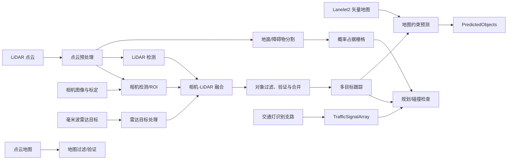

# Autoware 感知算法架构分析

本文基于本仓库当前版本的源码、launch 文件和 package README，说明 Autoware 感知系统如何把多传感器数据转换为可供规划使用的环境模型。重点是运行时的组件边界、数据流、算法选择和工程排障方法；具体 topic、参数默认值和模型文件仍应以实际传感器套件的配置为准。

## 1. 结论先行

Autoware 感知不是一个单体算法，而是一组按数据产品组织的流水线：



核心认识：

1. **对象主链**是检测 -> 过滤/融合 -> 跟踪 -> 预测，最终产生 `PredictedObjects`。
2. **占据栅格**从障碍物点云并行生成，不依赖对象检测结果，适合表达未知障碍物和自由空间风险。
3. **交通灯识别**是独立支路，结合地图中的灯组、相机 ROI、分类结果、遮挡预测和多相机融合，输出信号状态。
4. **运行时链路由 launch 参数决定**。`perception_mode`、LiDAR 检测模型、是否启用 radar 跟踪融合等参数会改变节点图，而不是只改变单个节点内部算法。

### 1.1 perception 包全模块运行时依赖图

下面这张图以 `src/universe/autoware_universe/perception` 下的全部 package 为范围。实线表示数据流或运行时调用关系，虚线表示可选实现、模型后端、调试/评估或地图辅助关系。图中的 detector、merger 和 tracker 并非全部同时启动，实际子图由 `perception_mode`、`lidar_detection_model` 以及各类 `use_*` 参数裁剪得到。

```mermaid
flowchart TB
  %% External inputs and shared runtime context
  subgraph INPUT[外部输入与运行时上下文]
    LIDAR[LiDAR 原始/拼接点云]
    IMAGE[相机图像 image_rect_color]
    INFO[相机内参与外参 TF]
    ROI[相机 ROI]
    RADAR[Radar detected objects/tracks]
    PCMAP[点云地图]
    VECTOR[Lanelet2 矢量地图]
    LOC[定位 TF / map-base_link]
    VEHICLE[车辆参数与感知参数 YAML]
  end

  subgraph COMMON[共同预处理]
    VOX[autoware_pointcloud_preprocessor\nCPU voxel downsample]
    CUDAVOX[ground_segmentation_cuda / CUDA 点云处理]
    PCL[perception_utils / autoware_tensorrt_common\n点云、几何、推理通用能力]
  end
  LIDAR --> VOX
  LIDAR -. CUDA 可选替代 .-> CUDAVOX
  VOX --> PCL
  CUDAVOX --> PCL
  INFO --> PCL
  LOC --> PCL
  VEHICLE -. 参数 .-> PCL

  subgraph SEG[障碍物分割与空间表示]
    GROUND[autoware_ground_segmentation\nray / scan / RANSAC]
    GROUND_CUDA[autoware_ground_segmentation_cuda]
    RAINDROP[autoware_raindrop_cluster_filter]
    ELEV[autoware_elevation_map_loader]
    OCC[autoware_probabilistic_occupancy_grid_map\npointcloud / laserscan / multi-lidar]
    OCC_FILTER[autoware_occupancy_grid_map_outlier_filter]
  end
  PCL --> GROUND
  PCL -. CUDA 可选替代 .-> GROUND_CUDA
  ELEV -. 高程约束 .-> GROUND
  GROUND --> RAINDROP
  GROUND --> OCC
  PCL --> OCC
  OCC --> OCC_FILTER
  OCC_FILTER --> GRID[OccupancyGrid / 障碍物概率]

  subgraph LIDAR_DET[LiDAR 检测器与点云候选生成]
    CENTER[autoware_lidar_centerpoint\nPointPillars + CenterPoint + TensorRT]
    TRANS[autoware_lidar_transfusion\nTransFusion]
    BEV[autoware_bevfusion\nLiDAR 分支/多模态 BEV]
    BEVDET[autoware_tensorrt_bevdet]
    BEVFORMER[autoware_tensorrt_bevformer]
    PT[autoware_ptv3\nPoint Transformer 3D]
    APOLLO[autoware_lidar_apollo_instance_segmentation]
    FRNET[autoware_lidar_frnet]
    EUCLID[autoware_euclidean_cluster\n欧式聚类]
    IRREG[autoware_detection_by_tracker\n基于 tracker 的补充检测]
  end
  PCL --> CENTER
  PCL --> TRANS
  PCL --> BEV
  PCL --> BEVDET
  PCL --> BEVFORMER
  PCL --> PT
  PCL --> APOLLO
  PCL --> FRNET
  GROUND --> EUCLID
  GROUND --> IRREG
  PCMAP -. 地图过滤 .-> CENTER
  PCMAP -. 地图过滤 .-> EUCLID
  LOC -. 坐标 .-> CENTER

  subgraph CAMERA_DET[相机检测与相机-LiDAR 融合]
    YOLOX[autoware_tensorrt_yolox\n2D detection / semantic segmentation]
    CAMCLS[autoware_tensorrt_classifier]
    STREAM[autoware_camera_streampetr\n相机 3D/BEV detector]
    PROJ[autoware_image_projection_based_fusion\n投影 / ROI cluster / PointPainting]
    IMGLOC[autoware_image_object_locator]
    CLUSTER_MERGER[autoware_cluster_merger]
  end
  IMAGE --> YOLOX
  IMAGE --> STREAM
  IMAGE --> IMGLOC
  INFO --> PROJ
  ROI --> PROJ
  ROI --> IMGLOC
  PCL --> PROJ
  GROUND --> PROJ
  YOLOX --> PROJ
  STREAM --> PROJ
  IMGLOC --> PROJ
  PROJ --> CLUSTER_MERGER
  EUCLID --> CLUSTER_MERGER

  subgraph RADAR_PIPE[Radar 处理]
    RADAR_CONVERT[autoware_radar_tracks_msgs_converter]
    RADAR_TRACK[autoware_radar_object_tracker]
    RADAR_FUSE[autoware_radar_fusion_to_detected_object]
    RANGE[autoware_object_range_splitter]
    VELOCITY[autoware_object_velocity_splitter]
    RADAR_SORT[autoware_object_sorter]
  end
  RADAR --> RADAR_CONVERT
  RADAR_CONVERT --> RADAR_TRACK
  RADAR_TRACK --> RADAR_SORT
  RADAR_CONVERT --> RADAR_FUSE
  RADAR_FUSE --> RANGE
  RADAR_FUSE --> VELOCITY
  RADAR_SORT --> RANGE
  RADAR_SORT --> VELOCITY
  VECTOR -. Lanelet 过滤 .-> RADAR_SORT

  subgraph DET_POST[检测后处理、验证与对象融合]
    FEATURE[autoware_detected_object_feature_remover]
    VALID[autoware_detected_object_validation\nobstacle pointcloud / occupancy grid]
    SHAPE[autoware_shape_estimation]
    SIMPLE[autoware_simple_object_merger]
    MERGER[autoware_object_merger\n数据关联与重叠判断]
    TRACK_MERGER[autoware_tracking_object_merger]
    SORTER[autoware_object_sorter]
    OUT[DetectedObjects\n/perception/object_recognition/detection/objects]
  end
  CENTER --> FEATURE
  TRANS --> FEATURE
  BEV --> FEATURE
  BEVDET --> FEATURE
  BEVFORMER --> FEATURE
  PT --> FEATURE
  APOLLO --> FEATURE
  FRNET --> FEATURE
  CLUSTER_MERGER --> FEATURE
  RADAR_FUSE --> FEATURE
  RANGE --> FEATURE
  VELOCITY --> FEATURE
  FEATURE --> VALID
  GROUND --> VALID
  GRID -. 可选验证 .-> VALID
  PCMAP -. 静态点过滤/验证 .-> VALID
  VALID --> SHAPE
  SHAPE --> SIMPLE
  FEATURE --> MERGER
  VALID --> MERGER
  SIMPLE --> MERGER
  MERGER --> SORTER
  TRACK_MERGER --> OUT
  SORTER --> OUT
  OUT --> DETECTED[DetectedObjects]

  subgraph TRACK[时序跟踪]
    MOT[autoware_multi_object_tracker\nmin-cost max-flow / EKF]
    BYTETRACK[autoware_bytetrack\n可选 2D/多目标关联]
    TRACK_INPUT[多 detection channels\n最多 12 路]
    TRACKED[TrackedObjects\n/perception/object_recognition/tracking/objects]
  end
  OUT --> TRACK_INPUT
  RADAR_TRACK --> TRACK_INPUT
  CENTER -. 独立通道 .-> TRACK_INPUT
  CLUSTER_MERGER -. 独立通道 .-> TRACK_INPUT
  TRACK_INPUT --> MOT
  TRACK_INPUT --> BYTETRACK
  MOT --> TRACKED
  BYTETRACK --> TRACKED
  LOC --> MOT

  subgraph PRED[对象未来路径预测]
    MAP_PRED[autoware_map_based_prediction\nLanelet 搜索 / lane follow / lane change]
    SIMPL[autoware_simpl_prediction\n可选简化预测]
    PATH_POST[autoware_predicted_path_postprocessor\n路径平滑/裁剪/后处理]
    PREDICTED[PredictedObjects\n/perception/object_recognition/objects]
  end
  TRACKED --> MAP_PRED
  TRACKED --> SIMPL
  VECTOR --> MAP_PRED
  LOC --> MAP_PRED
  MAP_PRED --> PATH_POST
  SIMPL --> PATH_POST
  PATH_POST --> PREDICTED

  subgraph TL[交通灯识别支路]
    MAP_TL[autoware_traffic_light_map_based_detector\n地图灯位/灯组 ROI]
    FINE[autoware_traffic_light_fine_detector]
    TLCLS[autoware_traffic_light_classifier\nCNN / HSV]
    MCAM[autoware_traffic_light_multi_camera_fusion]
    OCCLUSION[autoware_traffic_light_occlusion_predictor]
    CATEGORY[autoware_traffic_light_category_merger]
    SELECTOR[autoware_traffic_light_selector]
    ARBITER[autoware_traffic_light_arbiter]
    CROSS[autoware_crosswalk_traffic_light_estimator]
    TLVIZ[autoware_traffic_light_visualization]
    SIGNAL[TrafficSignalArray]
  end
  VECTOR --> MAP_TL
  IMAGE --> MAP_TL
  IMAGE --> FINE
  MAP_TL --> FINE
  FINE --> TLCLS
  TLCLS --> CATEGORY
  CATEGORY --> MCAM
  IMAGE --> MCAM
  PCL --> OCCLUSION
  OCCLUSION --> ARBITER
  MCAM --> SELECTOR
  SELECTOR --> ARBITER
  CROSS --> ARBITER
  ARBITER --> SIGNAL
  SIGNAL --> TLVIZ
  VECTOR --> CROSS

  subgraph SUPPORT[基础设施、地图辅助与评估]
    TRT[autoware_tensorrt_common\nONNX/TensorRT engine/runtime]
    TRT_PLUGINS[autoware_tensorrt_plugins\nCUDA/TensorRT custom plugins]
    MAPSEG[autoware_compare_map_segmentation\n地图与感知分割对比]
    ANALYTICS[autoware_perception_online_evaluator\nanalytics / online evaluator]
    UTILS[perception_utils]
  end
  TRT -. 推理后端 .-> CENTER
  TRT_PLUGINS -. 自定义算子 .-> TRT
  TRT -. 推理后端 .-> TRANS
  TRT -. 推理后端 .-> BEV
  TRT -. 推理后端 .-> BEVDET
  TRT -. 推理后端 .-> BEVFORMER
  TRT -. 推理后端 .-> PT
  TRT -. 推理后端 .-> YOLOX
  TRT -. 推理后端 .-> CAMCLS
  PCMAP --> MAPSEG
  GROUND --> MAPSEG
  DETECTED --> ANALYTICS
  TRACKED --> ANALYTICS
  PREDICTED --> ANALYTICS
  SIGNAL --> ANALYTICS
  UTILS -. 通用算法 .-> DET_POST

  classDef input fill:#e8f1ff,stroke:#3566a8,color:#102a43;
  classDef process fill:#eef7ee,stroke:#4d8b57,color:#17351d;
  classDef optional fill:#fff7df,stroke:#c08a17,color:#4b3500;
  classDef output fill:#ffe9e7,stroke:#bd5147,color:#4b1713;
  class LIDAR,IMAGE,INFO,ROI,RADAR,PCMAP,VECTOR,LOC,VEHICLE input;
  class VOX,CUDAVOX,PCL,GROUND,GROUND_CUDA,RAINDROP,ELEV,OCC,OCC_FILTER,CENTER,TRANS,BEV,BEVDET,BEVFORMER,PT,APOLLO,FRNET,EUCLID,IRREG,YOLOX,CAMCLS,STREAM,PROJ,IMGLOC,CLUSTER_MERGER,RADAR_CONVERT,RADAR_TRACK,RADAR_FUSE,RANGE,VELOCITY,RADAR_SORT,FEATURE,VALID,SHAPE,SIMPLE,MERGER,TRACK_MERGER,SORTER,MOT,BYTETRACK,MAP_PRED,SIMPL,PATH_POST,MAP_TL,FINE,TLCLS,MCAM,OCCLUSION,CATEGORY,SELECTOR,ARBITER,CROSS,TRT,MAPSEG,ANALYTICS,UTILS process;
  class GRID,DETECTED,TRACKED,PREDICTED,SIGNAL,OUT output;
```



#### 图的阅读规则

1. **默认主干**：`LIDAR -> VOX -> GROUND/OCC/CENTER(or other detector) -> VALID/MERGER -> MOT -> MAP_PRED`。
2. **检测模式分叉**：`camera`、`lidar`、`radar`、`camera_lidar_fusion`、`lidar_radar_fusion` 和 `camera_lidar_radar_fusion` 只启用相应子图。
3. **替代实现**：CenterPoint、TransFusion、BEVFusion、BEVDet、BEVFormer、PTV3、Apollo、FrNet 和 Euclidean cluster 是 LiDAR/BEV 检测候选，不是串行执行关系。
4. **融合位置**：Radar 可以在 `RADAR_FUSE` 处进入检测合并，也可以保留独立 channel，在 `MOT` 处参与跟踪；由 `use_radar_tracking_fusion` 控制。
5. **并行产品**：`GRID`、`PREDICTED` 和 `SIGNAL` 分别面向自由空间/未知障碍物、动态对象行为和交通信号，不应混为同一个对象列表。
6. **支撑包**：`autoware_tensorrt_common/plugins`、`perception_utils` 和评估包是运行时依赖或观测支路，不代表会产生独立感知对象。

## 2. 代码入口与职责边界

| 层次 | 代码位置 | 主要职责 |
| --- | --- | --- |
| 系统装配 | [`tier4_perception_component.launch.xml`](../src/launcher/autoware_launch/autoware_launch/launch/components/tier4_perception_component.launch.xml) | 创建感知容器、装载全局参数，并把顶层参数传给感知流水线 |
| 感知总编排 | [`perception.launch.xml`](../src/launcher/autoware_launch/tier4_universe_launch/tier4_perception_launch/launch/perception.launch.xml) | 建立 `common`、`obstacle_segmentation`、`occupancy_grid_map`、`object_recognition`、`traffic_light_recognition` 等命名空间 |
| 对象检测选择器 | [`detection.launch.xml`](../src/launcher/autoware_launch/tier4_universe_launch/tier4_perception_launch/launch/object_recognition/detection/detection.launch.xml) | 根据 `mode` 打开 DNN、规则聚类、camera-LiDAR、radar 和 merger 分支 |
| 算法包 | [`src/universe/autoware_universe/perception`](../src/universe/autoware_universe/perception) | 实现检测器、跟踪器、过滤器、融合器、交通灯和占据栅格算法 |
| 稳定接口 | [`autoware_perception_msgs`](../src/core/autoware_msgs/autoware_perception_msgs/msg) | 定义 `DetectedObjects`、`TrackedObjects`、`PredictedObjects` 和交通信号消息 |
| 模型与参数 | `autoware_data`、`autoware_launch/config/perception` | 存放 ONNX/TensorRT 模型、标签文件和参数 YAML |

系统启动时，`sensing-perception` 容器会同时启动 sensing 和 perception launch。感知节点通常以 composable node 方式装入点云容器，并使用 intra-process communication 减少高频点云复制。

## 3. 输入、坐标系与共同前提

### 3.1 主要输入

- **LiDAR**：默认主输入为 `/sensing/lidar/concatenated/pointcloud`，通常已经完成多雷达拼接和基础时间/坐标处理。
- **相机**：`/sensing/camera/cameraN/image_rect_color` 与对应的 `camera_info`；最多可向感知 launch 配置 8 路以上相机，实际使用数由 `image_number` 决定。
- **相机 ROI**：如 `/perception/object_recognition/detection/rois0`，可由相机检测器或交通灯检测器产生。
- **Radar**：默认 `/sensing/radar/detected_objects`，可在检测阶段或跟踪阶段融合。
- **点云地图**：用于过滤静态地图点和验证对象是否有相符的障碍物点。
- **Lanelet2 矢量地图**：用于车道过滤、对象所在车道判断和地图约束预测。
- **TF/定位**：感知必须能把传感器数据转换到 `base_link`、`map` 等目标坐标系；时间戳和 TF 延迟会直接影响融合与跟踪。

### 3.2 消息产品

| 产品 | 消息 | 语义 |
| --- | --- | --- |
| 检测结果 | `autoware_perception_msgs/msg/DetectedObjects` | 当前帧对象，含类别、置信度、形状、位姿和可选速度 |
| 跟踪结果 | `autoware_perception_msgs/msg/TrackedObjects` | 带稳定 ID 和时序状态的对象 |
| 预测结果 | `autoware_perception_msgs/msg/PredictedObjects` | 每个对象的一条或多条带概率未来路径 |
| 交通灯 | `autoware_perception_msgs/msg/TrafficSignalArray` | 灯组及其颜色/形状/置信度状态 |
| 占据栅格 | `nav_msgs/msg/OccupancyGrid` 等栅格接口 | 每个网格的障碍物概率，表达未知或非规则障碍物 |

`DetectedObjects`、`TrackedObjects`、`PredictedObjects` 都是“数组消息”，但不能只看数组本身判断质量，还要检查 header 时间、frame、对象的 shape、existence probability、分类和 kinematics 是否来自同一时间基准。

## 4. 端到端工作流程

### 4.1 点云共同预处理

`perception.launch.xml` 可以把原始拼接点云送入 `autoware_pointcloud_preprocessor` 的 voxel grid downsample；也可以直接把原始点云传给后续模块。CUDA 预处理通过 `cuda_pointcloud_preprocessor` 替代 CPU 版本。

主要权衡是：

- voxel 尺寸越大，计算量和带宽越低，但小目标和边界细节损失越明显；
- CPU 版本便于部署和验证，CUDA 版本降低高频点云处理延迟，但要求 GPU、CUDA 和消息接口配置一致；
- 所有依赖点云的支路应使用同一个预处理输出，否则对象检测、地面分割和占据栅格可能产生时空不一致。

### 4.2 地面与障碍物分割

入口包是 `autoware_ground_segmentation`，输入点云，输出去除地面后的障碍物点云。仓库提供三类主要方法：

- **Ray ground filter**：沿射线利用相邻点的几何关系判断地面，适合规则扫描线点云；
- **Scan ground filter**：与 ray 方法相近，针对扫描处理方式做性能改进；
- **RANSAC ground filter**：把地面近似为平面，适合局部地面近似平坦的场景，但坡道、路缘和起伏地面需要谨慎调参。

启动配置还可以打开单帧过滤或 time-series 过滤。后者能利用时间信息抑制短时噪声，但会引入状态和延迟。该输出同时服务于对象检测中的规则聚类、对象验证以及占据栅格。

### 4.3 对象检测

对象检测由 `detection.launch.xml` 按模式装配。主要分支如下：

| 模式 | 典型算法路径 | 适用特点 |
| --- | --- | --- |
| `lidar` | LiDAR DNN + 欧式聚类/规则检测 + LiDAR merger | 主动三维几何信息完整，适合通用障碍物检测 |
| `camera_lidar_fusion` | LiDAR DNN + 相机检测/分割 + 投影融合 | 用图像类别和语义补强 LiDAR，依赖标定与同步 |
| `lidar_radar_fusion` | LiDAR 检测 + radar 目标 | 速度观测更强，适合运动目标，但要处理 radar 虚警和坐标误差 |
| `camera_lidar_radar_fusion` | 相机、LiDAR、radar 全融合 | 信息最丰富，计算、同步和调参成本也最高 |
| `camera` | 相机检测链路 | 适合相机主导配置，三维距离和遮挡能力受限 |
| `radar` | radar 目标及其跟踪/转换 | 可作为低成本或降级输入，不等价于完整三维语义检测 |

#### LiDAR DNN 检测器

可选实现包括 `autoware_lidar_centerpoint`、`autoware_lidar_transfusion`、`autoware_bevfusion`、`autoware_tensorrt_bevdet`、`autoware_lidar_apollo_instance_segmentation` 和 `autoware_ptv3` 等，实际可用项由 `lidar_detection_model_type` 与模型文件决定。

以 `autoware_lidar_centerpoint` 为例：

1. 将点云编码为 voxel/pillar 特征；
2. 使用 PointPillars 风格 backbone 和 detection head 进行 TensorRT 推理；
3. 做 yaw 解码、类别置信度处理和 IoU/NMS 后处理；
4. 输出 `DetectedObjects`。

该包 README 明确指出，`existence_probability` 实际存放的是 DNN 分类置信度，不应直接解释为严格校准的概率。模型的 voxel 尺寸、类别顺序、输入范围等参数必须与 ONNX/TensorRT 模型匹配。

#### 规则检测与聚类

`autoware_euclidean_cluster` 以障碍物点云为输入，通过欧式距离聚类形成候选对象；配合 outlier、低高度、低强度和图像分割过滤，可减少地面残留、稀疏噪声和反射点造成的误检。`detection_by_tracker` 可以利用已有跟踪结果补回规则检测暂时漏掉的对象，代价是必须严格控制生命周期和误检传播。

#### Camera-LiDAR 融合

仓库同时包含 `autoware_image_projection_based_fusion` 和 BEV/PointPainting 等路径。常见交互是：

1. 用相机内外参把三维点/聚类投影到图像；
2. 从图像检测器获得 2D ROI、类别或语义分割；
3. 按时间同步、投影重叠、距离和类别关系匹配；
4. 将图像语义附着到点云对象，或合并成新的三维对象。

关键风险是标定误差、相机和 LiDAR 时间偏移、遮挡、ROI 不完整，以及不同模型的类别集合不一致。融合前要先验证每个传感器单独输出，再验证投影关系，最后才调融合阈值。

#### Radar 处理

Radar 可在检测阶段通过 `autoware_radar_fusion_to_detected_object` 融合，也可由 `use_radar_tracking_fusion` 推迟到跟踪阶段。配置中还会对远近距离和速度做 splitter，并用 Lanelet2 过滤不合理的 radar 目标。推迟到 tracking 的优点是保留各来源的独立观测通道，便于多通道 tracker 做数据关联；提前融合则可以更早得到统一对象，但错误关联会更早污染主链。

### 4.4 对象过滤、验证与合并

检测结果进入跟踪前通常经过以下处理：

- **点云地图过滤**：移除或标记与静态点云地图一致的点，降低地图静态物被检测成动态物的概率；
- **Lanelet/position 过滤**：根据车道、区域和几何位置排除明显不合理的对象；
- **Obstacle pointcloud validator**：检查对象框内是否确实存在障碍物点；也可用 occupancy grid 做验证；
- **Shape estimation**：根据点云或对象类别估计尺寸和朝向；
- **Object merger**：对不同 detector 输出做重叠判断、类别兼容判断和数据关联，形成统一的 `detection/objects`；
- **Object sorter/splitter**：按距离、速度或来源拆分输入，给不同下游模块使用。

这里的“融合”不只有传感器融合，也包括同一传感器的 DNN、聚类、短距离模型、异常小目标 detector 和 radar 通道的对象合并。

### 4.5 多目标跟踪

代表包是 `autoware_multi_object_tracker`，输入可配置最多 12 个 detection channel。其核心算法是：

1. 对历史 track 做状态预测；
2. 对每个观测和 track 计算代价与门限；
3. 以 maximum score matching / min-cost max-flow 求数据关联；
4. 使用按类别选择的 EKF 更新位置、速度和形状；
5. 管理新建、确认、丢失、删除和类别过渡状态；
6. 输出带稳定 ID 的 `TrackedObjects`。

README 中列出的关联门包括 BEV 面积、Mahalanobis 距离和最大距离。行人、自行车、轿车、大型车辆和 unknown 使用不同模型；某些类别的多个 EKF 会并行运行，以提高类别变化或车辆尺寸不稳定时的连续性。

实践上，跟踪质量主要由三类因素控制：检测漏检率、时间戳/TF 一致性、关联门和生命周期参数。仅调 tracker 往往无法修复前端检测框抖动或错误类别。

### 4.6 对象预测

感知 launch 在 tracking 后加载 `prediction`，典型实现是 `autoware_map_based_prediction`，也可由 `autoware_simpl_prediction` 等方案替换。

Map-based prediction 的步骤是：

1. 根据对象重心、朝向和位置搜索候选 Lanelet；
2. 与历史 Lanelet 关联，维护对象时序和换道证据；
3. 生成 Lane Follow、Left Lane Change、Right Lane Change 等候选路径；
4. 用边界距离、横向速度和到边界的预计时间估计换道概率；
5. 在 Frenet 坐标系中用多项式/最小 jerk 方式平滑路径；
6. 按横向加速度等约束裁剪不可执行路径；
7. 输出带概率的 `PredictedObjects`。

因此预测不仅依赖对象位置和速度，也依赖矢量地图质量、定位结果、历史长度和车辆运动学参数。地图不匹配时，预测错误可能看起来像 tracker 错误，应优先检查对象所在 Lanelet 和 map frame。

### 4.7 概率占据栅格

`autoware_probabilistic_occupancy_grid_map` 从原始点云和障碍物点云构造栅格，并可使用 binary Bayes filter 更新每个格子的障碍物概率。启动参数当前支持：

- `pointcloud_based`：直接利用点云射线和障碍物点；
- `laserscan_based`：先形成 LaserScan，再更新栅格；
- `multi_lidar_pointcloud_based`：分别处理多雷达输入。

占据栅格与对象主链的关系是“并行互补”：对象检测提供类别、速度和形状，栅格提供未知障碍物、不可分类点和自由空间证据。规划或碰撞检查应明确使用的是对象、栅格还是两者融合，避免把空栅格误解为没有障碍物。

### 4.8 交通灯识别

交通灯链路在 `traffic_light_recognition` 命名空间独立启动，典型顺序为：

```text
矢量地图灯组/灯位
    + 相机图像与 ROI
    -> map based detector / whole-image detector
    -> fine detector
    -> car / pedestrian classifier
    -> 多相机融合
    -> 遮挡预测与 arbiter
    -> TrafficSignalArray
```

`autoware_traffic_light_classifier` 支持 CNN（EfficientNet-b1、MobileNet-v2）和 HSV 分类。空 ROI 或被判断为背光时，输出会降为 UNKNOWN 和低置信度，而不是强行猜测颜色。遮挡预测器还会使用点云判断灯具是否被车辆或其他物体遮挡；arbiter 负责在多来源结果和时间状态之间选择最终结果。

交通灯支路不是普通 3D object detector 的简单类别扩展：它需要地图中灯组关系、车辆行驶方向和信号语义，因此调试时要同时检查地图匹配、ROI、分类和 arbiter 状态。

## 5. 关键运行时交互

### 5.1 推荐关注的 topic 链

不同 sensor kit 会重映射 topic，下面是默认 launch 中最有代表性的路径：

```text
/sensing/lidar/concatenated/pointcloud
  -> /perception/obstacle_segmentation/pointcloud
  -> /perception/object_recognition/detection/*/objects
  -> /perception/object_recognition/tracking/objects
  -> /perception/object_recognition/objects

/perception/obstacle_segmentation/pointcloud
  -> /perception/occupancy_grid_map/map

/sensing/camera/cameraN/image_rect_color
  -> /perception/object_recognition/detection/roisN
  -> camera-LiDAR fusion / traffic light recognition
```

真实运行时应使用 `ros2 topic list`、`ros2 topic info` 和 `ros2 topic echo --once` 逐段确认；不要只依据 topic 名称推断某个模块已经启动，因为 launch 的 mode 和开关可能使该 topic 不发布。

### 5.2 影响拓扑的关键开关

| 参数 | 影响 |
| --- | --- |
| `perception_mode` | 选择 camera、LiDAR、radar 及融合组合 |
| `lidar_detection_model` | 选择 `centerpoint`、`bevfusion`、`transfusion`、`apollo`、`clustering` 等实现/模型 |
| `use_multi_channel_tracker_merger` | 是否保留多检测通道交给 tracker 合并，而不是在 detection 侧先合并 |
| `use_radar_tracking_fusion` | radar 在 detection 阶段还是 tracking 阶段融合 |
| `use_detection_by_tracker` | 是否用 track 辅助生成补充检测 |
| `use_object_validator` | 是否启用障碍物点云/栅格验证 |
| `use_pointcloud_map` | 是否使用点云地图过滤或验证 |
| `use_vector_map` | 是否让预测使用 Lanelet2 地图 |
| `use_traffic_light_recognition` | 是否启动交通灯整条支路 |
| `use_obstacle_segmentation_time_series_filter` | 是否引入分割时序状态和额外延迟 |

排查问题时，先记录这些开关的实际值，再比较 topic 图；同一个包在不同 mode 下可能根本没有被 launch。

## 6. 算法选择与工程权衡

| 目标 | 优先选择 | 主要代价 |
| --- | --- | --- |
| 低延迟三维检测 | TensorRT CenterPoint / TransFusion 的轻量模型 | 需要 GPU、模型与参数严格匹配 |
| 小目标和图像语义 | PointPainting、image projection fusion、BEV fusion | 标定、同步和显存压力更敏感 |
| 速度估计和远距离运动目标 | LiDAR + radar tracking fusion | radar 虚警和数据关联复杂 |
| 未知障碍物和自由空间 | 地面分割 + occupancy grid | 不能天然提供稳定类别和对象 ID |
| 稳定对象 ID | multi-object tracker + 合理检测通道 | 对漏检、时间戳和门限很敏感 |
| 路网内车辆行为预测 | map-based prediction | 依赖高质量 Lanelet2 地图与定位 |
| 资源不足的降级运行 | 关闭非必要融合、采用轻量模型或 radar-only | 精度、类别和三维定位能力下降 |

## 7. 可操作的阅读、启动和排障流程

### 7.1 阅读源码顺序

1. 先看 [`tier4_perception_component.launch.xml`](../src/launcher/autoware_launch/autoware_launch/launch/components/tier4_perception_component.launch.xml) 的参数入口。
2. 再看 [`perception.launch.xml`](../src/launcher/autoware_launch/tier4_universe_launch/tier4_perception_launch/launch/perception.launch.xml) 的命名空间和模块分叉。
3. 根据 `perception_mode` 进入 [`detection.launch.xml`](../src/launcher/autoware_launch/tier4_universe_launch/tier4_perception_launch/launch/object_recognition/detection/detection.launch.xml)。
4. 对当前模式只追一条 detector 输出到 tracker 输入，避免同时阅读所有可选模型。
5. 最后查看对应包 README、schema 和参数 YAML，确认算法假设、类别顺序和模型输入。

### 7.2 运行时排障顺序

```text
传感器频率/时间戳
    -> TF 与 frame
    -> 点云/图像单独可视化
    -> 地面分割输出
    -> detector 原始 objects
    -> validator/merger 输出
    -> tracker ID 和速度
    -> prediction Lanelet 与路径
    -> planner 实际消费的 topic
```

对应的快速检查：

- **没有对象**：先确认 detector 分支是否因 `mode` 未打开、模型路径错误或点云 topic 重映射失败而未启动。
- **对象漂移/跳 ID**：检查 header 时间、TF 延迟、点云拼接顺序、tracker 关联门和输入 channel 配置。
- **融合错位**：分别显示相机、投影点和 LiDAR 框，优先检查内外参、时间同步和 frame，而不是先调置信度。
- **地面误检**：比较 raw pointcloud、ground segmentation output 和 occupancy map，检查坡道、路缘、雨雪和点云稀疏性。
- **交通灯 UNKNOWN**：按地图灯位 -> ROI -> classifier -> multi-camera fusion -> arbiter 顺序定位。
- **预测方向错误**：检查对象速度/朝向、Lanelet 匹配、地图坐标系和 lane-change 参数。
- **延迟过高**：分别测量点云预处理、TensorRT、融合、tracker 和栅格更新的 processing time；不要只看端到端频率。

### 7.3 验证与回归

建议每次更改模型或参数都保留一组固定 rosbag，并分别比较：检测召回率/误检率、跟踪 ID 切换、速度误差、预测路径概率、交通灯 UNKNOWN 比例、占据栅格稳定性和端到端延迟。包级测试可以参考：

- `autoware_multi_object_tracker` 的 gtest 和性能 benchmark；
- `autoware_probabilistic_occupancy_grid_map` 的输入输出及 Bayes 更新测试；
- 各 TensorRT detector 的模型 engine 构建与单包推理检查；
- 在 RViz 中同时显示 TF、原始点云、障碍物点云、检测框、跟踪 ID、预测路径和栅格。

## 8. 当前架构的限制与注意事项

- 许多实现、模型和参数是传感器套件相关的，目录中存在不代表默认 launch 一定启用。
- 模型置信度、对象存在概率和融合后的概率未必经过统一校准，不能跨 detector 直接比较。
- 预测和过滤强依赖地图与定位；感知问题有时实际来自 map frame、TF 或 Lanelet 数据。
- 感知 launch 同时承载多个历史兼容路径，topic 名称和参数名可能随版本迁移；调试时以当前 launch 的 remap 为准。
- 端到端安全性不能由单个检测器保证，需要对象、栅格、地图、定位和规划验证共同参与。

## 9. 相关源码索引

- [`src/universe/autoware_universe/perception`](../src/universe/autoware_universe/perception)
- [`tier4_perception_launch`](../src/launcher/autoware_launch/tier4_universe_launch/tier4_perception_launch)
- [`autoware_lidar_centerpoint/README.md`](../src/universe/autoware_universe/perception/autoware_lidar_centerpoint/README.md)
- [`autoware_multi_object_tracker/README.md`](../src/universe/autoware_universe/perception/autoware_multi_object_tracker/README.md)
- [`autoware_ground_segmentation/README.md`](../src/universe/autoware_universe/perception/autoware_ground_segmentation/README.md)
- [`autoware_probabilistic_occupancy_grid_map/README.md`](../src/universe/autoware_universe/perception/autoware_probabilistic_occupancy_grid_map/README.md)
- [`autoware_map_based_prediction/README.md`](../src/universe/autoware_universe/perception/autoware_map_based_prediction/README.md)
- [`autoware_traffic_light_classifier/README.md`](../src/universe/autoware_universe/perception/autoware_traffic_light_classifier/README.md)
- [`autoware_perception_msgs/msg`](../src/core/autoware_msgs/autoware_perception_msgs/msg)