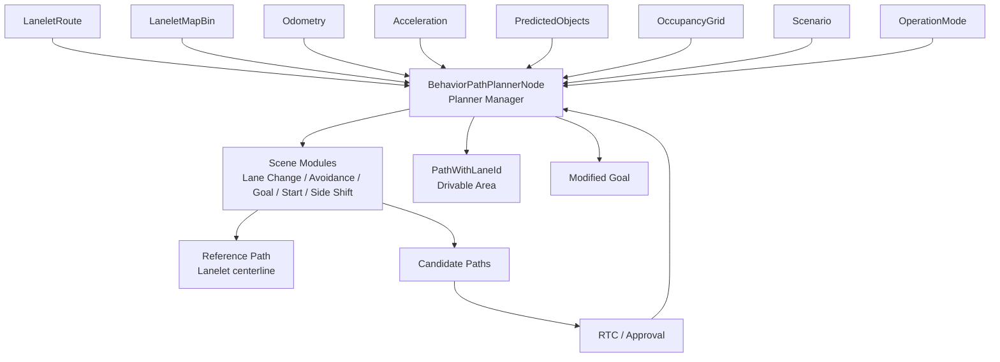

# Autoware Behavior Path Planner 算法详细分析

本文基于当前工作区的 Behavior Path Planner 源码、README、路径生成设计文档、安全检查设计文档、launch 和参数文件，分析其主要组成、数学原理、运行流程、输入输出、关键参数和实际应用表现。

## 1. 核心定位

Behavior Path Planner 的职责是：**在 Mission Planner 给出的 LaneletRoute 和当前交通环境约束下，决定车辆的横向驾驶行为，并输出带 lane id 的可行驶路径、drivable area 以及转向灯/危险灯相关命令。**

它主要回答：

- 是否保持当前车道。
- 是否需要换道。
- 是否需要绕过静态或动态障碍物。
- 是否执行起步、靠边、侧向平移或目标区域行为。
- 当前候选行为是否通过碰撞、间隙、边界和车辆运动学检查。

它不负责最终速度曲线的全部生成。红灯、横道、路口停车等速度规则由 Behavior Velocity Planner 进一步处理，轨迹曲率和速度可执行性还会经过 Motion Planning 和 Velocity Smoother。

## 2. 运行时架构

### 2.1 主要代码包

```text
src/universe/autoware_universe/planning/behavior_path_planner/
├── autoware_behavior_path_planner/                    # 主节点与 Planner Manager
├── autoware_behavior_path_planner_common/             # 公共数据结构、path shift、安全检查
├── autoware_behavior_path_lane_change_module/         # 左右换道
├── autoware_behavior_path_static_obstacle_avoidance_module/
├── autoware_behavior_path_dynamic_obstacle_avoidance_module/
├── autoware_behavior_path_avoidance_by_lane_change_module/
├── autoware_behavior_path_external_request_lane_change_module/
├── autoware_behavior_path_goal_planner_module/
├── autoware_behavior_path_start_planner_module/
├── autoware_behavior_path_sampling_planner_module/
├── autoware_behavior_path_side_shift_module/
└── autoware_behavior_path_bidirectional_traffic_module/
```

### 2.2 主节点和 Scene Module Manager

`BehaviorPathPlannerNode` 通常作为一个 composable node 启动，多个 scene module 不是多个独立 ROS 节点，而是由同一个 Planner Manager 通过 pluginlib/模块列表管理。



Planner Manager 的核心职责：

1. 根据当前情况激活相关 scene module。
2. 管理模块的生命周期和状态。
3. 决定多个同时运行模块的执行顺序和优先级。
4. 合并多个模块生成的候选 path。
5. 在 approval/RTC 未满足时保持候选路径而不立即执行。
6. 发布最终 path、drivable area、灯光命令和 debug 信息。

### 2.3 默认 launch 装配

入口文件：

```text
src/launcher/autoware_launch/tier4_universe_launch/tier4_planning_launch/launch/
  scenario_planning/lane_driving/behavior_planning/behavior_planning.launch.xml
```

该文件先根据 `launch_*_module` 参数组装 `behavior_path_planner_launch_modules`，再把模块列表作为 `launch_modules` 参数传给 `BehaviorPathPlannerNode`。因此：

- 包存在不代表模块运行。
- 模块是否运行取决于 preset、launch 条件和运行时参数。
- 多个模块可能在同一个容器和同一个主节点内协作。

## 3. 输入输出接口

### 3.1 输入

| 输入                           | 类型                                              | 作用                                                  |
| ------------------------------ | ------------------------------------------------- | ----------------------------------------------------- |
| `~/input/route`              | `autoware_planning_msgs/msg/LaneletRoute`       | 当前任务路线、preferred lane 和可换道 lanelet         |
| `~/input/vector_map`         | `autoware_map_msgs/msg/LaneletMapBin`           | Lanelet 几何、道路边界、车道属性和交通语义            |
| `~/input/odometry`           | `nav_msgs/msg/Odometry`                         | ego pose、速度、姿态和最近路径点                      |
| `~/input/accel`              | `geometry_msgs/msg/AccelWithCovarianceStamped`  | 车辆当前加速度和运动状态判断                          |
| `~/input/perception`         | `autoware_perception_msgs/msg/PredictedObjects` | 车辆、行人等动态/静态目标                             |
| `~/input/occupancy_grid_map` | `nav_msgs/msg/OccupancyGrid`                    | 目标区域、遮挡或局部可行驶空间判断                    |
| `~/input/costmap`            | `nav_msgs/msg/OccupancyGrid`                    | 停车/避障相关 costmap                                 |
| `~/input/traffic_signals`    | `TrafficLightGroupArray`                        | 行为模块和后续速度模块的交通灯状态                    |
| `~/input/scenario`           | `Scenario`                                      | 只有当前场景为 LaneDriving 时才运行 lane-driving 行为 |
| operation mode                 | `OperationModeState`                            | 判断是否自动模式、是否允许模块执行/审批               |
| lateral offset                 | `tier4_planning_msgs/msg/LateralOffset`         | 可选的 side shift 请求                                |

上层 launch 的典型 remap 为：

```text
/planning/mission_planning/route
/map/vector_map
/localization/kinematic_state
/localization/acceleration
/perception/object_recognition/objects
/perception/occupancy_grid_map/map
/planning/scenario_planning/scenario
```

### 3.2 输出

| 输出                              | 类型                                                   | 含义                                   |
| --------------------------------- | ------------------------------------------------------ | -------------------------------------- |
| `~/output/path`                 | `autoware_internal_planning_msgs/msg/PathWithLaneId` | 最终行为路径、lane id 和 drivable area |
| `~/output/turn_indicators_cmd`  | `autoware_vehicle_msgs/msg/TurnIndicatorsCommand`    | 转向灯命令                             |
| `~/output/hazard_lights_cmd`    | `autoware_vehicle_msgs/msg/HazardLightsCommand`      | 危险灯命令                             |
| `~/output/modified_goal`        | `autoware_planning_msgs/msg/PoseWithUuidStamped`     | 需要 Mission Planner 修改目标时的请求  |
| `~/output/reroute_availability` | `tier4_planning_msgs/msg/RerouteAvailability`        | 当前候选行为是否可安全触发 reroute     |
| debug path candidate              | `autoware_planning_msgs/msg/Path`                    | approval 前候选路径                    |
| debug marker/message              | MarkerArray 或 debug message                           | 边界、最大可行驶区域、避障/换道原因    |

在当前 launch 下，主要输出通常展开为：

```text
/planning/scenario_planning/lane_driving/behavior_planning/path_with_lane_id
/planning/turn_indicators_cmd
/planning/scenario_planning/modified_goal
/planning/scenario_planning/status/stop_reasons
```

## 4. 工作流程和模块生命周期

### 4.1 单周期流程

```text
1. 接收 route、map、odometry、objects、scenario 等输入
2. 将 ego pose 投影到 route 和 lanelet map
3. 生成参考路径和静态 drivable area
4. 更新每个 Scene Module 的注册/激活/运行状态
5. 对 active module 生成 candidate path
6. 做碰撞、间隙、边界、曲率和状态一致性检查
7. 处理 RTC approval 和自动模式权限
8. 按模块优先级合并 path shift、lane change、avoidance 等结果
9. 生成 lane id、drivable area、turn/hazard signal
10. 发布 path 和 debug 输出
```

### 4.2 状态机抽象

单个 Scene Module 可以抽象为：

```text
IDLE
  -> candidate / registered
  -> APPROVAL_REQUIRED
  -> RUNNING
  -> SUCCESS
  -> FAILURE / ABORT
```

管理器在每个周期根据模块的 `isExecutionRequested()`、`isReady()`、`isSafe()` 和 approval 状态选择行为。实际类名和细节因模块不同而不同，但基本规律是：

- candidate path 不等于 approved path。
- 模块可以提前注册，等场景条件满足后再执行。
- 当前执行中的模块可能因为安全条件恶化而取消或切换。
- 多模块并发时，管理器必须解决路径修改范围重叠问题。

## 5. 主要 Scene Module

### 5.1 Lane Following

Lane Following 以 route preferred lanelet 的 centerline 或参考路径为基础，生成基础 path。它是没有特殊行为模块时的默认路径来源。

数学上可将参考中心线写成弧长参数曲线：

$$
r(s)=[x_r(s),y_r(s)],\qquad s\in[0,S]
$$

参考航向为：

$$
\psi_r(s)=\operatorname{atan2}\left(\frac{dy_r}{ds},\frac{dx_r}{ds}\right)
$$

其他行为模块通常在此基础上产生横向偏移，而不是重新规划任务 route。

### 5.2 Lane Change

`autoware_behavior_path_lane_change_module` 负责左右换道：

- 选择目标同向 lanelet。
- 检查前方和后方车辆的间隙。
- 生成准备段、换道段和完成段。
- 等待 RTC/外部 approval（若配置要求）。
- 执行过程中持续检查安全条件。

抽象状态可以写成：

$$
\text{Prepare}\rightarrow\text{Shift}\rightarrow\text{Finish}
$$

目标路径由参考路径加横向 shift 构成：

$$
p(s)=r(s)+l(s)n(s)
$$

其中 $l(s)$ 从 0 平滑变化到目标车道横向偏移 $L$。

### 5.3 External Request Lane Change

`autoware_behavior_path_external_request_lane_change_module` 接收外部换道请求，并复用换道的目标车道、安全间隙、候选路径和 approval 逻辑。外部请求不会跳过安全检查；请求只是行为意图来源，最终是否执行仍由模块状态和安全判断决定。

### 5.4 Static Obstacle Avoidance

`autoware_behavior_path_static_obstacle_avoidance_module` 在车道内生成横向绕行 path，适合路边停放车辆、静态障碍物或道路局部阻塞。

基本几何约束是车辆 footprint 不得与安全膨胀后的障碍物相交：

$$
F(p(s))\cap\left(\mathcal O\oplus B(r_{safe})\right)=\varnothing
$$

其中 $F(p(s))$ 是车辆在路径位置 $s$ 的 footprint，$\mathcal O$ 是障碍物区域，$B(r_{safe})$ 是安全余量膨胀。

若可用道路宽度不足，模块不应强行生成越界 path，可能转而等待 Motion Velocity Planner 停车。

### 5.5 Avoidance by Lane Change

`autoware_behavior_path_avoidance_by_lane_change_module` 在道路内横向绕行不够安全或不够可行时，选择通过换道避开障碍物。它连接了：

```text
障碍物检测
  -> 道路内避障可行性判断
  -> 目标车道搜索
  -> 换道安全检查
  -> lane change path
```

该模块与 Static Obstacle Avoidance 可能竞争，最终由 Manager 的执行顺序和模块条件决定采用哪种策略。

### 5.6 Dynamic Obstacle Avoidance

`autoware_behavior_path_dynamic_obstacle_avoidance_module` 面向动态目标生成横向避让，但当前 README 将其标记为 WIP，且默认 preset 中通常关闭或仅在仿真/实验中使用。动态目标安全检查还依赖预测轨迹质量，因此不能只根据当前目标位置判断。

### 5.7 Goal Planner

`autoware_behavior_path_goal_planner_module` 处理车辆当前在 driving lane、而最终 goal 位于 shoulder lane 或目标区域的情况，负责生成驶向目标的 path，并配合停车行为。

它可能输出 `modified_goal`，让 Mission Planner 重新构造 route。此时必须注意：Behavior Path Planner 触发的是路线层修改请求，新的最终 path 仍要重新经过 Mission/Scenario/Motion 链路。

### 5.8 Start Planner

`autoware_behavior_path_start_planner_module` 处理车辆静止且 footprint 位于 shoulder 的起步场景，生成从肩道并入道路的 path。其结束条件通常是车辆完成并入并回到正常 driving lane。

### 5.9 Side Shift

`autoware_behavior_path_side_shift_module` 根据外部 lateral offset 指令生成侧向平移 path，常用于远程控制、特殊车辆或操作员干预。

若参考路径为 $r(s)$，请求侧移量为 $L$，则：

$$
p_{shift}(s)=r(s)+l(s)n(s),
\qquad l(s_{start})=0,\quad l(s_{end})=L
$$

它仍需满足横向加速度、jerk、道路边界和障碍物安全检查。

### 5.10 Sampling Planner

`autoware_behavior_path_sampling_planner_module` 通过采样多个横向候选或行为候选，再按可行性和代价选择最佳 path：

$$
p^*=\arg\min_{p\in\mathcal P_{valid}}J(p)
$$

常见代价包括：

$$
J=w_dJ_{deviation}+w_cJ_{curvature}+w_oJ_{obstacle}+w_bJ_{boundary}+w_aJ_{action}
$$

默认 preset 通常将其作为实验模块关闭，因为候选数量、计算时间和参数敏感性需要额外验证。

### 5.11 Bidirectional Traffic

`autoware_behavior_path_bidirectional_traffic_module` 处理临时借道、双向交通或狭窄道路中的方向性行为，核心是扩展可行驶 lanelet 集合并约束车辆与对向交通的几何关系。其输出仍是普通 Behavior Path，不是独立的任务路线。

## 6. Path Shift 的数学原理

Behavior Path Planner 的重要共性算法是通过平滑 lateral shift 生成换道和避障 path。设计文档采用 constant-jerk profile。

### 6.1 横向运动模型

设横向位移为 $l(t)$，横向速度为 $v_l(t)$，横向加速度为 $a_l(t)$，横向 jerk 为 $j_l(t)$：

$$
\dot l=v_l,\qquad \dot v_l=a_l,\qquad \dot a_l=j_l
$$

在一段 constant jerk 区间内，若初始横向速度和加速度为零，则：

$$
a_l(t)=j_lt
$$

$$
v_l(t)=\frac{1}{2}j_lt^2
$$

$$
l(t)=\frac{1}{6}j_lt^3
$$

完整 shift 通常由对称的 jerk、constant acceleration 和反向 jerk 段组成。用 $T_j$ 表示 constant jerk 时间，用 $T_a$ 表示 constant acceleration 时间，用 $T_v$ 表示 constant lateral velocity 时间，最终 shift length 为 $L$。

当前实现通常忽略 $T_v$，因为绝大多数换道和绕障不需要长时间保持横向速度。

### 6.2 对称 shift 的关键公式

在没有横向速度和加速度额外约束、且 $T_a=T_v=0$ 时：

$$
T_j=\frac{T_{total}}{4}
$$

$$
L=2j_lT_j^3
$$

最大横向加速度为：

$$
a_{l,max}=j_lT_j
$$

因此：

$$
a_{l,max}=\frac{8L}{T_{total}^2}
$$

这个关系说明：在固定横向 shift 距离 $L$ 下，缩短换道时间会以平方关系增大横向加速度，乘坐舒适性和稳定性会变差。

### 6.3 有横向加速度限制时

在 $T_v=0$、最大横向加速度限制为 $a_{lim}^{lat}$ 时，设计文档给出的 shift 关系为：

$$
L=2j_lT_j^3+3j_lT_aT_j^2+j_lT_a^2T_j
$$

$$
a_{lim}^{lat}=j_lT_j
$$

$$
T_{total}=4T_j+2T_a
$$

由此可解：

$$
T_j=\frac{T_{total}}{2}-\frac{2L}{a_{lim}^{lat}T_{total}}
$$

$$
T_a=\frac{4L}{a_{lim}^{lat}T_{total}}-\frac{T_{total}}{2}
$$

$$
j_l=\frac{2(a_{lim}^{lat})^2T_{total}}
{a_{lim}^{lat}T_{total}^2-4L}
$$

实际使用时，必须检查 $T_j\geq0$、$T_a\geq0$ 以及 jerk、加速度和道路长度约束是否同时可行。

### 6.4 从 jerk 和加速度反求换道时间

若给定横向 jerk 上限 $j_l$、横向加速度上限 $a_{lim}^{lat}$ 和 shift length $L$：

$$
T_j=\frac{a_{lim}^{lat}}{j_l}
$$

$$
T_a=\frac{1}{2}\sqrt{\left(\frac{a_{lim}^{lat}}{j_l}\right)^2+
\frac{4L}{a_{lim}^{lat}}}
-\frac{3a_{lim}^{lat}}{2j_l}
$$

$$
T_{total}=4T_j+2T_a
$$

这组公式直接连接了配置参数和行为表现：增大允许 jerk 或加速度，通常会缩短完成同一横向偏移所需时间；但实际仍受可用纵向距离、目标车道安全间隙和道路边界限制。

## 7. 碰撞与安全检查数学原理

### 7.1 预测位置插值

对目标 predicted path，在时刻 $t$ 通过相邻预测点插值获得目标 pose、速度和 yaw。Behavior Path Planner 依赖目标预测点的方向大致指向下一个点；如果预测 yaw 与轨迹切向方向严重不一致，安全检查可能出现边界误判。

### 7.2 前后车辆判断

将 ego 和目标车辆投影到当前参考 path 的弧长坐标 $s$，比较车辆 footprint 前端的弧长位置：

$$
s_{front}=\max_{p\in F}s(p)
$$

弧长更大的车辆视为前车，另一辆视为后车。该关系用于判断谁需要预留制动距离。

### 7.3 最小安全制动距离

设计文档给出的安全制动距离为：

$$
d_{braking}=v_{rear}(t_{reaction}+t_{margin})
+\frac{v_{rear}^2}{2|a_{rear,decel}|}
-\frac{v_{front}^2}{2|a_{front,decel}|}
$$

其中：

- $v_{front}$、$v_{rear}$ 是前后车辆速度。
- $a_{front,decel}$、$a_{rear,decel}$ 是最大减速度。
- $t_{reaction}$ 是系统/驾驶行为反应时间。
- $t_{margin}$ 是安全余量。

该式由三部分组成：后车在反应期间行驶的距离、后车制动距离、减去前车同步制动后已经让出的距离。如果后车更快或后车减速度能力更弱，所需安全距离变大。

### 7.4 多边形扩展和重叠

安全检查将车辆表示为多边形。对后车 polygon 做：

- 沿纵向扩展 $d_{braking}$。
- 沿横向扩展安全 margin。

设扩展后的后车区域为 $F_{rear}^{+}$，前车区域为 $F_{front}$，则：

$$
F_{rear}^{+}\cap F_{front}\neq\varnothing
\Rightarrow \text{candidate path unsafe}
$$

同时还会先检查当前时刻是否已经发生 footprint overlap。该逻辑被 Lane Change、Avoidance 等模块复用，用于 candidate path 和执行中 path 的安全检查。

## 8. Drivable Area 生成

Behavior Path Planner 不只发布一条中心线 path，也生成车辆允许活动的 drivable area。静态 drivable area 通常由 lanelet polygon、车辆 footprint、障碍物和当前行为的额外空间共同决定。

可抽象为：

$$
\mathcal D_{behavior}=\mathcal D_{lane}\oplus\mathcal E_{behavior}
$$

其中 $\mathcal D_{lane}$ 是车道可行驶区域，$\mathcal E_{behavior}$ 是当前行为所需扩展，例如绕过障碍物所需的侧向空间。最终 path 必须满足：

$$
F(p(s))\subseteq\mathcal D_{behavior}
$$

这样可以限制 avoidance path 不要无限扩展到 lanelet 外部，同时为必要的局部绕障保留空间。

## 9. 关键参数与调参方法

### 9.1 公共 Behavior Path 参数

文件：

```text
autoware_behavior_path_planner/config/behavior_path_planner.param.yaml
```

| 参数                                         |      当前值 | 作用                          |
| -------------------------------------------- | ----------: | ----------------------------- |
| `planning_hz`                              |    `10.0` | 行为路径更新频率              |
| `backward_path_length`                     |   `5.0 m` | 输出 path 向后保留长度        |
| `forward_path_length`                      | `300.0 m` | 输出 path 向前长度            |
| `minimum_pull_over_length`                 |  `16.0 m` | pull-over 行为所需最小长度    |
| `refine_goal_search_radius_range`          |   `7.5 m` | 目标附近 lanelet 搜索范围     |
| `input_path_interval`                      |   `2.0 m` | 输入路径点间隔                |
| `output_path_interval`                     |   `2.0 m` | 输出路径点间隔                |
| `traffic_light_signal_timeout`             |   `1.0 s` | 交通灯输入过期时间            |
| `turn_signal_intersection_search_distance` |  `30.0 m` | 路口转向灯搜索范围            |
| `turn_signal_search_time`                  |   `3.0 s` | 转向灯行为预测时间            |
| `turn_signal_shift_length_threshold`       |   `0.3 m` | 触发侧向行为灯光的 shift 阈值 |
| `turn_signal_on_swerving`                  |    `true` | 绕行时是否打开转向灯          |

### 9.2 Scene Module 参数

主要配置目录：

```text
src/launcher/autoware_launch/autoware_launch/config/planning/
  scenario_planning/lane_driving/behavior_planning/behavior_path_planner/
```

重点参数类别：

| 类别             | 调整对象                                   | 典型表现                         |
| ---------------- | ------------------------------------------ | -------------------------------- |
| Lane Change      | 准备距离、换道长度、前后安全距离、approval | 换道触发时机、完成距离、等待时间 |
| Static Avoidance | 障碍物检测距离、横向余量、偏移上限         | 绕行是否触发、路径偏移大小       |
| Avoidance by LC  | 可绕行宽度、目标车道和换道间隙             | 道路内绕行与换道之间的选择       |
| Goal/Start       | pull-over、pull-out、目标搜索范围          | 靠边停车和起步并入行为           |
| Side Shift       | shift distance、shift duration、边界限制   | 外部侧移响应和平滑性             |
| Scene Manager    | 模块优先级、状态保持、approval             | 多模块同时触发时的最终行为       |

### 9.3 调参原则

一次只修改一个参数或一个明确的模块参数组，并记录：

```text
地图、车辆模型、初始速度
route 和 objects 输入
原始/修改后的 YAML
module 状态和 approval 状态
candidate/reference/final path
stop reason、debug marker 和控制表现
```

不要只看最终 path：如果 path 没有变化但车辆行为变慢，原因可能在 Behavior Velocity 或 Motion Velocity；如果 candidate path 变化但 final path 不变，可能是 approval 或安全检查没有通过。

## 10. 实际应用表现

### 10.1 正常跟车和车道保持

没有特殊模块激活时，输出接近 route preferred lane 的参考中心线，保持稳定 lane id 和相对平滑曲率。定位抖动或 map lanelet 几何不连续会直接表现为 path 抖动。

### 10.2 静态障碍物

道路宽度足够时，常见表现是：

```text
障碍物出现
  -> static avoidance candidate
  -> safety/footprint check
  -> approval 或自动执行
  -> path 横向偏移
```

道路空间不足时，模块可能不生成绕行 path，而由下游速度规划减速/停车。这不是模块失效，而是几何约束下没有有效解。

### 10.3 换道

换道行为通常先进入准备阶段，等待目标车道前后间隙满足条件。即使 lane-change candidate 已经存在，未经 approval 时也可能继续沿原 path 行驶。实际表现受以下因素共同影响：

- 目标车道 lanelet 是否在 Mission route 的 primitives 中。
- 前后目标车辆的速度和预测 path。
- 当前速度和可用换道距离。
- lateral jerk/acceleration 限制。
- operation mode 和 RTC approval。

### 10.4 目标区域和靠边

接近 shoulder goal 时，Goal Planner 可能生成 pull-over path 并发布 modified goal；起步时 Start Planner 可能生成从 shoulder 回到 driving lane 的 path。该类行为通常比普通 lane following 对地图 shoulder、车辆 footprint 和纵向空间更敏感。

### 10.5 动态目标

动态避障模块的实际表现高度依赖 predicted objects：

- 目标速度或 yaw 不稳定，会导致 candidate path 频繁变化。
- 预测 horizon 太短，可能无法提前生成横向避让。
- 安全制动距离过于保守，会造成频繁等待或停车。
- 默认模块关闭时，系统可能只执行纵向 slowdown/stop，而不会横向绕行。

## 11. 可操作的调试流程

### 11.1 最小 topic 检查

```bash
ros2 node list | grep behavior_path_planner
ros2 topic info /planning/scenario_planning/lane_driving/behavior_planning/path_with_lane_id -v
ros2 topic echo /planning/scenario_planning/lane_driving/behavior_planning/path_with_lane_id --once
ros2 topic echo /planning/scenario_planning/modified_goal --once
ros2 topic echo /planning/scenario_planning/status/stop_reasons --once
ros2 topic list | grep -E 'path_candidate|path_reference|lane_change|avoidance'
```

### 11.2 状态和参数检查

```bash
ros2 param list /planning/scenario_planning/lane_driving/behavior_planning/behavior_path_planner
ros2 param get /planning/scenario_planning/lane_driving/behavior_planning/behavior_path_planner planning_hz
ros2 topic echo /planning/behavior_path_planner/reroute_availability --once
ros2 topic echo /planning/turn_indicators_cmd --once
```

如果模块是 plugin，不一定会出现在 `ros2 node list` 中；应查看主节点的 `launch_modules`、debug message 和 Manager transition 信息。将公共参数中的 `verbose` 打开，可以观察 registered、approved、candidate 和 executing module 状态。

### 11.3 三个可复现实验

#### 实验 A：静态障碍物绕行

1. 在安全仿真场景中放置静态障碍物。
2. 记录 reference path、candidate path 和最终 path。
3. 比较关闭/开启 static avoidance 时的横向 shift、drivable area 和 module state。
4. 确认道路宽度不足时是否转为速度减速/停车。

#### 实验 B：换道安全间隙

1. 在目标车道分别设置空车道、前车、后车和前后车组合。
2. 记录 candidate path、approval、lane-change debug message 和最终 lane id。
3. 改变目标车速度或安全距离参数，比较触发位置和等待时间。
4. 验证最终 candidate 不会通过扩展后的后车 polygon 与前车 polygon 重叠检查。

#### 实验 C：侧向 shift 舒适性

1. 固定 shift length $L$，改变 shift duration $T_{total}$。
2. 根据 $a_{l,max}=8L/T_{total}^2$ 预估横向加速度变化。
3. 对比 path curvature、lateral acceleration、jerk 和控制跟踪误差。
4. 检查较短 duration 是否导致 boundary check 或 safety check 失败。

## 12. 常见问题定位

| 现象                 | 首先检查                                          | 可能原因                                       |
| -------------------- | ------------------------------------------------- | ---------------------------------------------- |
| 没有 path            | route、scenario、map、odometry                    | 输入未 ready、当前不是 LaneDriving、模块未启动 |
| path 仍沿原车道      | module state、candidate path、approval            | 场景条件未满足、候选不安全、等待 RTC           |
| 绕行路径越界         | drivable area、vehicle footprint、avoidance 参数  | 横向余量或边界扩展配置过宽                     |
| 换道反复准备         | 前后车预测、时间间隙、approval                    | 目标间隙不稳定或安全阈值过保守                 |
| path 突然跳变        | shift line、输入采样、定位                        | candidate 合并、路径点间隔或定位抖动           |
| 动态目标不触发避让   | preset、predicted objects、模块状态               | 动态模块关闭、预测数据无效或安全检查失败       |
| modified goal 不生效 | UUID、Mission Planner state、reroute availability | route 不匹配、当前不可 reroute 或 goal 非法    |
| path 正常但车辆减速  | Behavior/Motion Velocity topic                    | 速度规则或障碍物模块改变了 trajectory velocity |
| 转向灯异常           | turn signal 参数、intersection/shift debug        | 路口搜索距离、shift 阈值或 lanelet 拓扑问题    |

## 13. 设计优势和限制

### 优势

- Scene Module 插件化，便于按车辆和场景组合。
- candidate/reference/final path 分层，便于解释行为决策。
- constant-jerk shift 能显式约束横向舒适性。
- 多边形和安全制动距离检查比单点距离判断更接近车辆真实占用。
- 输出 drivable area、turn signal、modified goal 和 reroute availability，便于与其他模块协同。

### 限制

- 多模块组合会带来优先级、状态和参数耦合。
- 动态安全检查依赖预测路径 yaw、速度和时间戳质量。
- 安全距离模型是工程近似，不是完整概率碰撞保证。
- constant-jerk shift 假设参考路径足够平滑，并且当前实现通常不使用长时间 constant lateral velocity 段。
- Behavior Path 解决横向行为，不代表最终 trajectory 已满足速度、纵向舒适性和控制跟踪要求。
- 默认 preset 与实验配置差异明显，不能把 README 支持模块等同于当前实际启用模块。

## 14. 总结

Behavior Path Planner 可以概括为：

```text
LaneletRoute + 地图 + ego 状态 + 目标预测
  -> 参考 path
  -> Scene Module 激活和状态管理
  -> candidate path 生成
  -> constant-jerk shift / lane change / avoidance
  -> footprint、边界、间隙和安全制动检查
  -> approval 与模块优先级处理
  -> PathWithLaneId + drivable area + 灯光/重规划接口
```

它的核心不是单一最优算法，而是一个以规则状态机、平滑横向 shift、候选路径筛选和安全多边形检查组成的行为规划框架。排查问题时应沿 `reference -> candidate -> approval -> final path -> downstream velocity` 顺序观察，这比只看最终轨迹更容易定位根因。
