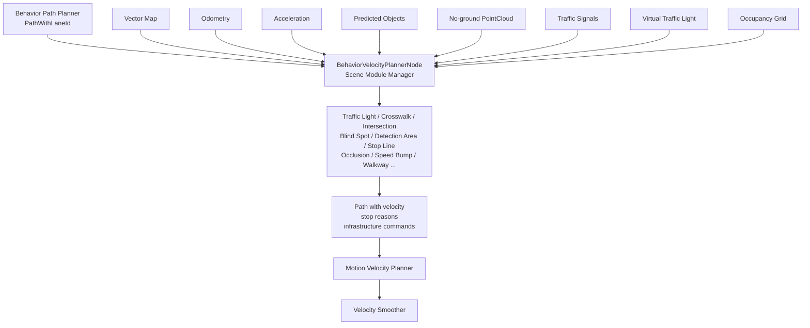

# Autoware Behavior Velocity Planner 算法详细分析

本文基于当前工作区的 Behavior Velocity Planner 源码、各 Scene Module README、launch remap 和参数文件，分析其算法组成、数学原理、输入输出、工作流程、关键参数和实际运行表现。

## 1. 核心定位

Behavior Velocity Planner 接收 Behavior Path Planner 输出的 `PathWithLaneId`，在不改变主要横向路径意图的前提下，根据交通规则、地图设施、道路参与者和可见性条件，为路径点设置：

- 停止点。
- 速度上限或减速区。
- 停车原因和基础设施命令。
- 后续 Motion Velocity Planner 可继续处理的速度约束。

它主要解决“在这条 path 上什么时候减速、在哪里停车、以多快速度通过”的问题，而不是重新决定任务路线或大范围绕障。

## 2. 运行时架构

### 2.1 主节点和插件

主要包：

```text
src/universe/autoware_universe/planning/behavior_velocity_planner/
├── autoware_behavior_velocity_blind_spot_module/
├── autoware_behavior_velocity_crosswalk_module/
├── autoware_behavior_velocity_detection_area_module/
├── autoware_behavior_velocity_intersection_module/
├── autoware_behavior_velocity_no_drivable_lane_module/
├── autoware_behavior_velocity_no_stopping_area_module/
├── autoware_behavior_velocity_occlusion_spot_module/
├── autoware_behavior_velocity_roundabout_module/
├── autoware_behavior_velocity_rtc_interface/
├── autoware_behavior_velocity_speed_bump_module/
├── autoware_behavior_velocity_traffic_light_module/
├── autoware_behavior_velocity_virtual_traffic_light_module/
└── autoware_behavior_velocity_walkway_module/
```

`BehaviorVelocityPlannerNode` 作为一个 composable node 启动，各规则模块通过 `launch_modules` 参数动态加载。模块通常共享同一个输入 path，并依次对 path 点的纵向速度、停止点和 debug factor 做处理。



### 2.2 主要 launch 入口

```text
src/launcher/autoware_launch/tier4_universe_launch/tier4_planning_launch/launch/
  scenario_planning/lane_driving/behavior_planning/behavior_planning.launch.xml
```

该 launch 会根据 `launch_*_module` 条件组装：

```text
behavior_velocity_planner_launch_modules
```

再传给主节点的 `launch_modules` 参数。因此需要区分：源码中存在的模块、launch 支持的模块和当前 preset 实际启用的模块。

## 3. 输入输出接口

### 3.1 输入

| 输入 | 类型 | 用途 |
| --- | --- | --- |
| `~/input/path_with_lane_id` | `autoware_internal_planning_msgs/msg/PathWithLaneId` | 行为路径、lane id 和已有速度 |
| `~/input/vector_map` | `autoware_map_msgs/msg/LaneletMapBin` | 停止线、交通灯、横道、路口、减速带和区域语义 |
| `~/input/vehicle_odometry` | `nav_msgs/msg/Odometry` | ego pose、速度、路径最近点和车辆运动状态 |
| `~/input/accel` | `geometry_msgs/msg/AccelWithCovarianceStamped` | 当前纵向加速度和减速判断 |
| `~/input/dynamic_objects` | `autoware_perception_msgs/msg/PredictedObjects` | 行人、车辆、自行车等道路参与者及其预测路径 |
| `~/input/no_ground_pointcloud` | `sensor_msgs/msg/PointCloud2` | 遮挡、检测区域和点云障碍物判断 |
| `~/input/traffic_signals` | `autoware_perception_msgs/msg/TrafficLightGroupArray` | 红黄绿灯和箭头信号 |
| `~/input/virtual_traffic_light_states` | 虚拟交通灯状态 | V2X/基础设施协同信号 |
| `~/input/occupancy_grid` | `nav_msgs/msg/OccupancyGrid` | 遮挡区、占据区域和未知空间 |
| 外部速度限制 | `float`/内部规划消息 | 施工、限速或外部系统速度上限 |

当前 launch 的典型 remap：

```text
path_with_lane_id
/map/vector_map
/localization/kinematic_state
/localization/acceleration
/perception/object_recognition/objects
/perception/obstacle_segmentation/pointcloud
/perception/traffic_light_recognition/traffic_signals
/perception/occupancy_grid_map/map
```

### 3.2 输出

| 输出 | 用途 |
| --- | --- |
| `~/output/path` | 在原 path 上修改速度/停车约束后的 path |
| `~/output/stop_reasons` | 交通灯、横道、路口、障碍等停车原因 |
| `~/output/infrastructure_commands` | 与路口/基础设施协同的命令 |
| `~/output/traffic_signal` | 交通灯 debug 状态 |
| debug marker/factor | 停止线、减速区、TTC、目标和决策状态 |

在系统命名空间下通常表现为：

```text
/planning/scenario_planning/lane_driving/behavior_planning/path
/planning/scenario_planning/status/stop_reasons
/planning/scenario_planning/status/infrastructure_commands
```

该输出随后进入 Motion Planning 的 Path Smoother/Path Optimizer 和 Motion Velocity Planner。Behavior Velocity Planner 不应被理解为最终 `/planning/trajectory` 的唯一生产者。

## 4. 单周期工作原理

```text
1. 接收 PathWithLaneId、地图、ego 状态和环境输入
2. 计算车辆在 path 上的最近点和弧长坐标
3. 根据 path 中的 lane id 激活对应规则模块
4. 每个模块识别自己的地图设施/对象/信号
5. 计算候选停止点、速度上限或减速区
6. 处理模块状态、迟滞、RTC approval 和安全条件
7. 合并多个模块对 path 的速度约束
8. 写入 stop reasons、infrastructure commands 和 debug factors
9. 发布带速度约束的 path
```

多数模块不改变 path 的 $x,y$ 主几何，而是修改：

$$
v_i\leftarrow\min(v_i,v_{limit,i})
$$

或在停止位置 $s_{stop}$ 设置：

$$
v(s_{stop})=0
$$

### 4.1 插件状态

规则模块常见状态可抽象为：

```text
INACTIVE -> APPROACH -> STOP / SLOWDOWN / GO_OUT
                         -> APPROVED / RTC_ACTIVE
                         -> FINISHED
```

状态机用于避免每个周期重复创建停止点、减少红绿灯和目标感知抖动，并在车辆已经越过停止线或进入安全区域后防止突然重新停车。

## 5. 主要功能模块

### 5.1 Traffic Light Module

包：`autoware_behavior_velocity_traffic_light_module`

功能：根据地图中的交通灯与对应停止线、感知信号和当前车辆状态判断 STOP/GO。

工作步骤：

1. 从 route/path 和 Lanelet2 地图找到对应交通灯及停止线。
2. 选择可靠性最高的识别结果。
3. 信号不是绿灯或对应箭头时生成停止候选。
4. 处理信号超时、stop-time hysteresis 和黄灯 dilemma zone。
5. 在 APPROACH/GO_OUT 等状态中插入或清除停止点。

### 5.2 黄灯 dilemma zone

设停止线距离为 $d$，当前速度为 $v$，允许减速度为 $a_{max}>0$，系统延迟为 $T_d$，则近似可停车距离为：

$$
d_{stop}=vT_d+\frac{v^2}{2a_{max}}
$$

若考虑 jerk 限制，则减速不会瞬间达到 $-a_{max}$，实际停车距离更长。黄灯判断还会比较：

- 是否能在黄灯结束前通过。
- 是否能在允许减速度和 jerk 约束下停止。

典型区域：

- 能安全通过且不能合理停车：PASS。
- 能通过也能安全停车：通常选择 STOP。
- 不能及时通过且也不能在约束内停车：dilemma zone，可能触发更强制动策略。

关键参数包括：

| 参数 | 作用 |
| --- | --- |
| `stop_margin` | 停止线前余量 |
| `tl_state_timeout` | 交通灯状态有效期 |
| `stop_time_hysteresis` | 防止 STOP/GO 抖动 |
| `yellow_lamp_period` | 黄灯持续时间 |
| `yellow_light_stop_velocity` | 低于该速度时更倾向停车 |
| `enable_pass_judge` | 是否启用黄灯通行判断 |
| `enable_arrow_aware_yellow_passing` | 转向车道黄灯箭头通行策略 |

### 5.3 Stop Line Module

包：`autoware_behavior_velocity_stop_line_module`

依据地图停止线，在 path 上找到对应位置并插入 stop point。它是交通规则中最基础的停止约束，常被 Traffic Light、Intersection 或其他规则作为默认停止线参考。

### 5.4 Crosswalk Module

包：`autoware_behavior_velocity_crosswalk_module`

功能：判断行人、自行车等横道使用者是否需要让行，并在横道前减速或停车。

目标选择通常考虑：

- 行人、自行车、摩托车和可配置的 unknown 类型。
- 目标预测 path 是否进入横道 attention area。
- 目标是否会与 ego 在虚拟冲突点附近相遇。

设 ego 到冲突点的时间为 TTC，目标到冲突点的时间为 TTV：

$$
TTC=\frac{d_e}{v_e},\qquad TTV=\frac{d_o}{v_o}
$$

实际计算会考虑预测轨迹、速度和 margin。决策可抽象为：

$$
|TTC-TTV|\leq\Delta T_{risk}
\Rightarrow \text{yield/stop}
$$

若目标足够早通过或 ego 足够早通过，则可以不停车；若冲突风险存在，插入 stop point。

停止位置通常取以下候选中的保守位置：

1. 地图显式停止线。
2. 横道前固定距离。
3. 目标预测冲突点前的 preferred margin。
4. 当前车辆在 preferred deceleration 下能达到的位置。

停止所需减速度可用：

$$
a_{req}=-\frac{v_0^2}{2d_{stop}}
$$

如果需要的减速度超过参数允许范围，模块会移动停止点或根据 no-stop decision 配置取消停车。

### 5.5 Walkway Module

包：`autoware_behavior_velocity_walkway_module`

处理车辆进入或离开 private area/walkway/crosswalk 相关区域时的让行和停车规则。其核心与 Crosswalk 类似：识别目标、计算路径交叉和停止位置，但地图语义和激活区域不同。

### 5.6 Intersection Module

包：`autoware_behavior_velocity_intersection_module`

功能包括：

- 路口冲突车辆检测。
- attention area 构造。
- 交通灯优先级处理。
- 遮挡区域探测和 peeking。
- stuck vehicle/yielding vehicle 处理。
- 根据 collision interval 插入停止线。

#### Attention Area

attention area 是与 ego path 冲突的 lanelet 及其上游一定长度的集合。若冲突 lanelet 集合为 $A$，上游扩展距离为 $L_a$，则：

$$
\mathcal A=\bigcup_{l\in A}\left(l\oplus[-L_a,0]\right)
$$

地图中的 `turn_direction`、`right_of_way` 和 intersection area 决定哪些 lanelet 被纳入检查。地图标签不完整时，attention area 可能过大，导致不必要停车；标签错误则可能漏检冲突车道。

#### TTC 碰撞判断

对目标预测轨迹，估计目标进入 ego 冲突区域的时间 $t_o$；对 ego path 使用速度 profile 估计进入同一区域的时间 $t_e$。若：

$$
|t_e-t_o|\leq
\begin{cases}
\Delta t_{start},&t_e<t_o\\
\Delta t_{end},&t_e\geq t_o
\end{cases}
$$

则判断存在碰撞风险并插入 stop line。实现还会考虑预测路径置信度、collision start/end margin、collision hold time 和 ego 是否已越过 pass judge line。

#### 状态机

典型状态包括：

```text
Safe
StuckStop
YieldStuck
NonOccludedCollisionStop
FirstWaitBeforeOcclusion
PeekingTowardOcclusion
OccludedCollisionStop
FullyPrioritized
OverPassJudgeLine
```

车辆进入 intersection 后不能简单继续沿用入口判断；`OverPassJudgeLine` 用于避免已经进入冲突区域后突然急刹造成更大风险。

### 5.7 Blind Spot Module

包：`autoware_behavior_velocity_blind_spot_module`

在地图盲区或视觉不可见区域前检查车辆、行人等目标，必要时插入停止点或限制速度。其核心是：

```text
盲区几何区域
  -> 目标/点云检测
  -> 是否存在可能冲突道路参与者
  -> 停止或继续
```

### 5.8 Detection Area Module

包：`autoware_behavior_velocity_detection_area_module`

针对地图定义的 detection area，根据对象和点云是否出现在区域内判断是否停车。它通常通过 RTC interface 管理外部审批状态，输出 stop reason 和 debug factor。

### 5.9 Occlusion Spot Module

包：`autoware_behavior_velocity_occlusion_spot_module`

用于处理车辆、护栏或其他障碍物造成的遮挡，考虑未知物体从遮挡点突然出现的风险。算法可能基于 occupancy grid 或 predicted object 构造 occlusion spot，并估计：

- ego 到潜在冲突点的 TTC。
- 行人从遮挡处到冲突点的 TTV。
- 在系统 delay、jerk 和减速度限制下的安全速度。

安全速度概念可抽象为：要求车辆在潜在冲突发生前能通过减速到安全速度或停止：

$$
d_{safe}(v)=vT_d+\frac{v^2}{2a_{safe}}+d_{margin}
$$

遮挡点距离越近、假设行人速度越高、系统延迟和安全余量越大，允许速度越低。该模块 README 明确其仍是 prototype，可能因 occupancy grid 噪声产生过度减速。

### 5.10 Speed Bump Module

包：`autoware_behavior_velocity_speed_bump_module`

从 Lanelet2 regulatory element 找到 speed bump，与 path 求交，生成 slow start/end point，并对区间内 path 点赋值 `slow_down_speed`。

如果地图提供减速带高度 $h$ 而没有直接速度标签，可以在 $(h_{min},v_{max})$ 和 $(h_{max},v_{min})$ 之间做线性映射：

$$
v_{bump}(h)=v_{max}
-\frac{h-h_{min}}{h_{max}-h_{min}}(v_{max}-v_{min})
$$

若 annotation 已提供 `slow_down_speed`，则优先使用该速度值而不再按高度计算。`slow_start_margin` 和 `slow_end_margin` 控制减速开始与恢复位置。

### 5.11 No Stopping Area Module

包：`autoware_behavior_velocity_no_stopping_area_module`

当其他模块在禁停区域内产生停止候选时，该模块根据地图区域修正停止点或保持低速通过，避免在不允许停车的位置停车。它不是简单地删除所有 stop point，还需要考虑停止点是否已经不可避免和下游安全约束。

### 5.12 No Drivable Lane Module

包：`autoware_behavior_velocity_no_drivable_lane_module`

检测 path 与 `no_drivable_lane` polygon 的交集。当车辆路径进入不可行驶 lane 区域时，模块可以产生停车/限速约束。其核心几何判断为：

$$
P_{path}\cap P_{no\_drivable}\neq\varnothing
$$

### 5.13 Roundabout、Virtual Traffic Light 和 RTC

- **Roundabout**：按环岛入口、出口和冲突对象处理速度与停车。
- **Virtual Traffic Light**：使用 V2X/外部基础设施的虚拟信号生成停止或放行约束，并可使用剩余时间预测。
- **RTC Interface**：为需要外部批准的规则模块提供 UUID、activation、approval 和执行状态管理。

## 6. 速度约束的统一数学模型

### 6.1 多模块速度上限合并

设 path 弧长坐标为 $s$，地图限速为 $v_{map}(s)$，外部限速为 $v_{ext}(s)$，第 $k$ 个模块给出的速度上限为 $v_k(s)$，则行为层的保守合并可写为：

$$
v_{behavior}(s)=\min\left[
v_{map}(s),v_{ext}(s),v_1(s),\ldots,v_n(s)
\right]
$$

停止点是特殊速度约束：

$$
v_{behavior}(s_{stop})=0
$$

因此交通灯、横道、路口和障碍物模块可以同时运行，而最终速度通常取更严格的约束。实际模块还会按状态、优先级和历史结果过滤无效候选。

### 6.2 停止距离和制动

忽略 jerk 时，当前速度 $v_0$、目标停止点距离 $d$ 和恒定减速度 $a_d>0$ 满足：

$$
v^2=v_0^2-2a_dd
$$

车辆能停止的条件为：

$$
d\geq\frac{v_0^2}{2a_d}
$$

考虑系统延迟 $T_d$ 后：

$$
d_{required}=v_0T_d+\frac{v_0^2}{2a_d}+d_{margin}
$$

Behavior Velocity Planner 的停止点选择、横道 preferred stop、交通灯 dilemma zone 和速度 smoother 都围绕这一基本约束扩展。

### 6.3 Jerk 约束

加速度变化率定义为：

$$
j=\frac{da}{dt}
$$

公共参数中的典型约束为：

```text
max_accel: -2.8 m/s^2
max_jerk: -5.0 m/s^3
system_delay: 0.5 s
delay_response_time: 0.5 s
```

若减速度从 0 以 jerk $j_{max}$ 增加到 $a_d$，达到减速度所需时间近似为：

$$
t_j=\frac{|a_d|}{|j_{max}|}
$$

这意味着真实停车距离比恒定减速度模型更长。行为模块通常负责确定“必须在哪停/速度不能超过多少”，而后续 Motion Velocity/Velocity Smoother 负责把约束变成连续速度轨迹。

### 6.4 TTC/TTV

对 ego 和目标到同一冲突点的距离分别为 $d_e,d_o$，速度分别为 $v_e,v_o$：

$$
TTC=\frac{d_e}{\max(v_e,\epsilon)},\qquad
TTV=\frac{d_o}{\max(v_o,\epsilon)}
$$

若两者到达时间差小于安全 margin：

$$
|TTC-TTV|<\Delta T_{safe}
$$

则应减速、停车或等待。Intersection 模块进一步使用预测路径和速度 profile，而不是只使用恒速公式。

## 7. 关键参数

### 7.1 公共参数

文件：

```text
.../behavior_velocity_planner/behavior_velocity_planner_common.param.yaml
```

| 参数 | 当前值 | 作用 |
| --- | ---: | --- |
| `max_accel` | `-2.8 m/s^2` | 规划减速度约束 |
| `max_jerk` | `-5.0 m/s^3` | 减速度变化率约束 |
| `system_delay` | `0.5 s` | 系统反应延迟 |
| `delay_response_time` | `0.5 s` | 延迟响应时间 |
| `is_publish_debug_path` | `false` | 是否发布各模块 debug path |

### 7.2 主节点参数

文件：

```text
.../behavior_velocity_planner/behavior_velocity_planner.param.yaml
```

| 参数 | 当前值 | 作用 |
| --- | ---: | --- |
| `forward_path_length` | `1000.0 m` | 处理 path 的前向长度 |
| `backward_path_length` | `5.0 m` | 保留 ego 后方 path 长度 |
| `behavior_output_path_interval` | `1.0 m` | 输出路径采样间隔 |
| `planning_factor_console_output.enable` | `false` | 是否输出 planning factor |

### 7.3 规则模块参数

| 模块 | 关键参数类别 |
| --- | --- |
| Traffic Light | `stop_margin`、信号 timeout、黄灯时间、yellow stop velocity、hysteresis、V2I 剩余时间 |
| Crosswalk | 横道 attention range、preferred/limit stop distance、preferred deceleration、TTC/TTV margin、目标类型 |
| Intersection | attention area length、right-of-way、stopline margin、collision margin、hold time、pass judge line |
| Occlusion | pedestrian velocity/radius、detection area length、max lateral distance、safe margin、slowdown jerk/acceleration |
| Speed Bump | slow start/end margin、min/max bump height、min/max speed |
| Blind Spot/Detection Area | 检测区域、停止距离、对象类型、approval 和安全 margin |
| No Stopping Area | 禁停区域、停止点修正距离和状态保持 |

实际键名必须以当前 launch 传入的 YAML 为准。修改未被 preset 引用的包内默认配置不会改变运行行为。

## 8. 实际应用表现

### 8.1 红绿灯

正常表现：

```text
识别交通灯
  -> 匹配地图 traffic light/stop line
  -> APPROACH
  -> STOP 或 PASS
  -> GO_OUT 后清除停止状态
```

信号超时通常应采取保守策略；`stop_time_hysteresis` 用于防止识别信号在边界状态下频繁 STOP/GO。若车辆在黄灯时突然急停或急加速，应检查 dilemma zone、yellow lamp period、当前速度和速度平滑参数。

### 8.2 横道和行人

横道模块可能在 path 几何不变时只修改速度，因此 RViz 中 path 看起来正常，但 trajectory 速度会在横道前下降。定位问题要同时看：

- 目标类型和预测 path。
- crosswalk attention area。
- TTC/TTV。
- preferred stop 和 limit stop。
- 所需减速度是否超过 `min_acc_preferred`。

### 8.3 路口

路口表现强依赖 HD Map：`turn_direction`、`right_of_way`、intersection area 和 stopline 标注错误会直接导致过度停车或漏检。路口进入后，如果车辆已经越过 pass judge line，模块可能停止新的碰撞检查以避免在路口中央急刹。

### 8.4 遮挡和盲区

遮挡模块往往表现为提前降速，即使当前没有检测到目标。这是因为未知区域被当作潜在道路参与者出现的位置。若 occupancy grid 噪声较大，可能发生过度减速；应通过 debug occlusion marker、occupancy grid 和 safe velocity 参数判断是否为预期行为。

### 8.5 多模块同时触发

例如同一位置同时满足交通灯、横道和路口条件时，最终速度通常取最保守约束：

$$
v_{final}(s)=\min(v_{traffic\_light},v_{crosswalk},v_{intersection},v_{other})
$$

不要只根据“车辆在此减速”判断是哪一个模块触发，应查看 `stop_reasons`、planning factor 和各模块 debug 输出。

## 9. 可操作调试流程

### 9.1 Topic 和节点检查

```bash
ros2 node list | grep behavior_velocity
ros2 topic info /planning/scenario_planning/lane_driving/behavior_planning/path -v
ros2 topic echo /planning/scenario_planning/lane_driving/behavior_planning/path --once
ros2 topic echo /planning/scenario_planning/status/stop_reasons --once
ros2 topic echo /planning/scenario_planning/status/infrastructure_commands --once
ros2 topic echo /planning/scenario_planning/lane_driving/trajectory --once
ros2 topic list | grep -E 'traffic_signal|velocity_factor|debug|stop_reasons'
```

### 9.2 参数和模块检查

```bash
ros2 param list /planning/scenario_planning/lane_driving/behavior_planning/behavior_velocity_planner
ros2 param get /planning/scenario_planning/lane_driving/behavior_planning/behavior_velocity_planner max_accel
ros2 param get /planning/scenario_planning/lane_driving/behavior_planning/behavior_velocity_planner max_jerk
```

插件不是独立 node 时，不要只用 `ros2 node list` 判断是否加载。应检查主节点 `launch_modules`、启动日志、stop reason 和 debug marker。

### 9.3 三组验证实验

#### 实验 A：交通灯黄灯 dilemma zone

固定地图和车辆速度，改变停止线距离和黄灯剩余时间，记录：

```text
traffic signal timestamp
stop/pass decision
stop point
maximum deceleration
maximum jerk
stop reason
```

验证决策是否符合：能安全停车时停车、能安全通过时通过、两者都不满足时进入 dilemma handling。

#### 实验 B：横道 TTC/TTV

改变行人速度、横道距离和预测 path，比较 TTC/TTV 差值与 stop point。一次只改一个 margin，并保存 objects、traffic signal、behavior path 和 trajectory。

#### 实验 C：路口遮挡和冲突

分别设置无目标、可见目标、遮挡目标、stuck vehicle 和 yield vehicle，观察 Intersection Module 状态、attention area、pass judge line、TTC 数组和 stop reason。

## 10. 常见问题定位

| 现象 | 首先检查 | 可能原因 |
| --- | --- | --- |
| 交通灯前不停车 | traffic signal、stop line、模块列表 | 信号 timeout、地图匹配失败、插件未加载 |
| 绿灯仍停车 | signal 时间戳、hysteresis、intersection/occlusion | 过期信号、其他规则模块更保守 |
| 黄灯急停/急过 | dilemma zone、yellow 参数、当前速度 | pass judge 或减速度约束不匹配 |
| 横道前不让行 | objects prediction、attention area、TTC/TTV | 目标类型未启用、预测路径不进入区域 |
| 路口频繁停车 | right_of_way、intersection area、collision hold | 地图冲突 lane 过多或预测抖动 |
| 遮挡处严重降速 | occupancy grid、safe margin、pedestrian velocity | 原型逻辑保守或点云噪声 |
| 减速带速度不对 | regulatory element、height/slow_down_speed tag | 地图标签单位或参数错误 |
| 输出速度突然跳变 | max_accel、max_jerk、外部限速 | 上游硬写速度，下游平滑尚未生效 |
| stop reason 与预期不符 | `/stop_reasons`、planning factors | 多模块同时触发，最终采用更保守约束 |

## 11. 设计优势和限制

### 优势

- 规则模块插件化，交通灯、横道、路口等功能可独立启停。
- 停止点和速度约束可解释，便于通过 stop reason/debug factor 排查。
- 支持地图语义、感知对象、点云、占据栅格和 V2X 信号组合。
- TTC/TTV、制动距离、加速度和 jerk 约束使速度规划具有物理意义。
- 主节点输出仍是 path，方便后续 Motion Velocity Planner 和 Velocity Smoother 继续处理。

### 限制

- 规则正确性高度依赖 HD Map 标签、交通灯识别和预测对象质量。
- 多模块最小速度合并容易产生保守行为，需要追踪所有触发来源。
- 行为速度层不是完整的车辆控制器，最终可执行性仍需 Motion Velocity、Velocity Smoother 和 Validator。
- 遮挡点模块 README 明确仍处于 prototype，可能产生过度减速。
- 速度模型通常是工程近似，不能等同于概率意义上的碰撞安全证明。
- 模块通过动态插件加载，默认 preset 与源码中可用模块集合可能不同。

## 12. 总结

Behavior Velocity Planner 可以概括为：

```text
Behavior Path
  -> 识别地图设施、信号和对象
  -> 计算 TTC/TTV、停止距离和速度上限
  -> 插入 stop point 或修改 path velocity
  -> 合并多个规则模块的保守约束
  -> 输出 stop reasons/debug/infrastructure commands
  -> Motion Velocity Planner 和 Velocity Smoother
```

分析问题时，先区分“停止点错误”“速度上限错误”“速度平滑错误”和“最终轨迹被下游修改”。最有效的排查顺序是：

```text
输入时间戳/地图匹配
  -> 模块是否加载
  -> 模块状态和候选 stop/limit
  -> stop_reasons/planning factors
  -> behavior velocity path
  -> motion velocity trajectory
  -> final velocity smoother/validator output
```