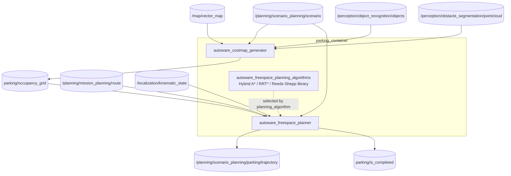
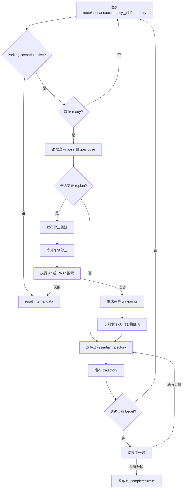

# Autoware Freespace Planner 算法详细分析

本文基于当前工作区的 `autoware_freespace_planner`、`autoware_freespace_planning_algorithms`、`autoware_costmap_generator`、parking launch 和参数文件，分析 Freespace Planner 的功能、数学原理、运行流程、关键参数、输入输出和实际表现。

## 1. 核心定位

Freespace Planner 是停车/自由空间场景的全局路径规划器。它不依赖车辆始终位于 Lanelet 车道中心线，而是在 occupancy grid 表示的二维自由空间内，结合车辆尺寸、轴距、最大转角和障碍物，搜索从当前 pose 到 goal pose 的可行轨迹。

```text
Scenario Selector 选择 Parking
  -> Costmap Generator 生成 occupancy grid
  -> Freespace Planner 搜索自由空间轨迹
  -> 拆分前进/倒车轨迹
  -> 分段发布单方向 trajectory
  -> parking/is_completed
  -> Scenario Selector 判断是否回到 LaneDriving
```

当前默认参数：

```yaml
planning_algorithm: astar
```

算法库同时实现：

- Hybrid A*。
- RRT*。
- Informed RRT*。
- Reeds-Shepp 曲线连接。
- 运动学自行车模型。

## 2. 运行时架构

### 2.1 Parking launch

```text
src/launcher/autoware_launch/tier4_universe_launch/tier4_planning_launch/launch/
  scenario_planning/parking.launch.xml
```



`Costmap Generator` 和 `Freespace Planner` 通常运行在同一个 `parking_container` 中，但职责不同：前者构建环境栅格，后者执行搜索和轨迹管理。

## 3. 输入输出接口

### 3.1 Freespace Planner 输入

| 输入                       | 类型                                        | 用途                          |
| -------------------------- | ------------------------------------------- | ----------------------------- |
| `~/input/route`          | `autoware_planning_msgs/msg/LaneletRoute` | 提供 goal pose 和任务路线信息 |
| `~/input/occupancy_grid` | `nav_msgs/msg/OccupancyGrid`              | 表示障碍物和可行驶自由空间    |
| `~/input/odometry`       | `nav_msgs/msg/Odometry`                   | 当前 ego pose、速度和停止状态 |
| `~/input/scenario`       | `Scenario`                                | 只有 Parking 场景激活时才规划 |

### 3.2 Freespace Planner 输出

| 输出                           | 类型                                      | 含义                           |
| ------------------------------ | ----------------------------------------- | ------------------------------ |
| `~/output/trajectory`        | `autoware_planning_msgs/msg/Trajectory` | 当前应跟踪的停车轨迹分段       |
| `is_completed`               | `std_msgs/msg/Bool`                     | 所有分段轨迹是否已经发布和完成 |
| `~/debug/pose_array`         | `geometry_msgs/msg/PoseArray`           | 完整规划轨迹可视化             |
| `~/debug/partial_pose_array` | `geometry_msgs/msg/PoseArray`           | 当前发布的部分轨迹             |
| `~/debug/processing_time_ms` | `Float64Stamped`                        | 搜索和处理耗时                 |

README 明确说明：为了适配轨迹跟踪，输出 trajectory 会拆成单方向路径，不会把前进和倒车混在同一条待跟踪 trajectory 中。

## 4. Costmap Generator：从环境到栅格

### 4.1 输入来源

`autoware_costmap_generator` 可以组合以下信息：

- `PredictedObjects`：动态/静态对象障碍区域。
- 无地面点云：补充未被对象检测覆盖的障碍物。
- Lanelet2 vector map：wayarea、parkinglot 和可行驶区域。
- 当前 scenario：判断是否激活停车 costmap。

输出两种表示：

```text
grid_map_msgs/GridMap       0.0 ~ 1.0
nav_msgs/OccupancyGrid      0 ~ 100
```

### 4.2 栅格数学表示

将工作空间离散为栅格：

$$
G=\{g_{ij}\mid i=0,\ldots,W-1,\ j=0,\ldots,H-1\}
$$

每个栅格有占用/代价值：

$$
C(g_{ij})\in[0,100]
$$

当：

$$
C(g_{ij})\geq C_{obs}
$$

则规划器把该栅格视为障碍物，其中 `obstacle_threshold` 默认值为 100。

对象矩形通常会按 `expand_rectangle_size` 膨胀，点云还会按高度阈值过滤。这样得到的障碍区不是传感器原始点，而是包含车辆安全余量的 planning obstacle。

### 4.3 Costmap 更新流程

```text
当前车辆 pose
  -> 以车辆附近为中心建立/更新 grid
  -> 添加 wayarea/parkinglot 可行驶区域
  -> 添加 object obstacle polygons
  -> 添加 no-ground pointcloud
  -> obstacle expansion / kernel blur
  -> 发布 GridMap 和 OccupancyGrid
```

关键参数：

| 参数                           | 作用                           |
| ------------------------------ | ------------------------------ |
| `activate_by_scenario`       | 是否仅在 Parking scenario 激活 |
| `use_objects`                | 是否使用对象障碍物             |
| `use_points`                 | 是否使用点云障碍物             |
| `use_wayarea`                | 是否使用地图 wayarea           |
| `use_parkinglot`             | 是否使用 parkinglot            |
| `grid_resolution`            | 栅格分辨率                     |
| `grid_length_x/y`            | 栅格尺寸                       |
| `grid_position_x/y`          | 栅格相对位置                   |
| `minimum_lidar_height_thres` | 点云高度下限                   |
| `maximum_lidar_height_thres` | 点云高度上限                   |
| `expand_rectangle_size`      | 对象矩形膨胀尺寸               |
| `size_of_expansion_kernel`   | 障碍物 costmap 模糊/扩张核大小 |

## 5. Freespace Planner 节点工作流程



### 5.1 何时重新规划

代码中的 replan 条件主要包括：

- 当前 trajectory 为空。
- 当前 trajectory 上检测到障碍物，并持续超过 `th_obstacle_time_sec`。
- 车辆偏离当前 trajectory 超过 `th_course_out_distance_m`。
- 对应的 `replan_when_obstacle_found` 或 `replan_when_course_out` 已启用。

重新规划前，车辆通常必须先停住：

```text
发现需要重规划
  -> 发布 stop trajectory
  -> 等待 ego 速度低于阈值并保持停止
  -> 清理旧规划状态
  -> 重新执行搜索
```

### 5.2 轨迹分段和完成判定

如果完整路径包含前进和倒车，节点根据方向变化记录 `reversing_indices_`，然后只发布当前单方向 partial trajectory。

当车辆：

1. 速度低于 `th_stopped_velocity_mps`。
2. 保持停止超过 `th_stopped_time_sec`。
3. 到达当前 target index 的距离小于 `th_arrived_distance_m`。

节点会切换到下一个分段。所有分段完成后发布：

```text
is_completed = true
```

## 6. 车辆运动学模型

### 6.1 Kinematic Bicycle Model

车辆状态可以表示为：

$$
q=(x,y,\psi)
$$

控制/参数包括轴距 $L$、转角 $\delta$ 和沿车辆运动方向的距离增量 $d$。曲率为：

$$
\kappa=\frac{\tan\delta}{L}
$$

转弯半径为：

$$
R=\frac{L}{\tan\delta}
$$

如果 $|\delta|$ 很小，使用直线近似：

$$
x'=x+d\cos\psi,
 \qquad y'=y+d\sin\psi,
 \qquad \psi'=\psi
$$

否则使用圆弧积分：

$$
\beta=\frac{d}{R}
$$

$$
x'=x+R[\sin(\psi+\beta)-\sin\psi]
$$

$$
y'=y+R[\cos\psi-\cos(\psi+\beta)]
$$

$$
\psi'=\psi+\beta
$$

Freespace Planner 的节点状态是离散 pose，但每个搜索扩展动作都必须遵守该模型，不能像普通二维 A* 一样任意横向跳跃。

### 6.2 车辆碰撞模型

车辆 shape 由：

```text
length
width
wheelbase/base_length
max_steering
base2back
```

组成，并加上 `vehicle_shape_margin_m`。算法对每个候选 pose 将车辆 footprint 映射到 costmap，检查覆盖栅格是否超过 obstacle threshold 或越出地图边界。

可抽象为：

$$
F(q)\cap O=\varnothing
$$

其中 $F(q)$ 是 pose $q$ 下的车辆 footprint，$O$ 是膨胀后的障碍物区域。

## 7. Hybrid A* 搜索

### 7.1 状态离散

Hybrid A* 将连续 pose 映射到离散索引：

```text
IndexXYT = (x_index, y_index, theta_index)
```

角度被划分为 `theta_size` 个离散区间：

$$
\theta_i=\operatorname{wrapToPi}(\theta)\rightarrow i\in\{0,\ldots,N_\theta-1\}
$$

但节点扩展仍使用连续运动学模型，因此它比单纯栅格 A* 更适合车辆姿态和倒车规划。

### 7.2 节点扩展

从当前状态选择若干转向动作和前进/倒车方向：

```text
steering angle samples
  -> kinematic bicycle/reeds-shepp extension
  -> collision and map boundary check
  -> next IndexXYT
```

关键参数：

- `max_turning_ratio`：实际使用最大转角的比例。
- `turning_steps`：转角离散动作数。
- `theta_size`：航向角离散数量。
- `expansion_distance`：每次扩展长度。
- `adapt_expansion_distance`：是否根据环境调整扩展距离。

### 7.3 A* 代价

A* 使用：

$$
f(n)=g(n)+w_hh(n)
$$

其中 $g(n)$ 是起点到当前节点的累计代价，$h(n)$ 是到目标的启发式估计，`distance_heuristic_weight` 为启发式权重。

累计代价可包含：

$$
g=\sum_i\left(
 c_{distance}+w_{curve}c_{curve}+
 w_{reverse}c_{reverse}+
 w_{switch}c_{direction\_change}+
 w_{obstacle}c_{obstacle}
\right)
$$

参数含义：

| 参数                          | 作用                 |
| ----------------------------- | -------------------- |
| `curve_weight`              | 曲线动作额外代价     |
| `reverse_weight`            | 倒车代价             |
| `direction_change_weight`   | 前进/倒车切换代价    |
| `distance_heuristic_weight` | 距离启发式权重       |
| `smoothness_weight`         | 曲率/转向变化代价    |
| `obstacle_distance_weight`  | 与障碍物距离相关代价 |
| `goal_lat_distance_weight`  | 目标横向偏差代价     |

### 7.4 Goal 判定

节点不要求搜索状态精确等于目标 pose，而是在范围内接受：

$$
|\Delta x_{lon}|\leq R_{lon}
$$

$$
|\Delta y_{lat}|\leq R_{lat}
$$

$$
|\operatorname{wrapToPi}(\Delta\psi)|\leq R_{angle}
$$

对应：

```text
longitudinal_goal_range
lateral_goal_range
angle_goal_range
```

## 8. Reeds-Shepp 曲线

Reeds-Shepp 曲线用于连接带有方向和转向约束的车辆状态，允许前进和倒车组合。对状态：

$$
q=(x,y,\psi)
$$

它搜索由：

```text
左转 L、右转 R、直行 S
前进/倒车方向
```

组成的最短可行曲线。Freespace Planner 使用它作为车辆运动学连接和候选扩展的几何基础。

Reeds-Shepp distance 可以作为两状态之间的路径长度估计：

$$
d_{RS}(q_s,q_g)
$$

但实际障碍物环境下，算法仍需检查整条曲线采样点和车辆 footprint，不能只检查起点/终点。

## 9. RRT* 和 Informed RRT*

### 9.1 RRT* 基本过程

RRT* 在连续状态空间随机采样：

```text
sample state
  -> find nearest node
  -> steer with Reeds-Shepp/vehicle model
  -> collision check
  -> choose best parent among neighbors
  -> rewire neighboring nodes
  -> update best goal path
```

目标是随着采样数增加逐渐改善路径代价：

$$
\pi^*=\arg\min_{\pi\in\Pi_{free}}J(\pi)
$$

其中 $\Pi_{free}$ 是所有不碰撞且满足车辆运动学的路径集合。

### 9.2 Informed RRT*

找到一条可行路径后，设当前最优代价为 $c_{best}$，对状态 $x$ 的启发式下界为 $\hat f(x)$：

$$
X_{\hat f}=\{x\mid \hat f(x)<c_{best}\}
$$

只在这个有希望改善当前解的区域采样，可减少无效采样。

Freespace Planner 的说明采用欧氏距离下界：

$$
\hat f_{euc}(x)=
\|p_s-p_x\|_2+\|p_x-p_g\|_2
$$

于是可行采样区域是以起点和目标点为焦点的椭圆，再乘以航向角范围：

$$
X_{\hat f}=Ellipse(p_s,p_g,c_{best})\times(-\pi,\pi]
$$

这比直接对带航向的 Reeds-Shepp 下界采样更容易实现。

### 9.3 RRT* 参数

| 参数                      | 作用                          |
| ------------------------- | ----------------------------- |
| `enable_update`         | 找到可行路径后是否继续优化    |
| `use_informed_sampling` | 是否启用 informed RRT* 采样   |
| `max_planning_time`     | 最大规划时间                  |
| `neighbor_radius`       | 选择 parent/rewire 的邻居半径 |
| `margin`                | RRT* 碰撞检查安全余量         |

算法库 README 的质量/速度经验排序是：

```text
高质量/慢  <- A* <- informed RRT* <- RRT -> 低质量/快
```

复杂障碍几何一般不建议使用普通 RRT/RRT*，因为随机路径可能过于曲折；起终点很远时，纯网格 A* 可能计算时间较长。

## 10. 算法选择对比

| 算法                   | 搜索空间                      | 优点                         | 风险/限制                | 适合场景                   |
| ---------------------- | ----------------------------- | ---------------------------- | ------------------------ | -------------------------- |
| Hybrid A*              | 离散 XYTheta + 连续运动学扩展 | 可解释、路径较规整、默认稳定 | 起终点远时计算量较大     | 规则停车场、复杂但有限空间 |
| RRT*                   | 连续状态随机采样              | 可处理高维和复杂空间         | 路径可能曲折、结果随机   | 特殊复杂空间               |
| Informed RRT*          | 受当前最优解约束的随机采样    | 比普通 RRT* 更快改善质量     | 仍有随机性和时间预算依赖 | 有限时间内优化路径         |
| Reeds-Shepp connection | 车辆可行曲线                  | 支持前进/倒车和最小转弯半径  | 不能单独解决障碍物       | 搜索扩展/状态连接          |

默认配置：

```text
planning_algorithm: astar
```

## 11. 关键 Freespace Planner 参数

### 11.1 节点参数

| 参数                           |   当前默认值 | 作用                                 |
| ------------------------------ | -----------: | ------------------------------------ |
| `planning_algorithm`         |    `astar` | `astar` 或 `rrtstar`             |
| `waypoints_velocity`         |      `5.0` | 输出 waypoint 速度，当前主要支持常速 |
| `update_rate`                |  `10.0 Hz` | 重规划和发布频率                     |
| `th_arrived_distance_m`      |    `0.5 m` | 到达当前目标点阈值                   |
| `th_stopped_time_sec`        |    `1.0 s` | 判定车辆稳定停止的时间               |
| `th_stopped_velocity_mps`    | `0.01 m/s` | 停止速度阈值                         |
| `th_course_out_distance_m`   |    `1.0 m` | 偏离当前路线后触发重规划             |
| `th_obstacle_time_sec`       |    `1.0 s` | 障碍物持续存在多久才触发重规划       |
| `vehicle_shape_margin_m`     |    `0.5 m` | 车辆碰撞 shape 余量                  |
| `replan_when_obstacle_found` |     `true` | 当前轨迹发现障碍物时重规划           |
| `replan_when_course_out`     |     `true` | 车辆偏离轨迹时重规划                 |

### 11.2 Common Planner 参数

| 参数                        |   当前默认值 | 作用                       |
| --------------------------- | -----------: | -------------------------- |
| `time_limit`              | `30000 ms` | 搜索时间上限               |
| `max_turning_ratio`       |      `0.5` | 使用车辆最大转向范围的比例 |
| `turning_steps`           |        `1` | 转向动作离散数量           |
| `theta_size`              |      `120` | 航向角离散数量             |
| `lateral_goal_range`      |    `0.5 m` | 目标横向接受范围           |
| `longitudinal_goal_range` |    `1.0 m` | 目标纵向接受范围           |
| `angle_goal_range`        |  `6.0 deg` | 目标航向接受范围           |
| `curve_weight`            |      `0.5` | 曲线代价                   |
| `reverse_weight`          |      `0.7` | 倒车代价                   |
| `direction_change_weight` |      `2.0` | 换向代价                   |
| `obstacle_threshold`      |      `100` | 栅格障碍阈值               |

### 11.3 A* 参数

| 参数                          |  当前默认值 | 作用                        |
| ----------------------------- | ----------: | --------------------------- |
| `search_method`             | `forward` | 从 start 到 goal 或反向搜索 |
| `only_behind_solutions`     |   `false` | 是否只接受目标后方解        |
| `use_back`                  |    `true` | 是否允许倒车                |
| `adapt_expansion_distance`  |    `true` | 是否根据环境调整扩展距离    |
| `expansion_distance`        |   `0.5 m` | 节点扩展长度                |
| `near_goal_distance`        |   `3.0 m` | 接近目标时的特殊阈值        |
| `distance_heuristic_weight` |     `2.0` | 距离启发式权重              |
| `smoothness_weight`         |     `0.5` | 平滑性代价                  |
| `obstacle_distance_weight`  |    `1.75` | 障碍物距离代价              |
| `goal_lat_distance_weight`  |     `5.0` | 目标横向误差代价            |

### 11.4 RRT* 参数

| 参数                      | 当前默认值 | 作用                 |
| ------------------------- | ---------: | -------------------- |
| `enable_update`         |   `true` | 找到可行解后继续优化 |
| `use_informed_sampling` |   `true` | 使用 informed RRT*   |
| `max_planning_time`     | `150 ms` | RRT* 更新时间预算    |
| `neighbor_radius`       |  `8.0 m` | 邻居搜索半径         |
| `margin`                |  `0.1 m` | 碰撞检查余量         |

## 12. 实际运行表现

### 12.1 正常停车

正常链路：

```text
Scenario=Parking
  -> costmap 更新
  -> 当前 pose/goal 转到 costmap frame
  -> 搜索可行路径
  -> 生成 forward/backward waypoints
  -> 只发布当前方向 partial trajectory
  -> 车辆停止并切换下一段
  -> is_completed=true
```

停车轨迹可能包含多次前进/倒车，不应按 lane driving 的“单一车道、单向轨迹”标准评价。

### 12.2 障碍物出现

当前 trajectory 被检测到障碍物后，节点会先等待 `th_obstacle_time_sec`，避免单帧噪声触发重规划。确认需要重规划后：

```text
当前轨迹 -> stop trajectory
  -> 等待 ego 停止
  -> 重新建立 costmap/搜索
  -> 发布新的 partial trajectory
```

### 12.3 车辆偏离轨迹

如果 ego 与当前 trajectory 的距离超过 `th_course_out_distance_m`，会触发重规划。若车辆未停止，节点会保持 stop trajectory 并等待车辆停稳。

### 12.4 无解或计算超时

算法可能因以下原因失败：

- costmap 没有连通自由空间。
- 车辆 footprint 膨胀后通道过窄。
- goal orientation 超出接受范围。
- 最小转弯半径/最大转角不允许到达目标。
- `time_limit` 内未找到解。
- A* 离散分辨率过粗或搜索空间过大。
- RRT* 时间预算不足或采样没有覆盖可行区域。

失败时不会得到有效新 trajectory，应保留 stop 行为并检查 costmap、TF 和车辆参数。

### 12.5 规划质量与实时性

A* 通常更规整、可解释，但远距离和高分辨率 costmap 会增加搜索量；RRT* 更灵活，但路径质量具有随机性。降低 grid resolution 可以加快搜索，却会降低窄通道和车辆边界表示精度；增大 margin 会提高安全性，但可能使问题无解。

## 13. 可操作调试流程

### 13.1 Topic 检查

```bash
ros2 topic echo /planning/scenario_planning/scenario --once
ros2 topic echo /planning/scenario_planning/parking/trajectory --once
ros2 topic echo /planning/scenario_planning/parking/is_completed --once
ros2 topic echo /planning/scenario_planning/parking/costmap_generator/occupancy_grid --once
ros2 topic info /planning/scenario_planning/parking/trajectory -v
ros2 topic hz /planning/scenario_planning/parking/trajectory
```

### 13.2 节点和参数检查

```bash
ros2 node list | grep -E 'costmap_generator|freespace_planner'
ros2 param list /planning/scenario_planning/parking/freespace_planner
ros2 param get /planning/scenario_planning/parking/freespace_planner planning_algorithm
ros2 param get /planning/scenario_planning/parking/freespace_planner vehicle_shape_margin_m
```

### 13.3 三组推荐实验

#### 实验 A：A* 与 RRT* 对比

固定地图、起点、终点和车辆模型，只修改：

```yaml
planning_algorithm: astar
```

和：

```yaml
planning_algorithm: rrtstar
```

记录：

```text
规划耗时
路径长度
倒车次数
方向切换次数
最小障碍物距离
轨迹曲率/转向变化
```

#### 实验 B：障碍物重规划

1. 在当前停车轨迹上放置静态对象或点云障碍物。
2. 记录障碍物首次出现时间。
3. 比较 `th_obstacle_time_sec` 与实际重规划时间。
4. 确认重规划前是否先发布 stop trajectory。
5. 观察新 partial trajectory 和 `is_completed` 状态。

#### 实验 C：车辆尺寸和安全余量

改变 `vehicle_shape_margin_m` 和 RRT* `margin`，比较：

- 窄通道是否仍有解。
- 车辆 footprint 与障碍物的最小距离。
- 搜索耗时和失败率。
- 轨迹是否出现不必要的倒车/换向。

## 14. 常见问题定位

| 现象                       | 首先检查                                  | 可能原因                                  |
| -------------------------- | ----------------------------------------- | ----------------------------------------- |
| 没有停车轨迹               | scenario、route、occupancy_grid、odometry | Parking 未激活或输入未 ready              |
| costmap 全部不可行驶       | Costmap Generator 参数和 map              | wayarea/parkinglot、点云膨胀或 frame 错误 |
| 搜索无解                   | goal ranges、vehicle margin、最大转角     | 目标姿态/通道/车辆模型不匹配              |
| A* 很慢                    | theta_size、grid resolution、time_limit   | 状态空间过大或远距离搜索                  |
| RRT* 路径曲折              | sampling、neighbor_radius、margin         | 随机解质量或时间预算不足                  |
| 轨迹频繁重规划             | obstacle/coursed-out threshold            | 点云噪声、阈值过小或定位抖动              |
| 车辆停止后不继续           | stopped threshold、partial target index   | 停止条件或目标切换逻辑不满足              |
| parking 不完成             | arrived distance、停止时间、goal pose     | 目标姿态/位置超出接受范围                 |
| 前进和倒车混在输出         | partial trajectory/state                  | 应检查 reversing indices 和方向拆分逻辑   |
| 重新规划时车辆未停住       | odometry buffer、stopped threshold        | stop trajectory 或停止判断问题            |
| costmap 中看不到点云障碍物 | height threshold、use_points、frame       | 点云高度过滤或坐标变换错误                |

## 15. 架构优势和限制

### 优势

- 直接在占据栅格自由空间中规划，适合停车场、窄路和非车道区域。
- Hybrid A* 将车辆运动学纳入搜索，支持倒车和换向。
- RRT*/Informed RRT* 提供连续空间的可选搜索策略。
- Reeds-Shepp 连接能表达前进/倒车组合和最小转弯半径。
- 轨迹分段发布降低了控制器同时处理前进/倒车方向切换的复杂度。
- 通过 stop-before-replan、障碍物持续时间和 course-out 阈值减少抖动。

### 限制

- 规划质量高度依赖 occupancy grid、车辆参数、TF 和 costmap 分辨率。
- Hybrid A* 的离散状态和搜索范围会影响实时性与可行性。
- RRT* 路径具有随机性，候选路径可能需要额外平滑和安全验证。
- 当前输出速度主要是常速 waypoint velocity，纵向舒适性由下游模块处理。
- 重新规划通常要求车辆先停住，不适合所有动态避障场景。
- Freespace Planner 解决局部自由空间到 goal 的轨迹，不替代 Mission Planner 的任务路线和 Behavior Planner 的道路行为决策。

## 16. 总结

Autoware Freespace Planner 的完整链路是：

```text
objects/pointcloud/vector map
  -> Costmap Generator
  -> occupancy grid
  -> Hybrid A* 或 RRT*/Informed RRT*
  -> Reeds-Shepp / kinematic bicycle expansion
  -> footprint collision check
  -> forward/backward trajectory split
  -> stop-aware partial trajectory publishing
  -> parking/is_completed
```

最关键的安全条件是：

$$
F(q)\cap O=\varnothing
$$

最关键的车辆约束是：

$$
\kappa=\frac{\tan\delta}{L},
\qquad
R=\frac{L}{\tan\delta}
$$

分析实际问题时，应按以下顺序核对：

```text
Scenario 是否为 Parking
  -> costmap 是否包含正确可行驶区域和障碍物
  -> start/goal TF 是否正确
  -> vehicle shape/margin 是否合理
  -> planning_algorithm 和搜索参数
  -> 是否先停车再重规划
  -> partial trajectory 分段和 is_completed
```
