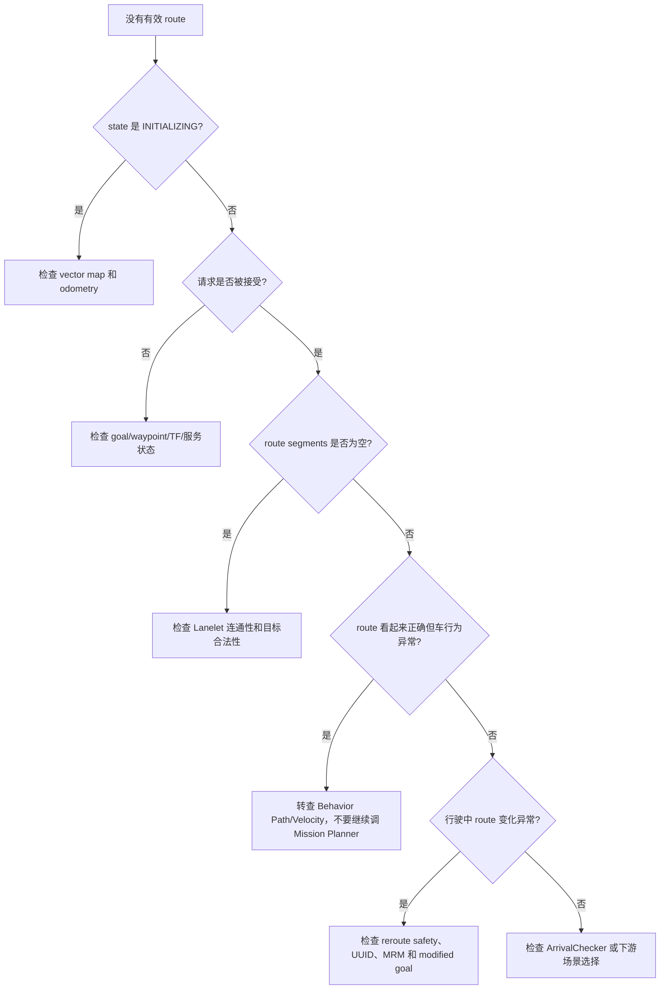

# Autoware Mission Planning 算法详细分析

本文基于当前工作区 `src/universe/autoware_universe/planning/autoware_mission_planner_universe` 的源码、README、launch、消息和参数文件，分析 Autoware Universe 中 Mission Planning 的算法组成、工作原理、输入输出、关键参数和实际表现。

Mission Planning 的核心任务是：**在静态 Lanelet2 矢量地图上，根据车辆当前位姿、目标点和可选检查点，生成一条由 Lanelet 段组成的任务路线 `LaneletRoute`，供后续 Scenario Planning 和 Behavior Planning 使用。**

## 1. Mission Planning 在整车规划中的位置

```mermaid
flowchart LR
    API[Route API\n目标点/检查点/路线服务]
    MAP[/map/vector_map\nLaneletMapBin]
    LOC[/localization/kinematic_state\nOdometry]
    MODE[/system/operation_mode/state]
    MP[Mission Planner\n路线规划与状态机]
    RH[Route Handler\nLanelet2 地图/拓扑抽象]
    PLUGIN[Planner Plugin\n当前为 Lanelet2 DefaultPlanner]
    ROUTE[/planning/mission_planning/route\nLaneletRoute]
    STATE[/planning/mission_planning/state\nRouteState]
    SP[Scenario Planning\nBehavior/Motion/Velocity]

    API --> MP
    MAP --> MP
    LOC --> MP
    MODE --> MP
    MP --> PLUGIN
    PLUGIN --> RH
    RH --> PLUGIN
    PLUGIN --> ROUTE
    MP --> ROUTE
    MP --> STATE
    ROUTE --> SP
```

Mission Planning 只决定“沿哪组道路段走”，不负责：

- 根据动态车辆、行人实时绕障。
- 生成控制器直接跟踪的带速度轨迹。
- 处理红绿灯停止点和局部速度曲线。
- 根据实时道路施工自动修改地图拓扑。

这些工作分别由 Behavior Path、Behavior Velocity、Motion Velocity 和其他规划/感知组件负责。Mission Planning 的输出通常是低频、事件触发、保持有效的任务路线，而不是每个规划周期都重算。

## 2. 代码和运行时组成

### 2.1 主要文件

```text
src/universe/autoware_universe/planning/autoware_mission_planner_universe/
├── src/mission_planner/
│   ├── mission_planner.cpp/.hpp       # 主节点、服务、状态和重规划
│   ├── route_selector.cpp/.hpp        # normal route/MRM route 仲裁
│   └── arrival_checker.cpp/.hpp       # 到达目标判定
├── src/lanelet2_plugins/
│   ├── default_planner.cpp/.hpp       # Lanelet2 路线算法插件
│   └── utility_functions.cpp/.hpp
├── src/goal_pose_visualizer/          # 目标可视化
├── config/mission_planner.param.yaml
├── launch/mission_planner.launch.xml
└── test/                              # planner utility 和 lanelet plugin 测试
```

### 2.2 两个 composable node

`mission_planner.launch.xml` 在 `component_container_mt` 中启动：

1. `autoware::mission_planner_universe::MissionPlanner`
   - 接收地图、定位、目标修改和 route service。
   - 创建 Lanelet2 planner plugin。
   - 管理 route state、当前 route、到达判定和 reroute。
   - 发布规划结果。

2. `autoware::mission_planner_universe::RouteSelector`
   - 为 normal route 和 MRM route 各维护一个 route interface。
   - 将外部主接口请求转发给当前有效的路线通道。
   - MRM 工作时优先选择 MRM route；MRM 清除后尝试恢复 normal route。

这两个节点的职责不同：`MissionPlanner` 是算法与状态执行者，`RouteSelector` 是路线来源和安全模式之间的仲裁层。

## 3. 输入和输出接口

### 3.1 订阅输入

| 逻辑输入 | 默认 topic | 类型 | 用途 |
| --- | --- | --- | --- |
| Lanelet2 地图 | `/map/vector_map` | `autoware_map_msgs/msg/LaneletMapBin` | 构建 LaneletMap、RoutingGraph 和交通规则 |
| 车辆定位 | `/localization/kinematic_state` | `nav_msgs/msg/Odometry` | 设置路线起点、判断是否到达目标、执行安全 reroute |
| 操作模式 | `/system/operation_mode/state` | `autoware_adapi_v1_msgs/msg/OperationModeState` | 判断是否处于自动驾驶模式，决定 reroute 安全检查 |
| 修改后的目标 | `/planning/scenario_planning/modified_goal` | `autoware_planning_msgs/msg/PoseWithUuidStamped` | 由其他规划组件请求局部新目标并触发 reroute |
| reroute 可用性 | Behavior Path Planner 输出的 `is_reroute_available` | `tier4_planning_msgs/msg/RerouteAvailability` | 判断当前是否允许从行为层安全地改变路线 |

此外，route service 接收目标点、检查点或显式 Lanelet 路线。服务请求不是周期输入，而是路线规划的主要触发器。

### 3.2 服务输入

| 服务 | 类型 | 作用 |
| --- | --- | --- |
| `~/set_waypoint_route` | `autoware_planning_msgs/srv/SetWaypointRoute` | 使用 pose waypoint 序列请求路线 |
| `~/set_lanelet_route` | `autoware_planning_msgs/srv/SetLaneletRoute` | 使用显式 LaneletSegment 路线请求路线 |
| `~/set_preferred_primitive` | `autoware_planning_msgs/srv/SetPreferredPrimitive` | 修改当前 route section 的 preferred lane |
| `~/clear_route` | `autoware_planning_msgs/srv/ClearRoute` | 清除当前路线 |

经 `RouteSelector` 对外暴露时，主接口通常为：

```text
/planning/mission_planning/route_selector/main/set_waypoint_route
/planning/mission_planning/route_selector/main/set_lanelet_route
/planning/mission_planning/route_selector/main/clear_route
```

具体前缀可能由上层 launch 改写，调试时应使用 `ros2 service list` 确认。

### 3.3 发布输出

| 输出 | 类型 | 含义 |
| --- | --- | --- |
| `/planning/mission_planning/route` | `autoware_planning_msgs/msg/LaneletRoute` | Mission Planner 生成的路线 |
| `/planning/mission_planning/state` | `autoware_planning_msgs/msg/RouteState` | 当前路线状态和状态时间戳 |
| `/planning/mission_planning/route_marker` | `visualization_msgs/msg/MarkerArray` | RViz 路线可视化 |
| `~/debug/goal_footprint` | `visualization_msgs/msg/MarkerArray` | 目标点处车辆 footprint |
| `~/debug/processing_time_ms` | `autoware_internal_debug_msgs/msg/Float64Stamped` | 单次处理耗时 |

RouteSelector 还分别发布 normal route 和 MRM route 的 route/state。`LaneletRoute` 包含：

```text
header
start_pose
goal_pose
segments[]
uuid
allow_modification
```

每个 `LaneletSegment` 由 `preferred_primitive` 和 `primitives[]` 组成：preferred primitive 是主要推荐车道，primitives 是同方向、可用于换道的关联车道。消息不直接携带 lane 几何，后续模块通过 lane id 回到 vector map 查找几何和属性。

## 4. 核心算法组成

### 4.1 Planner Plugin 抽象

Mission Planner 使用 pluginlib 加载：

```text
autoware::mission_planner_universe::PlannerPlugin
  -> autoware::mission_planner_universe::lanelet2::DefaultPlanner
```

核心节点不直接依赖某一种地图格式，Planner Plugin 提供以下抽象能力：

- 初始化并判断地图/routing graph 是否 ready。
- 根据 route points 规划 `LaneletRoute`。
- 更新和清除当前路线。
- 暴露 Route Handler 给其他路线操作。
- 生成路线和目标 footprint 的可视化。

当前 Universe 实现只提供 Lanelet2 plugin，因此实际算法依赖 Lanelet2 map、routing graph 和 traffic rules。

### 4.2 Lanelet2 地图和 Route Handler

收到 `/map/vector_map` 后，`DefaultPlanner` 将 `LaneletMapBin` 转为 Lanelet2 地图，并交给 `RouteHandler`：

```text
LaneletMapBin
  -> LaneletMap
  -> TrafficRules
  -> RoutingGraph
  -> RouteHandler
```

`RouteHandler` 提供：

- 起点/终点附近 lanelet 查询。
- Lanelet2 routing graph 访问。
- 前后相邻 lanelet 查询。
- 左右同向 lanelet、对向 lanelet 和可换道邻居查询。
- goal lanelet、route section、route loop 查询。
- 将内部 lanelet 序列转换为 `LaneletSegment[]`。

它把地图拓扑、交通规则和路线消息连接起来，是 Mission Planner 与后续规划模块之间的重要边界。

### 4.3 检查点到路线的规划流程

当收到 waypoint route 或 lanelet route 请求时，典型流程是：

```text
1. 将请求 pose 转换到 map frame
2. 组合 current ego pose、途经检查点和 goal pose
3. 检查 planner 是否已收到地图和 odometry
4. 验证 goal pose 的方向、位置和车辆 footprint
5. 对每一对相邻检查点寻找起点/终点 lanelet
6. 使用 Lanelet2 RoutingGraph 计算 lanelet path
7. 初始化 RouteHandler 的 route lanelets
8. 计算每个 route section 的 preferred lane
9. 收集可用于换道的相邻 lanelet primitives
10. 创建 LaneletRoute，分配 UUID 和修改权限
11. 发布 route、state 和可视化 marker
```

Lanelet2 的基础搜索是拓扑图上的最短路径，而不是对动态障碍物进行实时轨迹优化。检查点越多，规划会在多个 checkpoint pair 之间拼接多个局部 lanelet path。

#### 数学抽象：检查点图搜索

把 Lanelet2 路网表示为有向图 $G=(V,E)$：

- $V$ 是可行驶 lanelet。
- $E$ 是 lanelet 之间的可达关系，例如前继、后继、连接或允许的换道关系。
- 每条边 $e\in E$ 具有由 Lanelet2 routing graph 和 traffic rules 决定的代价 $w(e)$。

对于相邻检查点 $p_i$ 和 $p_{i+1}$，算法寻找一条 lanelet 序列：

$$
\pi_i^* = \arg\min_{\pi\in\Pi(p_i,p_{i+1})}
  \sum_{e\in\pi} w(e)
$$

其中 $\Pi(p_i,p_{i+1})$ 是连接两个检查点的可行路径集合。这里的 $w(e)$ 不应简单理解为“几何长度”：它还可能受到道路方向、交通规则和 routing graph 配置影响。当前源码通过 `RouteHandler::planPathLaneletsBetweenCheckpoints()` 调用 Lanelet2 路由能力，Mission Planner 本身没有在 C++ 中重新定义一套动态障碍物代价函数。

多检查点路线通过拼接局部解得到：

$$
\Pi^* = \operatorname{concat}(\pi_0^*,\pi_1^*,\ldots,\pi_{n-1}^*)
$$

拼接时会删除相邻区段重复的 lanelet，随后把 lanelet 序列转换为 `LaneletSegment[]`。如果最终 route section 构成闭环，当前实现会拒绝该路线，因为 looped route 不受支持。

### 4.4 Route section 的构造

Mission Planner 不仅把最短路径上的单条 lanelet 写入 route。它还会扩展与规划路径相关的相邻车道，以便后续 Behavior Path Planner 执行换道：

1. 对主路径 lanelet，收集左右可换道邻居并加入 `route_lanelets`。
2. 对不可直接换道的邻居，先放入 candidate lanelets。
3. 如果 candidate lanelet 的前后连接仍在 route lanelets 中，则可以将其纳入 route section。
4. 由 Route Handler 选出 preferred lane，并把同方向候选 lane 编入 primitives。

因此，`LaneletRoute` 不是“车辆必须始终压在一条 lanelet 上”的硬编码轨迹，而是为后续行为规划提供一组合法、可切换的道路拓扑。

### 4.5 目标验证和目标高度修正

Lanelet2 DefaultPlanner 在规划前对目标进行检查：

#### 车道方向检查

目标 pose 的 yaw 与目标附近 lanelet 的方向比较。如果角度差超过 `goal_angle_threshold_deg`，目标会被拒绝。肩道路段会优先作为合法目标候选，以支持靠边停车或 MRM pull-over 场景。

设目标 yaw 为 $\psi_g$，目标附近 lanelet 在目标位置处的切线方向为 $\psi_l$。代码使用归一化角度差：

$$
\Delta\psi = \operatorname{wrapToPi}(\psi_l-\psi_g)
$$

目标方向检查通过的条件是：

$$
|\Delta\psi| < \theta_{goal},
\qquad
	heta_{goal}=\operatorname{deg2rad}(\texttt{goal\_angle\_threshold\_deg})
$$

`wrapToPi` 把角度映射到 $[-\pi,\pi]$，因此 $179^\circ$ 和 $-179^\circ$ 不会被错误地当成相差 $358^\circ$。

#### 车辆 footprint 检查

Mission Planner 使用车辆模型的 footprint，把目标 pose 转成目标位置的车辆多边形，并检查其是否被目标附近车道和肩道覆盖。为了容忍车辆后轴或车身位于 lanelet 起止边界附近，检查会向前后扩展一定的 lanelet 范围。

若车辆局部坐标系下的 footprint 顶点为 $q_j=(x_j,y_j)$，目标位姿为平移 $t=(x_g,y_g)$、偏航角 $\psi_g$，则第 $j$ 个地图坐标点为：

$$
p_j = R(\psi_g)q_j+t,
\qquad
R(\psi_g)=
\begin{bmatrix}
\cos\psi_g & -\sin\psi_g\\
\sin\psi_g & \cos\psi_g
\end{bmatrix}
$$

所有 $p_j$ 构成目标 footprint 多边形 $F_g$。对于目标附近 lanelet 合并得到的可行驶区域 $L_g$，代码使用多边形覆盖关系判断：

$$
F_g\subseteq L_g
$$

实现上对应 Boost.Geometry 的 `covered_by`。如果目标位于 parking space/parking lot，停车区域规则可以绕过普通道路 lanelet 的 footprint 检查；否则在 `check_footprint_inside_lanes=true` 时，footprint 越界会拒绝目标。

#### 目标高度修正

规划路线后，目标高度可以根据最后一个 preferred lanelet 的高度进行对齐，避免目标 z 值与地图车道高程不一致。

抽象地说，若最后一个 preferred lanelet 的地图表面为 $z=f(x,y)$，目标平面位置为 $(x_g,y_g)$，则修正后的目标为：

$$
z_g' = f(x_g,y_g),
\qquad
\mathbf p_g'=(x_g,y_g,z_g')
$$

当前实现通过 `project_goal_to_map()` 将目标点投影到目标 lanelet 的地图高程，而不是修改目标的平面位置。

#### 目标 pose 修正

如果 `enable_correct_goal_pose` 开启，算法可以根据最近 lanelet 的方向修正目标姿态；但这不是无条件纠正，目标仍需要通过路线和 footprint 检查。

### 4.6 到达判定

`ArrivalChecker` 在 route state 为 `SET` 时接收 odometry，判断车辆是否满足：

- 横向距离在阈值内。
- 纵向位置没有明显超前或落后。
- 车辆朝向与目标方向的角度满足阈值。
- 车辆在目标区域保持停止状态达到指定时间。

满足条件后状态变为 `ARRIVED`。到达检查不是单点距离比较，而是车辆运动状态、目标方向和持续时间的组合，因此可以减少高速经过目标点或短暂抖动导致的误判。

#### 数学判定

设车辆当前位姿为 $(x_v,y_v,\psi_v)$，目标位姿为 $(x_g,y_g,\psi_g)$，位置差为：

$$
\Delta x=x_v-x_g,\qquad \Delta y=y_v-y_g
$$

代码在目标坐标系中计算纵向和横向误差：

$$
d_{lon}=\cos\psi_g\,\Delta x+\sin\psi_g\,\Delta y
$$

$$
d_{lat}=-\sin\psi_g\,\Delta x+\cos\psi_g\,\Delta y
$$

方向误差为：

$$
\Delta\psi=\operatorname{wrapToPi}(\psi_v-\psi_g)
$$

到达的几何条件可以写为：

$$
|d_{lat}|\leq D_{lat}
$$

$$
-D_{under}\leq d_{lon}\leq D_{over}
$$

$$
|\Delta\psi|\leq\Theta
$$

其中 $D_{lat}$、$D_{under}$、$D_{over}$ 和 $\Theta$ 分别对应 `arrival_check_lateral_distance`、`arrival_check_longitudinal_undershoot_distance`、`arrival_check_longitudinal_overshoot_distance` 和 `arrival_check_angle_deg`。几何条件满足后，还必须满足车辆停止条件：

$$
\operatorname{Stopped}(t_0,T)=\text{true},
\qquad T=\texttt{arrival\_check\_duration}
$$

因此它不是简单的圆形距离阈值，而是目标坐标系中的矩形区域、方向约束和持续停车条件的交集。

### 4.7 Reroute 和安全切换

Mission Planner 支持三种主要 reroute 来源：

1. Route change API：行驶中修改目的地或路线。
2. MRM/emergency route：紧急状态下切换到靠边或最小风险路线。
3. Modified goal：Behavior/其他规划组件为绕过障碍物、靠边停车等提出新目标。

自动驾驶状态下，路线切换不能只看新旧 route 是否都可规划，还需要检查切换位置是否安全。关键策略包括：

- 车辆到 reroute 切换点的预计时间需超过 `reroute_time_threshold`。
- 新旧路线差异太小时，不发布新的 route，避免无意义刷新。
- `minimum_reroute_length` 控制新路线的最小有效长度。
- 如果 Behavior Path Planner 报告当前不可安全 reroute，modified goal 或路线变更可能被拒绝。
- MRM route 优先于 normal route；MRM 清除后尝试恢复普通路线，也要经过安全检查。

Mission Planning 的 reroute safety 不是控制级碰撞证明。它只是在路线切换层面提供提前量和基本安全约束，真正的轨迹碰撞、边界和控制安全仍由下游模块确认。

#### 数学抽象：切换提前量和路线有效长度

设车辆到计划切换位置的纵向距离为 $d_{switch}$，当前速度为 $v$。在 $v>0$ 且忽略加减速的简化模型下，预计切换时间为：

$$
t_{switch}\approx\frac{d_{switch}}{v}
$$

安全切换的基本时间条件可抽象为：

$$
t_{switch}\geq T_{reroute},
\qquad T_{reroute}=\texttt{reroute\_time\_threshold}
$$

如果新路线从切换位置向前的有效长度为 $L_{new}$，则还需要满足最小长度约束：

$$
L_{new}\geq L_{min},
\qquad L_{min}=\texttt{minimum\_reroute\_length}
$$

这两个公式是理解参数意义的工程化近似；实际安全判断还会结合当前 route、目标路线、自动驾驶模式和 Behavior Path Planner 的 `RerouteAvailability`，不能把它们当作完整的碰撞概率模型。

#### 数学抽象：route section 的可换道集合

对主路径上的 lanelet 集合 $P$，Mission Planner 会构造一个扩展集合 $R$。若 lanelet $l$ 是主路径 lanelet 的同向、可换道邻居，则：

$$
l\in R
\quad\text{if}\quad
l\in N_{same}(P)\land\operatorname{laneChangeable}(P,l)
$$

对于不能直接换道但前后都与路线连接的候选 lanelet $c$，可抽象为：

$$
c\in R
\quad\text{if}\quad
\operatorname{prev}(c)\in R\land\operatorname{next}(c)\in R
$$

每个 route section $S_k$ 最终包含一个 preferred primitive $p_k$ 和同方向候选集合 $C_k$：

$$
S_k=(p_k,C_k),\qquad p_k\in C_k
$$

这解释了为什么 route message 可以包含多条同方向 lanelet：它为后续行为规划提供合法候选，而不是表示 Mission Planner 同时规划了多条完整轨迹。

## 5. 状态机和生命周期

`RouteState.msg` 定义了以下状态：

| 状态 | 含义 | 常见触发 |
| --- | --- | --- |
| `UNKNOWN` | 状态尚未确定 | 节点刚启动或异常初始化 |
| `INITIALIZING` | 等待地图和定位数据 | planner 未 ready |
| `UNSET` | 已初始化但没有路线 | 地图/odometry 就绪后、clear route 后 |
| `ROUTING` | 正在计算或切换路线 | 接收到 route request 或 reroute |
| `SET` | 有效路线已发布 | 规划成功 |
| `REROUTING` | 行驶中正在重规划 | modified goal 或 route change |
| `ARRIVED` | 已满足目标到达条件 | ArrivalChecker 判定到达 |
| `ABORTED` | 规划请求失败或被中止 | 目标非法、路径为空、服务失败 |
| `INTERRUPTED` | 路线被外部流程打断 | MRM/系统状态切换等 |

初始化阶段会周期检查：

```text
收到 vector map -> planner ready
收到 odometry  -> Route API 可用
两者均就绪    -> 发布 UNSET，允许 route service
```

如果地图或定位尚未就绪，服务请求不会被当作有效路线处理。这个行为在实际启动调试中非常重要：服务存在不代表 Mission Planner 已经 ready。

## 6. 关键参数和调参含义

配置文件：

```text
src/universe/autoware_universe/planning/
  autoware_mission_planner_universe/config/mission_planner.param.yaml
```

### 6.1 目标验证参数

| 参数 | 默认值 | 作用 | 增大/开启后的典型影响 |
| --- | ---: | --- | --- |
| `map_frame` | `map` | 目标、地图和路线统一使用的坐标系 | 配错会导致 TF 转换失败或目标落在错误位置 |
| `goal_angle_threshold_deg` | `45.0` | 目标 yaw 与 lanelet 方向的最大允许差 | 增大更宽松，但可能接受朝向不适合车辆驶入的目标 |
| `enable_correct_goal_pose` | `false` | 是否按目标 lanelet 方向修正目标 pose | 开启可减少目标朝向误差，但会改变外部给定目标姿态 |
| `check_footprint_inside_lanes` | `true` | 是否要求目标车辆 footprint 在道路/肩道范围内 | 关闭会更容易接受目标，但停车姿态可能越界 |
| `consider_no_drivable_lanes` | `false` | 路线搜索时是否考虑 `no_drivable_lane` | 开启可覆盖特殊拓扑，但可能把非正常车道纳入路线 |
| `goal_lanelet_transparency` | `0.05` | RViz 中目标 lanelet 的可视化透明度 | 只影响 debug marker，不影响规划结果 |

### 6.2 到达判定参数

| 参数 | 默认值 | 作用 | 实际表现 |
| --- | ---: | --- | --- |
| `arrival_check_angle_deg` | `45.0` | 到达时车辆方向与目标方向的允许差 | 太小可能迟迟不 ARRIVED，太大可能提前认定到达 |
| `arrival_check_lateral_distance` | `1.0 m` | 目标附近横向距离阈值 | 增大可容忍靠边误差，但会降低到达位置精度 |
| `arrival_check_longitudinal_undershoot_distance` | `1.0 m` | 尚未越过目标时的纵向容差 | 控制车辆接近目标时的提前到达范围 |
| `arrival_check_longitudinal_overshoot_distance` | `2.0 m` | 越过目标后的纵向容差 | 防止车辆稍微超过目标后无法结束任务 |
| `arrival_check_duration` | `1.0 s` | 目标区域内保持条件的时间 | 增大可抑制瞬时误判，但任务结束更晚 |

### 6.3 重规划参数

| 参数 | 默认值 | 作用 | 调参建议 |
| --- | ---: | --- | --- |
| `reroute_time_threshold` | `10.0 s` | 到 reroute 切换点的预计时间阈值 | 过小可能临近切换点才改道；过大可能过早限制路线变化 |
| `minimum_reroute_length` | `30.0 m` | 新路线需要达到的最小有效长度 | 过小会产生频繁短路线；过大可能拒绝合理短距离修正 |
| `allow_reroute_in_autonomous_mode` | `true` | 自动驾驶状态是否允许 reroute | 关闭后自动驾驶中的 reroute 会失败；开启仍需安全检查 |

参数调整必须确认当前 launch 真正加载的是该文件，建议运行：

```bash
ros2 param list /planning/mission_planning/mission_planner
ros2 param get /planning/mission_planning/mission_planner reroute_time_threshold
```

## 7. 实际运行表现

### 7.1 正常路线设置

在地图和定位就绪后发送一个 goal，正常表现是：

```text
INITIALIZING -> UNSET
UNSET -> ROUTING -> SET
```

随后可观察到：

- route topic 发布一条带 UUID 的 `LaneletRoute`。
- route segments 按道路拓扑顺序排列。
- 每个 section 有 preferred lane 和可换道 primitives。
- RViz 看到 route lanelets 和 goal lanelet marker。
- 下游 Behavior Path Planner 开始根据 route 生成局部路径。

Mission Planner 不会因为周围出现一辆动态车辆就实时改变 route；车辆绕行通常先由 Behavior Path Planner 处理，只有无法在当前路线范围内解决或收到 modified goal 时才可能触发 reroute。

### 7.2 目标非法

典型失败原因：

- 目标不在道路或可接受的肩道附近。
- 目标 yaw 与 lanelet 行驶方向差异过大。
- 目标车辆 footprint 超出道路边界。
- 起点或终点没有可连接的 lanelet。
- 地图与目标坐标系不一致。

表现通常为服务返回失败、状态进入 `ABORTED` 或保持原状态，且不会产生有效新 route。应同时查看日志、`route_state`、goal footprint marker 和 TF。

### 7.3 复杂路网和换道

在多车道路网中，route section 会保留同方向相邻 lanelet。这样做的直接表现是：

- Route message 中的 `primitives[]` 可能多于一条。
- Behavior Path Planner 可以在 route 范围内选择合适的 preferred lane 或执行换道。
- Mission Planner 仍不负责车辆何时变道，只提供拓扑合法性和 route section 边界。

如果路线看似正确但车辆不变道，应优先检查 Behavior Path Planner 的 module state、RTC approval 和安全间隙，而不是重复调整 Mission Planner 的最短路径参数。

### 7.4 行驶中 reroute

安全 reroute 的可观察表现是：

```text
SET -> REROUTING -> SET
```

如果当前不满足安全条件，原 route 可能保持不变，服务/请求返回失败或状态进入错误处理。reroute 过于频繁时，重点检查：

- `minimum_reroute_length` 是否太小。
- 外部目标或 modified goal 是否在连续变化。
- Behavior Path Planner 是否持续报告不可 reroute。
- 定位速度和 route 切换点预测是否抖动。

### 7.5 MRM 路线

MRM 场景下，RouteSelector 将 normal route 与 MRM route 分离管理：

```text
normal route request -> main interface -> Mission Planner
MRM route request    -> mrm interface  -> Mission Planner
MRM active           -> RouteSelector 输出 MRM route
MRM cleared          -> 尝试恢复 main route
```

MRM route 的优先级高于普通 route，但 MRM route 本身也必须满足地图连通性、目标验证和路线发布条件。MRM 清除后的 normal route 恢复不是简单 topic relay，而是由 RouteSelector 管理状态和请求恢复。

## 8. 可操作的验证和调试流程

### 8.1 启动前检查

确认：

```text
1. vector map 与 pointcloud map 来自同一地图区域
2. map frame 通常为 map
3. localization/kinematic_state 已发布且 frame 可转换
4. vehicle model 参数已加载，尤其是 footprint 和 longitudinal offset
5. Mission Planner 参数文件来自当前 planning preset
```

### 8.2 最小命令集

```bash
ros2 node list | grep -E 'mission_planner|route_selector'
ros2 topic echo /planning/mission_planning/state --once
ros2 topic echo /planning/mission_planning/route --once
ros2 topic info /planning/mission_planning/route -v
ros2 topic echo /localization/kinematic_state --once
ros2 service list | grep -E 'set_waypoint_route|set_lanelet_route|clear_route'
ros2 topic echo /planning/mission_planning/route_marker --once
```

如果 topic 名称与这里不同，以 `mission_planner.launch.xml` 和运行时 `ros2 topic list` 为准。

### 8.3 路线请求实验

推荐用三个最小实验理解算法：

#### 实验 A：直路起点到终点

观察 route segments 数量、preferred primitive 和 route state。预期是单一连通路径，状态从 `UNSET` 进入 `ROUTING` 再进入 `SET`。

#### 实验 B：多车道和检查点

在中间车道或复杂路口加入 waypoint，观察不同 checkpoint pair 生成的 route section，以及相邻 lanelet 是否被加入 primitives。

#### 实验 C：修改目标和 reroute

在 route 已为 `SET` 时发送 modified goal 或新的 route service 请求，记录：

```text
原 route UUID
新 route UUID
state 序列
reroute_availability
新旧 route 的切换位置和长度
```

### 8.4 到达判定实验

分别改变车辆接近目标时的：

- 横向偏差。
- 目标前停止距离。
- 目标后越过距离。
- 车辆 yaw。
- 停止保持时间。

观察 `SET -> ARRIVED` 的触发边界。不要只用车辆是否经过目标点判断成功，应结合 odometry、目标 pose 和 `arrival_check_*` 参数。

### 8.5 参数修改原则

一次只改一个参数，保存：

```text
原始 YAML
修改后的 YAML
地图与车辆模型
route 请求内容
route_state 序列
route topic 内容
debug marker
```

特别是 `goal_angle_threshold_deg`、`check_footprint_inside_lanes` 和 reroute 参数，可能让服务从“拒绝”变为“接受”，不能只用最终车辆轨迹评价其效果。

## 9. 算法限制和工程风险

### 9.1 静态地图假设

Mission Planner 使用静态 vector map，不考虑：

- 当前动态车辆和行人。
- 临时道路施工或事故封路。
- 感知发现但尚未写入地图的障碍区域。

因此路线可达不等于当前轨迹安全，也不等于道路当前真的畅通。

### 9.2 Route 与 Trajectory 的边界

`LaneletRoute` 只表达拓扑 lanelet 和允许的 route section，不包含速度和完整几何轨迹。下游模块必须再次从地图获取 lanelet 几何，并结合感知和车辆状态生成 path/trajectory。

### 9.3 最短路径不等于最佳驾驶路线

Lanelet2 routing graph 的最短路径结果可能没有直接体现：

- 实时拥堵。
- 舒适性和控制难度。
- 动态障碍物风险。
- 复杂路口的行为代价。
- 乘客偏好或运营策略。

这些因素应通过上层 route request、地图代价、Behavior Planning 或可选路线策略补充。

### 9.4 Loop route 限制

当前 README 明确指出 looped route 不受支持。对于环形道路或重复经过同一拓扑段的任务，应验证 route section 是否会形成环路，并确认上层任务策略是否允许通过修改目标或分段路线规避。

### 9.5 Reroute safety 不是控制安全证明

Mission Planner 的 reroute safety 主要判断路线切换时机、路线长度和当前是否允许改变路线。它不能证明新轨迹不会碰撞、不会越界，也不能替代 Planning Validator、Collision Checker 和 Control Safety 模块。

## 10. 问题定位决策树



按优先级执行：

1. `route_state`：确认节点生命周期和状态。
2. `vector_map`/TF/odometry：确认输入可用且坐标正确。
3. 服务响应：确认 goal、waypoint 和 route request 是否通过。
4. `LaneletRoute`：检查 UUID、segments、preferred primitive 和 route 是否 looped。
5. goal footprint marker：确认车辆实际能放入目标车道。
6. reroute availability 与 operation mode：确认路线是否允许修改。
7. 下游 Behavior/Motion Planning：确认问题是否已经超出 Mission Planning 责任边界。

## 11. 总结

Autoware Universe 的 Mission Planning 可以概括为：

```text
Route API / goal / waypoint
  -> map frame 与目标验证
  -> Lanelet2 lanelet 搜索和 routing graph 最短路径
  -> route lanelet 扩展与 route section 构造
  -> preferred lane + 可换道 primitives
  -> LaneletRoute + RouteState
  -> Behavior/Motion Planning
```

它的优势是地图拓扑明确、输出可解释、接口清晰，并通过 pluginlib 与 Route Handler 保持了可扩展性；它的边界是只做静态拓扑路线，不理解动态交通和最终轨迹安全。

实际分析时，先回答“路线请求是否被接受、目标是否有效、地图是否连通、route 是否发布”，再把问题交给 Behavior Path、Velocity 或 Validator。这样可以避免把局部避障、红灯停车或控制跟踪问题误归因于 Mission Planner。