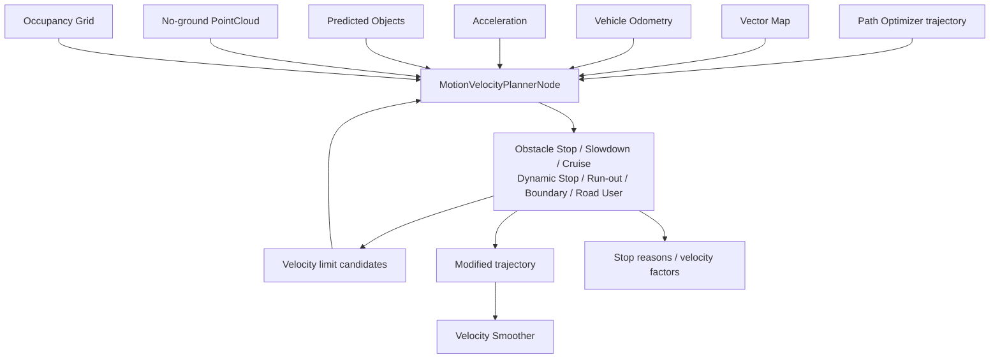

# Autoware Motion Velocity Planner 算法详细分析

本文基于当前工作区 `motion_velocity_planner` 的 launch、参数和模块源码结构，专门分析 Motion Velocity Planner。它与上一层的 Behavior Path Planner、Path Optimizer 和最终 Velocity Smoother 的边界如下：

```text
Behavior Path Planner：决定横向行为和 path
Path Optimizer：生成位置/姿态运动学可行的 trajectory
Motion Velocity Planner：沿已有 trajectory 施加障碍物/边界速度约束
Velocity Smoother：把速度约束变成满足加速度和 jerk 的连续速度曲线
Planning Validator：检查最终输出
```

Motion Velocity Planner 的核心问题是：**给定一条车辆准备跟踪的轨迹，车辆在每个轨迹位置最多能以多快速度行驶，是否需要减速或停车。**

## 1. 架构和默认运行链

### 1.1 主入口

```text
src/launcher/autoware_launch/tier4_universe_launch/tier4_planning_launch/launch/
  scenario_planning/lane_driving/motion_planning/motion_planning.launch.xml
```

主节点：

```text
autoware_motion_velocity_planner
  plugin: autoware::motion_velocity_planner::MotionVelocityPlannerNode
```

它在 `motion_planning_container` 中运行，并通过 `launch_modules` 字符串动态装载各模块。

### 1.2 默认模块列表

当前 launch 支持装载：

| 模块                                  | 主要作用                            |
| ------------------------------------- | ----------------------------------- |
| `ObstacleStopModule`                | 轨迹前方障碍物停车                  |
| `ObstacleSlowDownModule`            | 障碍物附近舒适减速                  |
| `ObstacleCruiseModule`              | 根据障碍物关系限制巡航速度          |
| `OutOfLaneModule`                   | 轨迹/车辆可能驶出车道时降速         |
| `ObstacleVelocityLimiterModule`     | 将障碍物风险转换为速度上限          |
| `DynamicObstacleStopModule`         | 动态障碍物冲突停车                  |
| `RunOutModule`                      | 处理行人/自行车等突然进入路径的风险 |
| `BoundaryDeparturePreventionModule` | 防止道路边界驶离                    |
| `RoadUserStopModule`                | 对道路参与者施加停止策略            |

这些模块通常在默认 preset 中开启，但实际是否运行仍由 planning preset 和 launch 条件决定。

### 1.3 数据流



## 2. 输入输出接口

### 2.1 输入

| 输入                   | 默认 topic                                                | 用途                           |
| ---------------------- | --------------------------------------------------------- | ------------------------------ |
| 输入 trajectory        | `path_optimizer/trajectory`                             | 已经具有位置/姿态的待处理轨迹  |
| vector map             | `/map/vector_map`                                       | 车道、道路边界、区域和地图语义 |
| vehicle odometry       | `/localization/kinematic_state`                         | ego pose、速度和轨迹最近点     |
| acceleration           | `/localization/acceleration`                            | 当前加速度和减速状态           |
| dynamic objects        | `/perception/object_recognition/objects`                | 动态车辆、行人、自行车等       |
| no-ground pointcloud   | `/perception/obstacle_segmentation/pointcloud`          | 点云障碍物                     |
| traffic signals        | `/perception/traffic_light_recognition/traffic_signals` | 兼容部分速度/冲突判断          |
| virtual traffic lights | `/perception/virtual_traffic_light_states`              | 外部基础设施状态               |
| occupancy grid         | `/perception/occupancy_grid_map/map`                    | 占据空间和障碍物判断           |

### 2.2 输出

| 输出     | 默认 topic                                              | 含义                                             |
| -------- | ------------------------------------------------------- | ------------------------------------------------ |
| 轨迹     | `/planning/scenario_planning/lane_driving/trajectory` | Motion Velocity 修改后的 lane-driving trajectory |
| 速度上限 | `/planning/scenario_planning/max_velocity_candidates` | 各模块输出的速度限制候选                         |
| 清除限制 | `/planning/scenario_planning/clear_velocity_limit`    | 清除已生效的速度限制                             |
| 停车原因 | `/planning/scenario_planning/status/stop_reasons`     | 解释为什么减速或停车                             |
| 速度因素 | `/planning/velocity_factors/motion_velocity_planner`  | debug/评估用的速度影响因素                       |

输出之后通常进入 Scenario Planning 的 Velocity Smoother，再经过 Planning Validator。Motion Velocity Planner 发布的 trajectory 不应直接等同于最终 `/planning/trajectory`。

## 3. 单周期工作原理

```text
1. 接收输入 trajectory 和环境数据
2. 对 trajectory 做速度 profile 预处理
3. 根据 trajectory polygon 裁剪/下采样点云
4. 每个 module 过滤目标并计算风险
5. 生成 stop point、slowdown profile 或 velocity limit
6. 合并多个 module 的约束
7. 修改 trajectory velocity 和 stop reason
8. 发布 trajectory、velocity candidates 和 debug factor
```

### 3.1 轨迹弧长坐标

把 trajectory 离散点表示为：

$$
T_i=(x_i,y_i,\psi_i,v_i,a_i,s_i),\qquad i=0,\ldots,N
$$

其中 $s_i$ 是从车辆当前位置沿 trajectory 的累计弧长：

$$
s_{i+1}=s_i+\|p_{i+1}-p_i\|_2
$$

大多数 Motion Velocity 模块在 $s$ 坐标中计算 obstacle distance、stop point 和 slowdown area，然后把结果映射回 trajectory index。

### 3.2 速度约束合并

设输入速度为 $v_{in}(s)$，第 $k$ 个模块输出速度上限 $v_k(s)$，则统一结果为：

$$
v_{out}(s)=\min\left(v_{in}(s),v_1(s),v_2(s),\ldots,v_m(s)\right)
$$

停车模块是特殊情况：

$$
v_{out}(s_{stop})=0
$$

因此多个模块同时触发时，通常由最严格的约束决定最终速度。`stop_reasons` 和 `velocity_factors` 用于追踪这些约束来源。

## 4. 公共数学原理

### 4.1 反应距离和制动距离

当前速度为 $v$，系统延迟为 $T_d$，允许舒适减速度为 $a_d>0$，额外安全余量为 $d_m$，则工程上常用的安全距离为：

$$
d_{safe}=vT_d+\frac{v^2}{2a_d}+d_m
$$

其中：

- $vT_d$ 是系统感知、规划和执行延迟期间的行驶距离。
- $v^2/(2a_d)$ 是恒定减速度模型下的制动距离。
- $d_m$ 是车辆尺寸、定位、感知和建模误差余量。

如果障碍物沿 trajectory 的距离 $d_o$ 满足：

$$
d_o\leq d_{safe}
$$

则需要停车或至少进入紧急 slowdown。若 $d_o$ 更大，仍可能根据舒适减速度和目标速度生成 slowdown。

### 4.2 jerk 约束

加速度变化率为：

$$
j=\frac{da}{dt}
$$

若减速度从 0 以最大 jerk $j_{max}$ 增长到 $a_d$，则达到目标减速度的时间约为：

$$
t_j=\frac{|a_d|}{|j_{max}|}
$$

实际停车距离会比恒定减速度模型更长。Motion Velocity Planner 主要设置 stop/limit 约束，最终连续速度通常由后续 Velocity Smoother 处理。

### 4.3 动态碰撞时间

若 ego 轨迹与目标预测轨迹在未来时刻 $t$ 的 footprint 距离为 $d(t)$，安全距离为 $d_{safe}(t)$，动态碰撞条件可写为：

$$
\exists t\in[t_0,t_0+T]:
\quad d(t)<d_{safe}(t)
$$

如果目标预测 path 与 ego trajectory polygon 的时间区间重叠，则可生成 stop/slowdown。实际实现还包括预测 path confidence、目标类别过滤、时间 margin 和对象忽略规则。

### 4.4 轨迹 polygon

把车辆 footprint $F$ 沿 trajectory 变换并求并集：

$$
P_T=\bigcup_{i=0}^{N}F(T_i)
$$

点云点、对象 polygon 或预测 path 与 $P_T$ 发生几何交叠时，认为存在轨迹风险：

$$
P_T\cap P_O\neq\varnothing
\Rightarrow \text{collision risk}
$$

为降低计算量，系统会按照 `decimate_trajectory_step_length` 对 trajectory 离散采样，并可使用 trajectory polygon 裁剪点云。

## 5. 主要功能模块

### 5.1 Obstacle Stop Module

包：

```text
autoware_motion_velocity_obstacle_stop_module
```

功能：对位于 ego trajectory 前方、且在车辆 footprint/安全区域内的障碍物生成停车点。

基本流程：

```text
轨迹 polygon
  -> 对象/点云过滤
  -> 最近障碍物和碰撞位置
  -> 减去 stop margin
  -> 插入 zero velocity
```

默认参数中的 `stop_margin` 代表障碍物前方的纵向余量；`terminal_stop_margin` 用于目标附近的特殊停车余量；`suppress_sudden_stop` 控制是否抑制突然停车。

### 5.2 Obstacle Slow Down Module

包：`autoware_motion_velocity_obstacle_slow_down_module`

在不必立即停车的情况下，根据障碍物横向距离、纵向距离和车辆速度计算 slowdown velocity。典型约束为：

$$
v_{slow}(d)=\min\left(v_{normal},v_{risk}(d)\right)
$$

随着障碍物接近或横向安全余量降低，$v_{risk}$ 下降。slowdown 模块适用于仍有可行驶空间但需要降低风险的场景。

### 5.3 Obstacle Cruise Module

包：`autoware_motion_velocity_obstacle_cruise_module`

根据前方目标速度、目标距离和安全跟车关系给出巡航速度。简化跟车模型可写为：

$$
d_{desired}=d_0+T_hv_{ego}
$$

其中 $d_0$ 是静态安全距离，$T_h$ 是期望时间间隔。当实际距离小于期望距离时，模块降低 ego 速度；当距离恢复时，可逐步恢复巡航速度。

### 5.4 Obstacle Velocity Limiter Module

包：`autoware_motion_velocity_obstacle_velocity_limiter_module`

它将 objects、点云、occupancy grid 和 trajectory 关系转换为统一 `max_velocity` 候选。该模块的核心价值是把复杂的障碍物风险检测与速度合并解耦：

```text
障碍物/点云/预测
  -> forward projection / distance check
  -> trajectory collision risk
  -> max velocity candidate
  -> Motion Velocity 主节点合并
```

### 5.5 Dynamic Obstacle Stop Module

包：`autoware_motion_velocity_dynamic_obstacle_stop_module`

针对动态目标预测路径与 ego trajectory 的时间/空间冲突生成停车约束。其判断重点不是目标当前是否在 path 上，而是未来预测时间窗内是否会进入 ego 轨迹占用区域。

### 5.6 Out of Lane Module

包：`autoware_motion_velocity_out_of_lane_module`

检查 ego trajectory footprint 是否离开可行驶 lanelet 或进入其他 lanelet/道路区域，并根据潜在碰撞和道路边界情况生成 slowdown/stop。

设 trajectory footprint 为 $F(s)$，道路允许区域为 $D(s)$：

$$
F(s)\subseteq D(s)
$$

如果该条件在未来弧长区间内被破坏，则可以根据越界距离、对象和时间到冲突点计算减速位置。

### 5.7 Boundary Departure Prevention Module

包：`autoware_motion_velocity_boundary_departure_prevention_module`

在轨迹接近道路边界但尚未完全越界时提前限制速度，为车辆控制和轨迹修正保留反应时间。它与 Out of Lane 的区别是：

- Out of Lane 更关注已进入/即将进入不允许区域。
- Boundary Departure Prevention 更关注边界接近和预防性限速。

### 5.8 Run Out Module

包：`autoware_motion_velocity_run_out_module`

处理行人、自行车、摩托车等可能突然进入 ego trajectory 的道路参与者。模块会：

- 按对象类别过滤目标。
- 选择预测 path confidence。
- 计算 ego 与目标预测 path 的时间重叠。
- 对 slowdown/stop 使用不同的 on/off hysteresis。
- 对已越过 ego 或特定地图区域中的碰撞应用忽略规则。

其碰撞区间可抽象为：

$$
I_{ego}=[t_{e,in},t_{e,out}],\qquad
I_{obj}=[t_{o,in},t_{o,out}]
$$

若：

$$
I_{ego}\cap I_{obj}\neq\varnothing
$$

并且时间重叠超过 margin，则触发风险决策。`time_margin`、`time_overlap_tolerance` 和对象过滤参数直接影响误触发率。

### 5.9 Road User Stop Module

包：`autoware_motion_velocity_road_user_stop_module`

针对道路参与者和 cut-in/yield 等关系生成停车或抑制突然停车。当前参数中包含：

- `longitudinal_margin`：障碍物前纵向余量。
- `terminal_margin`：目标附近停车余量。
- `minimum_margin`：最小安全余量。
- `suppress_sudden_stop`：是否抑制突然停车。
- obstacle velocity hysteresis：在 stop 与 cruise 之间切换的速度阈值。

### 5.10 Surround Obstacle Checker

它是 Motion Planning 的可选起步安全模块，不负责整条 trajectory 的障碍物速度规划，而是检查车辆近身障碍物并发布：

- `max_velocity`，通常为零。
- `velocity_limit_clear_command`。
- `no_start_reason`。

状态采用 PASS/STOP 迟滞：

$$
d_{recover}=d_{entry}+d_{hysteresis}
$$

这样障碍物在边界附近轻微抖动时不会导致速度限制快速开关。

## 6. 点云和轨迹预处理

Motion Velocity Planner 的公共参数包括：

```yaml
smooth_velocity_before_planning: true
trajectory_polygon_collision_check:
  decimate_trajectory_step_length: 2.0
  goal_extended_trajectory_length: 6.0
pointcloud_preprocessing:
  filter_by_trajectory_polygon:
    enable_monolithic_crop_box: true
    min_trajectory_length: 30.0
    braking_distance_scale_factor: 1.5
    lateral_margin: 2.0
    height_margin: 1.0
```

主要逻辑：

1. 先对输入 trajectory 速度进行平滑或预处理。
2. 根据 trajectory polygon 裁剪点云，减少无关点。
3. 按 voxel grid 下采样。
4. 可选进行 Euclidean clustering。
5. 将结果交给各 obstacle module。

如果 `min_trajectory_length` 未满足，点云裁剪策略可能改变；如果 `braking_distance_scale_factor` 增大，检测区域更保守，但计算量和误检概率也可能增加。

## 7. 关键参数

### 7.1 主节点公共参数

文件：

```text
.../motion_velocity_planner/motion_velocity_planner.param.yaml
```

| 参数                                          |     当前值 | 作用                         |
| --------------------------------------------- | ---------: | ---------------------------- |
| `smooth_velocity_before_planning`           |   `true` | 规划前平滑输入速度           |
| `decimate_trajectory_step_length`           |  `2.0 m` | trajectory polygon 采样间距  |
| `goal_extended_trajectory_length`           |  `6.0 m` | 目标附近延长检查距离         |
| `consider_current_pose.enable`              |   `true` | 将当前 ego pose 纳入碰撞检查 |
| `consider_current_pose.time_to_convergence` |  `1.5 s` | 假设当前 pose 误差收敛时间   |
| `min_trajectory_length`                     | `30.0 m` | 点云轨迹裁剪最小长度         |
| `braking_distance_scale_factor`             |    `1.5` | 点云裁剪制动距离缩放         |
| `lateral_margin`                            |  `2.0 m` | 点云裁剪横向余量             |
| `height_margin`                             |  `1.0 m` | 点云裁剪高度余量             |

### 7.2 Obstacle Stop

参数文件：`obstacle_stop.param.yaml`

重点参数：

| 参数                         | 作用                   |
| ---------------------------- | ---------------------- |
| `stop_margin`              | 障碍物前停车余量       |
| `terminal_stop_margin`     | 目标附近停车余量       |
| `ignore_crossing_obstacle` | 是否忽略部分横穿障碍物 |
| `suppress_sudden_stop`     | 是否抑制突然停车       |

### 7.3 Run Out

参数文件：`run_out.param.yaml`

| 参数                                 | 当前值/作用                               |
| ------------------------------------ | ----------------------------------------- |
| `collision.time_margin`            | `0.5 s`，碰撞判断时间余量               |
| `collision.time_overlap_tolerance` | `0.1 s`，合并相近时间区间               |
| `slowdown.on_time_buffer`          | `0.1 s`，触发 slowdown 所需持续碰撞时间 |
| `slowdown.off_time_buffer`         | `0.5 s`，清除 slowdown 所需无碰撞时间   |
| `stop.on_time_buffer`              | `0.3 s`，触发 stop 所需持续碰撞时间     |
| `stop.off_time_buffer`             | `1.0 s`，清除 stop 所需无碰撞时间       |
| `stop.distance_buffer`             | `2.5 m`，碰撞前纵向安全距离             |
| `objects.confidence_filtering`     | 预测 path 置信度过滤                      |
| `objects.target_labels`            | pedestrian/bicycle/motorcycle 等目标类别  |
| `preserved_duration/distance`      | 截断预测 path 时保留安全余量              |

### 7.4 Road User Stop

重点参数：

```text
stop_planning.longitudinal_margin.default_margin: 5.0 m
stop_planning.longitudinal_margin.terminal_margin: 3.0 m
stop_planning.longitudinal_margin.minimum_margin: 3.0 m
option.suppress_sudden_stop: true
```

### 7.5 Surround Obstacle Checker

| 参数                                   |  典型默认值 | 作用               |
| -------------------------------------- | ----------: | ------------------ |
| `surround_check_front_distance`      |   `0.5 m` | 前方停止触发距离   |
| `surround_check_side_distance`       |   `0.5 m` | 侧方停止触发距离   |
| `surround_check_back_distance`       |   `0.5 m` | 后方停止触发距离   |
| `surround_check_hysteresis_distance` |   `0.3 m` | PASS/STOP 恢复迟滞 |
| `state_clear_time`                   |   `2.0 s` | 清除 STOP 的时间   |
| `stop_state_ego_speed`               | `0.1 m/s` | 车辆停止速度阈值   |

## 8. 速度约束的工程表现

### 8.1 障碍物较远

如果障碍物距离大于停车安全距离，可能出现：

- 不修改速度。
- Obstacle Cruise 降低巡航速度。
- Obstacle Slowdown 产生渐进式限速。

### 8.2 障碍物接近

若：

$$
d_o<vT_d+\frac{v^2}{2a_d}+d_m
$$

则更可能生成停车约束。最终减速开始位置还会受到 jerk、Velocity Smoother、当前加速度和轨迹采样的影响。

### 8.3 动态目标突然横穿

Run Out/Dynamic Obstacle Stop 可能先进入 slowdown，再根据时间区间持续时间升级为 stop。on/off time buffer 防止单帧预测噪声导致紧急动作频繁开关。

### 8.4 越界风险

Out of Lane/Boundary Departure Prevention 的典型表现是速度下降而 path 几何保持不变。若轨迹已不可恢复，模块可能直接给出 stop reason；横向回到道路范围仍属于 Behavior Path 或 Path Optimizer 的责任。

### 8.5 起步风险

车辆已经停止时，Surround Obstacle Checker 会检查 footprint 周围点云和对象。如果障碍物未离开恢复距离，系统保持零速度限制并发布 `no_start_reason`。

## 9. 可操作的调试流程

### 9.1 Topic 检查

```bash
ros2 node list | grep motion_velocity
ros2 topic info /planning/scenario_planning/lane_driving/trajectory -v
ros2 topic echo /planning/scenario_planning/lane_driving/trajectory --once
ros2 topic echo /planning/scenario_planning/max_velocity_candidates --once
ros2 topic echo /planning/scenario_planning/status/stop_reasons --once
ros2 topic echo /planning/velocity_factors/motion_velocity_planner --once
ros2 topic echo /planning/scenario_planning/no_start_reason --once
```

### 9.2 输入有效性

```bash
ros2 topic hz /localization/kinematic_state
ros2 topic hz /perception/object_recognition/objects
ros2 topic hz /perception/obstacle_segmentation/pointcloud
ros2 topic echo /localization/acceleration --once
ros2 topic info /perception/object_recognition/objects -v
```

重点检查 header 时间戳、frame、objects predicted path confidence、点云是否覆盖 trajectory polygon。

### 9.3 参数检查

```bash
ros2 param list /planning/scenario_planning/lane_driving/motion_planning/motion_velocity_planner
ros2 param get /planning/scenario_planning/lane_driving/motion_planning/motion_velocity_planner smooth_velocity_before_planning
ros2 param get /planning/scenario_planning/lane_driving/motion_planning/motion_velocity_planner trajectory_polygon_collision_check.decimate_trajectory_step_length
```

模块通常不是独立 ROS node，因此应同时检查主节点的 `launch_modules` 和启动日志。

### 9.4 三组推荐实验

#### 实验 A：静态障碍物停车

1. 固定车辆速度和 trajectory。
2. 改变障碍物距离和 `stop_margin`。
3. 记录 obstacle polygon、stop reason、stop position 和最终 velocity。
4. 用下式估算结果：

$$
d_{safe}=vT_d+\frac{v^2}{2a_d}+d_m
$$

#### 实验 B：动态道路参与者

1. 分别设置 pedestrian、bicycle、motorcycle。
2. 改变 predicted path confidence 和目标横穿时间。
3. 记录 run-out collision interval、slowdown/stop decision 和 hysteresis。
4. 验证预测路径被截断或忽略的原因。

#### 实验 C：近身障碍物起步

1. 车辆停稳后在前、侧、后方向设置点云/对象。
2. 比较 PASS/STOP 状态、速度限制和 `no_start_reason`。
3. 改变 entry/recover distance 和 `state_clear_time`，观察抖动与恢复延迟。

## 10. 常见问题定位

| 现象               | 首先检查                                              | 可能原因                                 |
| ------------------ | ----------------------------------------------------- | ---------------------------------------- |
| 障碍物前不停车     | objects/pointcloud、trajectory polygon、Obstacle Stop | 时间戳、目标过滤、模块未加载             |
| 车辆过早停车       | stop margin、footprint、点云裁剪                      | margin 过大、点云误检、目标预测过保守    |
| 速度突然变为 0     | stop reasons、velocity factors                        | 多模块同时触发、Run Out 或 Boundary Stop |
| 动态目标触发不稳定 | predicted path、confidence、on/off buffer             | 预测抖动、时间区间过短                   |
| 目标已离开但仍限速 | clear command、off buffer、状态机                     | hysteresis 或状态清除条件未满足          |
| 越界仍高速         | Out of Lane、Boundary Prevention、vector map          | lanelet/边界地图错误或插件未加载         |
| 起步被阻止         | Surround Checker、pointcloud、no_start_reason         | 近身障碍物未清除或恢复距离不足           |
| 只有部分点云被检测 | trajectory polygon crop、min length、voxel 参数       | 点云裁剪范围或下采样设置不合适           |
| 输出与预期不同     | max velocity candidates、Velocity Smoother            | 后续模块再次合并更保守约束               |

## 11. 设计优势和限制

### 优势

- 各类障碍物风险通过插件独立扩展。
- 速度约束以 trajectory 弧长和时间为基础，便于解释。
- stop reason、velocity factor 和 debug marker 支持问题追踪。
- 通过点云裁剪、轨迹抽样和对象过滤控制计算量。
- 迟滞、预测置信度和对象类别过滤减少单帧误触发。

### 限制

- Motion Velocity Planner 不能替代横向避障和行为规划。
- 停车安全性依赖定位、感知、预测、车辆参数和时间戳。
- 多模块使用 `min` 合并时可能导致明显保守。
- 点云裁剪过窄可能漏检，过宽会增加计算量和误检。
- 预测对象 path 截断/忽略规则会改变风险判断，需要结合场景验证。
- 速度约束输出还要经过 Velocity Smoother，单看模块输出无法推断车辆最终控制表现。

## 12. 总结

Motion Velocity Planner 的核心流程是：

```text
输入已生成的 trajectory
  -> 构造弧长、轨迹 polygon 和预测时间关系
  -> 过滤障碍物/点云/动态目标
  -> 计算 stop、slowdown、cruise 和 boundary limit
  -> 以最保守速度约束合并
  -> 发布 trajectory、stop reason、velocity factor
  -> Velocity Smoother 生成最终可执行速度
```

最关键的数学关系是安全距离、制动距离、预测时间区间和速度上限合并：

$$
d_{safe}=vT_d+\frac{v^2}{2a_d}+d_m
$$

$$
v_{out}(s)=\min\left(v_{in}(s),v_1(s),\ldots,v_m(s)\right)
$$

实际调试时，必须同时观察 trajectory、max velocity candidates、stop reasons、velocity factors、objects 和 pointcloud，才能区分“没有检测到风险”“检测到了但未触发模块”和“触发后被下游速度平滑修改”这三类问题。
