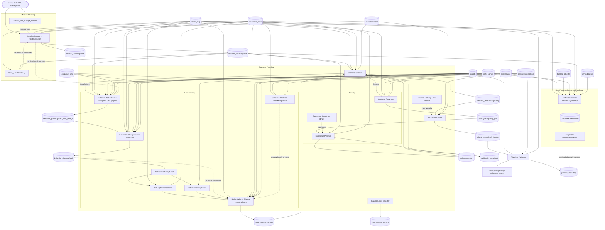
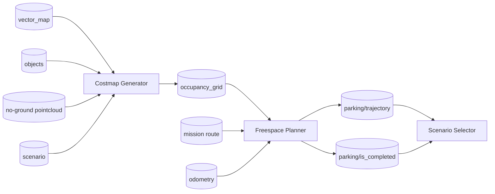
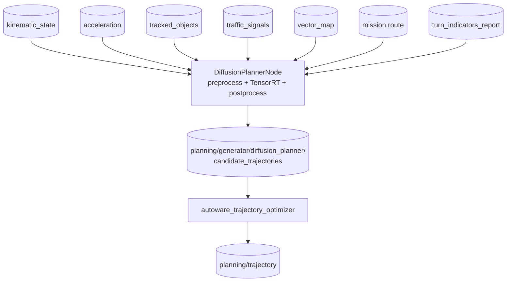
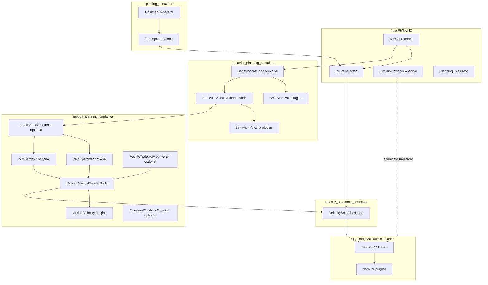
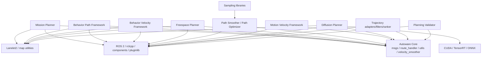
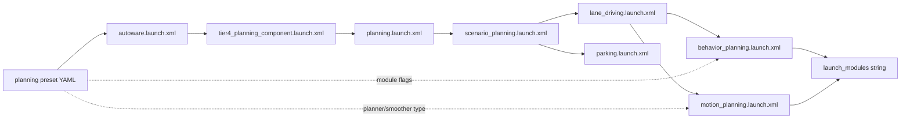

# Autoware Planning 完整数据流与运行时依赖图

本文基于当前工作区 `src/universe/autoware_universe/planning`、`autoware_launch` planning launch 和各包的实际装配关系，给出 Planning 的数据流、运行时容器关系、插件依赖和可选分支。

## 1. 图例和边界

| 表示         | 含义                                               |
| ------------ | -------------------------------------------------- |
| 实线箭头     | ROS topic、消息或运行时数据流                      |
| 虚线箭头     | approval、参数、速度限制或横切关系                 |
| `plugin`   | 通常由主节点动态加载，不一定是独立 ROS node        |
| `optional` | 由 preset、launch 条件或新 planning framework 决定 |
| `library`  | 编译/算法库，通常不直接发布 topic                  |

本文将运行时 topic 依赖与编译/库依赖分开。package 的编译依赖不代表运行时一定存在 ROS topic。

## 2. 完整运行时数据流



## 3. 旧 Universe 主链 topic 图

```mermaid
flowchart LR
    R[/planning/mission_planning/route]
    BP[/planning/scenario_planning/lane_driving/behavior_planning/path_with_lane_id]
    BV[/planning/scenario_planning/lane_driving/behavior_planning/path]
    SM[/planning/scenario_planning/lane_driving/motion_planning/path_smoother/path]
    PO[/planning/scenario_planning/lane_driving/motion_planning/path_optimizer/trajectory]
    MV[/planning/scenario_planning/lane_driving/trajectory]
    SEL[/planning/scenario_planning/scenario_selector/trajectory]
    VS[/planning/scenario_planning/velocity_smoother/trajectory]
    OUT[/planning/trajectory]
    R --> BP --> BV --> SM --> PO --> MV --> SEL --> VS --> OUT
```

实际变体：

- `motion_path_smoother_type=none` 时，`SM` 是 relay。
- `motion_path_planner_type=none` 时，`PO` 是 Path-to-Trajectory converter。
- `path_sampler` 可替代 `path_optimizer`。
- `planning_validator` 的输出是旧主链最终输出。

## 4. 停车分支



编译依赖方向：

```text
autoware_freespace_planner -> autoware_freespace_planning_algorithms (library)
```

## 5. Diffusion/new framework 分支

该分支来自 `autoware_diffusion_planner/README.md` 的集成示例，不等同于旧默认链路。



## 6. ROS 运行时容器图



### 6.1 独立节点

- `MissionPlanner`：路线、RouteState、reroute。
- `RouteSelector`：normal/MRM route 仲裁。
- `DiffusionPlannerNode`：可选神经轨迹生成器。
- Planning Evaluator：规划质量评估。

### 6.2 Composable node

- Behavior Path/Velocity Planner。
- Elastic Band、Path Optimizer、Path Sampler。
- Motion Velocity Planner、Surround Obstacle Checker。
- Costmap Generator、Freespace Planner。
- Velocity Smoother、Planning Validator。

### 6.3 容器内 plugin

- Behavior Path：lane change、static/dynamic avoidance、goal/start、side shift、sampling、bidirectional traffic 等。
- Behavior Velocity：traffic light、crosswalk、intersection、blind spot、detection area、occlusion、speed bump、stop line 等。
- Motion Velocity：obstacle stop/slowdown/cruise、dynamic stop、run-out、boundary、out-of-lane、road-user stop。
- Validator：latency、trajectory、intersection collision、rear collision checker。

## 7. 完整功能包清单

### 7.1 顶层 Planning 包

| 包                                              | 归属                  | 运行时角色                     |
| ----------------------------------------------- | --------------------- | ------------------------------ |
| `autoware_mission_planner_universe`           | Mission               | node + Lanelet2 planner plugin |
| `autoware_manual_lane_change_handler`         | Mission               | route/lane-change handler      |
| `autoware_scenario_selector`                  | Scenario              | scenario arbitration node      |
| `autoware_costmap_generator`                  | Parking               | composable node                |
| `autoware_freespace_planner`                  | Parking               | composable node                |
| `autoware_freespace_planning_algorithms`      | Parking               | algorithm library              |
| `behavior_path_planner`                       | Behavior Path         | manager + plugins              |
| `behavior_velocity_planner`                   | Behavior Velocity     | manager + plugins              |
| `autoware_path_smoother`                      | Motion                | optional node                  |
| `autoware_path_optimizer`                     | Motion                | optional MPT/QP node           |
| `motion_velocity_planner`                     | Motion Velocity       | manager + plugins              |
| `autoware_surround_obstacle_checker`          | Motion Velocity       | optional node                  |
| `sampling_based_planner`                      | Motion                | sampling libraries/node        |
| `autoware_diffusion_planner`                  | New framework         | optional neural generator      |
| `autoware_external_velocity_limit_selector`   | Cross-cutting         | velocity limit node            |
| `autoware_hazard_lights_selector`             | Cross-cutting         | light selector node            |
| `autoware_rtc_interface`                      | Cross-cutting         | RTC library                    |
| `autoware_remaining_distance_time_calculator` | Cross-cutting         | optional metric node           |
| `planning_validator`                          | Output safety         | validator + checker plugins    |
| `autoware_trajectory_optimizer`               | Candidate/postprocess | optional optimizer/selector    |
| `autoware_trajectory_adapter`                 | Candidate/postprocess | trajectory adapter             |
| `autoware_trajectory_concatenator`            | Candidate/postprocess | trajectory continuity          |
| `autoware_trajectory_modifier`                | Candidate/postprocess | trajectory modifier            |
| `autoware_trajectory_ranker`                  | Candidate/postprocess | candidate ranking              |
| `autoware_trajectory_safety_filter`           | Candidate/postprocess | safety filtering               |
| `autoware_trajectory_traffic_rule_filter`     | Candidate/postprocess | traffic-rule filtering         |

### 7.2 Behavior Path 子包

```text
autoware_behavior_path_planner
autoware_behavior_path_planner_common
autoware_behavior_path_lane_change_module
autoware_behavior_path_static_obstacle_avoidance_module
autoware_behavior_path_dynamic_obstacle_avoidance_module
autoware_behavior_path_avoidance_by_lane_change_module
autoware_behavior_path_external_request_lane_change_module
autoware_behavior_path_goal_planner_module
autoware_behavior_path_start_planner_module
autoware_behavior_path_sampling_planner_module
autoware_behavior_path_side_shift_module
autoware_behavior_path_bidirectional_traffic_module
```

### 7.3 Behavior Velocity 子包

```text
autoware_behavior_velocity_planner
autoware_behavior_velocity_crosswalk_module
autoware_behavior_velocity_walkway_module
autoware_behavior_velocity_traffic_light_module
autoware_behavior_velocity_intersection_module
autoware_behavior_velocity_roundabout_module
autoware_behavior_velocity_blind_spot_module
autoware_behavior_velocity_detection_area_module
autoware_behavior_velocity_virtual_traffic_light_module
autoware_behavior_velocity_stop_line_module
autoware_behavior_velocity_occlusion_spot_module
autoware_behavior_velocity_speed_bump_module
autoware_behavior_velocity_no_stopping_area_module
autoware_behavior_velocity_no_drivable_lane_module
autoware_behavior_velocity_rtc_interface
autoware_behavior_velocity_template_module
```

### 7.4 Motion Velocity 子包

```text
autoware_motion_velocity_planner
autoware_motion_velocity_obstacle_stop_module
autoware_motion_velocity_obstacle_slow_down_module
autoware_motion_velocity_obstacle_cruise_module
autoware_motion_velocity_dynamic_obstacle_stop_module
autoware_motion_velocity_obstacle_velocity_limiter_module
autoware_motion_velocity_out_of_lane_module
autoware_motion_velocity_boundary_departure_prevention_module
autoware_motion_velocity_run_out_module
autoware_motion_velocity_road_user_stop_module
```

### 7.5 Validator 和 Sampling 子包

```text
autoware_planning_validator
autoware_planning_validator_latency_checker
autoware_planning_validator_trajectory_checker
autoware_planning_validator_intersection_collision_checker
autoware_planning_validator_rear_collision_checker
autoware_planning_validator_test_utils

autoware_sampler_common
autoware_bezier_sampler
autoware_frenet_planner
autoware_path_sampler
```

## 8. 编译/库依赖图



## 9. 配置和启用关系



一个包/模块实际运行的条件通常是：

```text
包已构建
  AND 上层 launch 已 include
  AND launch 条件为 true
  AND preset 已打开
  AND plugin 出现在 launch_modules
  AND 所需输入 topic 已 ready
```

## 10. Topic 边界速查

| 边界                               | 上游                      | 下游                            | 主要数据                       |
| ---------------------------------- | ------------------------- | ------------------------------- | ------------------------------ |
| Mission -> Scenario                | Mission Planner           | Scenario Selector/Behavior Path | `LaneletRoute`               |
| Scenario -> Behavior               | Scenario Selector         | Behavior Path Planner           | `Scenario`、route            |
| Behavior Path -> Behavior Velocity | Behavior Path Planner     | Behavior Velocity Planner       | `PathWithLaneId`             |
| Behavior -> Motion                 | Behavior Velocity Planner | Smoother/Optimizer              | path + velocity constraints    |
| Motion Geometry -> Motion Velocity | Path Optimizer/Sampler    | Motion Velocity Planner         | `Trajectory`                 |
| Motion Velocity -> Scenario        | Motion Velocity Planner   | Scenario Selector               | lane-driving trajectory        |
| Parking -> Scenario                | Freespace Planner         | Scenario Selector               | parking trajectory + completed |
| Scenario -> Smoother               | Scenario Selector         | Velocity Smoother               | selected trajectory            |
| Smoother -> Validator              | Velocity Smoother         | Planning Validator              | smoothed trajectory            |
| Validator -> Control               | Planning Validator        | Control/Trajectory Follower     | `/planning/trajectory`       |
| Generator -> Selector              | Diffusion Planner         | Trajectory Optimizer/Selector   | `CandidateTrajectories`      |

## 11. 如何在运行时核对图

### 11.1 节点和组件

```bash
ros2 node list | grep -E 'planning|mission|scenario|behavior|motion|trajectory|validator'
ros2 component list
```

`ros2 node list` 只能证明独立节点/容器存在；plugin module 应查看主节点参数和日志。

### 11.2 Publisher/subscriber

```bash
ros2 topic info /planning/mission_planning/route -v
ros2 topic info /planning/scenario_planning/lane_driving/behavior_planning/path -v
ros2 topic info /planning/scenario_planning/lane_driving/trajectory -v
ros2 topic info /planning/scenario_planning/velocity_smoother/trajectory -v
ros2 topic info /planning/trajectory -v
```

### 11.3 Plugin 是否加载

```bash
ros2 param get /planning/scenario_planning/lane_driving/behavior_planning/behavior_path_planner launch_modules
ros2 param get /planning/scenario_planning/lane_driving/behavior_planning/behavior_velocity_planner launch_modules
ros2 param get /planning/scenario_planning/lane_driving/motion_planning/motion_velocity_planner launch_modules
```

### 11.4 新 Diffusion 分支

```bash
ros2 topic info /planning/generator/diffusion_planner/candidate_trajectories -v
ros2 topic info /planning/generator/trajectory_optimizer/candidate_trajectories -v
ros2 topic echo /planning/trajectory --once
```

## 12. 总结

Autoware Planning 的完整运行时依赖可以归纳为：

```text
地图/定位/感知/目标
  -> Mission route
  -> Scenario arbitration
  -> Behavior path and rule velocity
  -> Motion geometry and obstacle velocity
  -> lane/parking trajectory selection
  -> velocity smoothing
  -> candidate filtering / validation
  -> final /planning/trajectory
```

当前工作区同时存在：

1. **旧 Universe 主链**：Mission -> Scenario -> Behavior -> Motion -> Velocity -> Validator。
2. **新 generator/selector 链**：Diffusion 或其他 generator -> `CandidateTrajectories` -> Trajectory Optimizer/Selector -> final trajectory。
3. **横切依赖**：RTC、外部限速、hazard lights、remaining distance/time、filters、ranker 和 diagnostics。

排查时先确认当前启用哪条链，再沿 topic、container、plugin 和 preset 逐层核对，避免把未启用的包、同容器插件和可选新框架误画成当前车辆必然执行的路径。
