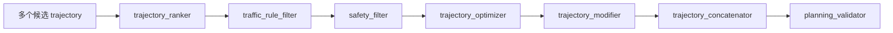
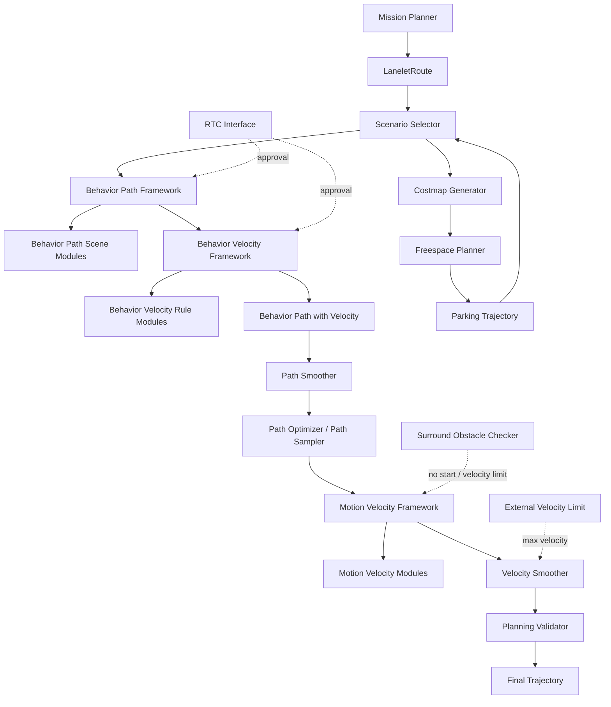

# Autoware Universe Planning 功能包关系分析

本文针对当前工作区 `src/universe/autoware_universe/planning` 下的 Universe Planning 功能包，逐包说明主要功能、输入输出和相互关系。分析以当前仓库的 package、源码入口和 `tier4_planning_launch` 的实际装配为依据。

## 1. 阅读边界和总体结论

### 1.1 功能包不等于当前运行节点

Planning 目录同时包含：

- 当前 lane-driving 默认链路中的运行节点。
- parking/freespace 等场景分支中的运行节点。
- 可替换的规划算法实现，例如采样规划、扩散模型规划。
- 轨迹后处理、安全过滤、候选排序等可选处理器。
- 被主节点以 pluginlib 方式动态加载的 scene module。
- 只提供接口、公共算法或测试辅助能力的包。

所以，目录中存在某个包，不代表默认 preset 一定会启动它。判断实际是否运行，应同时检查：

```text
autoware.launch.xml
  -> tier4_planning_component.launch.xml
  -> tier4_planning_launch/launch/planning.launch.xml
  -> scenario_planning/.../*.launch.xml
  -> planning preset 和参数文件
```

### 1.2 主数据流

```mermaid
flowchart TD
    MAP[地图\nvector_map / pointcloud_map]
    LOC[定位\nkinematic_state / acceleration]
    PER[感知\nobjects / pointcloud / occupancy_grid]
    GOAL[起点、目标点、路线请求]
    TL[交通灯与虚拟交通灯]

    GOAL --> MP[autoware_mission_planner_universe]
    MAP --> MP
    LOC --> MP
    MP --> ROUTE[/planning/mission_planning/route\nLaneletRoute]

    ROUTE --> SS[autoware_scenario_selector]
    LOC --> SS
    SS -->|lane_driving| BP[behavior_path_planner\n行为路径模块]
    SS -->|parking| COST[autoware_costmap_generator]
    COST --> FS[autoware_freespace_planner]
    FS --> PARK[/planning/scenario_planning/parking/trajectory]

    MAP --> BP
    LOC --> BP
    PER --> BP
    BP --> PATH[PathWithLaneId / behavior path]
    PATH --> BV[behavior_velocity_planner\n交通规则速度模块]
    TL --> BV
    PER --> BV
    BV --> PATHV[带速度约束的 path]

    PATHV --> SM[autoware_path_smoother]
    SM --> PO[autoware_path_optimizer\n或 autoware_path_sampler]
    PO --> MVP[motion_velocity_planner\n障碍物和边界速度模块]
    PER --> MVP
    LOC --> MVP
    MVP --> VSM[autoware_velocity_smoother\nAutoware Core]
    VSM --> VAL[planning_validator]
    PARK --> SS
    VAL --> FINAL[/planning/trajectory]
```

### 1.3 四类核心数据

| 数据                   | 解决的问题                                        | 典型生产包                            |
| ---------------------- | ------------------------------------------------- | ------------------------------------- |
| `LaneletRoute`       | 在 Lanelet2 拓扑图上走哪些道路段                  | `autoware_mission_planner_universe` |
| `PathWithLaneId`     | 车辆在道路平面内如何走，包含 lane id 和可行驶区域 | `behavior_path_planner`             |
| `Trajectory`         | 路径上的速度、加速度、曲率和时间相关运动状态      | motion/velocity planner               |
| 验证后的`Trajectory` | 哪一条轨迹允许交给控制器                          | `planning_validator`                |

## 2. 当前运行链路

### 2.1 Launch 入口

主要编排文件：

```text
src/launcher/autoware_launch/autoware_launch/launch/autoware.launch.xml
src/launcher/autoware_launch/autoware_launch/launch/components/tier4_planning_component.launch.xml
src/launcher/autoware_launch/tier4_universe_launch/tier4_planning_launch/launch/planning.launch.xml
```

`planning.launch.xml` 启动四类顶层能力：

1. Mission Planning：路线。
2. Scenario Planning：lane driving、parking 和场景选择。
3. Planning Validator：对速度平滑后的轨迹做检查。
4. Planning Evaluator：采集规划质量指标。

lane driving 进一步拆成：

```text
scenario_selector
  -> behavior_planning
       -> behavior_path_planner
       -> behavior_velocity_planner
  -> motion_planning
       -> path_smoother
       -> path_optimizer 或 path_sampler
       -> motion_velocity_planner
       -> surround_obstacle_checker
  -> velocity_smoother
  -> planning_validator
```

### 2.2 默认 topic 边界

| 阶段                   | 默认输入                                                    | 默认输出                                                     |
| ---------------------- | ----------------------------------------------------------- | ------------------------------------------------------------ |
| Mission Planner        | goal、定位、vector map                                      | `/planning/mission_planning/route`                         |
| Scenario Selector      | route、定位、lane/parking trajectory                        | scenario、选择后的 trajectory                                |
| Behavior Path          | route、vector map、objects、定位、点云                      | `.../behavior_planning/path`                               |
| Behavior Velocity      | path、vector map、objects、交通灯、占据栅格                 | `.../behavior_planning/path`（带速度约束）                 |
| Path Smoother          | behavior path、odometry                                     | `.../motion_planning/path_smoother/path`                   |
| Path Optimizer/Sampler | smooth path、odometry，Sampler 还需要 objects               | `.../path_optimizer/trajectory`                            |
| Motion Velocity        | trajectory、map、objects、点云、定位、交通灯                | `/planning/scenario_planning/lane_driving/trajectory`      |
| Velocity Smoother      | scenario trajectory、acceleration、operation mode、速度限制 | `/planning/scenario_planning/velocity_smoother/trajectory` |
| Validator              | velocity-smoother trajectory、objects、点云、map            | `/planning/trajectory`                                     |

`...` 表示由 namespace 展开的前缀，通常为 `/planning/scenario_planning/lane_driving`。最终以启动后的 `ros2 topic info -v` 为准。

## 3. 顶层功能包逐包说明

本节覆盖 planning 目录下不属于某个 scene-module 子目录的功能包。

### 3.1 任务、场景和停车

| 功能包                                     | 主要功能                                                           | 主要输入                                                                                              | 主要输出/关系                                                                                                |
| ------------------------------------------ | ------------------------------------------------------------------ | ----------------------------------------------------------------------------------------------------- | ------------------------------------------------------------------------------------------------------------ |
| `autoware_mission_planner_universe`      | 根据起点、目标和 Lanelet2 地图进行任务路线规划、到达判定和 reroute | goal/start pose、`/localization/kinematic_state`、`/map/vector_map`、路线修改请求                 | `/planning/mission_planning/route`（`LaneletRoute`）；为 Scenario Selector 和 Behavior Path 提供拓扑路线 |
| `autoware_manual_lane_change_handler`    | 将外部/手动换道请求转换为任务路线修改或 lane-change 请求           | 当前 route、车辆状态、外部 lane-change API                                                            | 修改后的 route 或任务规划请求；与 Mission Planner 和 Behavior Path 的换道模块衔接                            |
| `autoware_scenario_selector`             | 在 lane driving 与 parking 等场景间仲裁，并选择对应 trajectory     | route、`/localization/kinematic_state`、lane driving trajectory、parking trajectory、operation mode | 当前 scenario、选择后的 trajectory；将 route 分发到 lane driving 或 parking 逻辑                             |
| `autoware_costmap_generator`             | 将对象、点云和 vector map 转为停车用 costmap/grid map              | objects、无地面点云、`/map/vector_map`、当前 scenario                                               | `grid_map`、`occupancy_grid`；供 Freespace Planner 使用                                                  |
| `autoware_freespace_planner`             | 在没有明确车道边界的停车/自由空间中生成可行轨迹                    | route、scenario、costmap occupancy grid、odometry、车辆参数                                           | `/planning/scenario_planning/parking/trajectory`、停车完成标志；回到 Scenario Selector                     |
| `autoware_freespace_planning_algorithms` | Freespace Planner 使用的搜索、碰撞和轨迹生成算法库                 | 栅格、车辆 footprint、起终点、运动学参数                                                              | 规划候选路径/轨迹和可行性结果；通常不独立发布 ROS topic                                                      |

停车分支的关系是：

```text
route + scenario + objects + pointcloud
  -> autoware_costmap_generator
  -> occupancy_grid
  -> autoware_freespace_planner
  -> parking/trajectory
```

### 3.2 路径、运动和速度处理

| 功能包                                           | 主要功能                                                     | 主要输入                                                  | 主要输出/关系                                                                                          |
| ------------------------------------------------ | ------------------------------------------------------------ | --------------------------------------------------------- | ------------------------------------------------------------------------------------------------------ |
| `autoware_path_smoother`                       | 对行为路径做几何平滑，降低离散噪声和曲率突变                 | path、odometry、车辆参数、平滑参数                        | 平滑 path；送入 Path Optimizer 或 Path-to-Trajectory 转换器                                            |
| `autoware_path_optimizer`                      | 通过约束优化生成车辆运动学更可行的路径/轨迹                  | smooth path、odometry、车辆 footprint/运动学参数          | trajectory；通常作为 motion planning 的几何优化阶段                                                    |
| `sampling_based_planner/autoware_path_sampler` | 从候选路径空间采样并按碰撞、边界和代价选择路径               | path、odometry、objects、车辆参数                         | 候选排序后的 trajectory；可替换 Path Optimizer                                                         |
| `autoware_diffusion_planner`                   | 使用训练的 diffusion model 生成或预测候选轨迹的可选规划器    | ego state、地图、objects/预测信息、历史轨迹等内部规划消息 | 候选 trajectory 及 debug/诊断结果；不是默认 lane-driving launch 的必经阶段                             |
| `autoware_external_velocity_limit_selector`    | 合并外部速度限制请求，选择当前有效速度上限                   | 外部速度限制、operation mode、时间/优先级信息             | `/planning/scenario_planning/max_velocity` 等速度限制；影响 Velocity Smoother 和 Motion Velocity     |
| `autoware_surround_obstacle_checker`           | 起步和低速阶段检查车辆周围障碍物，阻止危险启动               | odometry、objects、点云、车辆 footprint                   | 最大速度、清除限速命令、`no_start_reason`、stop reason；与 Motion Velocity 和 Velocity Smoother 交互 |
| `autoware_trajectory_optimizer`                | 以插件链方式修正轨迹点、施加运动学可行性约束、平滑和速度优化 | trajectory、车辆参数、地图/障碍物相关信息（取决于插件）   | 优化后的 trajectory；是否启用取决于当前 launch/preset，不应仅凭包存在判断                              |
| `autoware_trajectory_adapter`                  | 在不同规划轨迹表示或历史轨迹之间进行适配                     | 内部 trajectory、规划状态                                 | 适配后的 trajectory/内部规划消息；为新旧规划接口或下游组件提供兼容层                                   |
| `autoware_trajectory_concatenator`             | 拼接新旧轨迹，使重规划切换连续                               | 当前 trajectory、上一条 trajectory、车辆状态              | 连续拼接后的 trajectory；降低规划刷新时的跳变                                                          |
| `autoware_trajectory_modifier`                 | 对 trajectory 做局部修改或状态相关的后处理                   | trajectory、车辆状态、修改请求                            | 修改后的 trajectory；可插入速度/路径后处理链                                                           |
| `autoware_trajectory_ranker`                   | 对多个候选 trajectory 计算代价并排序                         | 候选 trajectory、地图、对象、车辆状态                     | 排序后的候选或最佳轨迹；可与 sampling/diffusion planner 配合                                           |
| `autoware_trajectory_safety_filter`            | 对轨迹做边界离开、安全性和车辆 footprint 过滤                | trajectory、vector map、车辆状态、车辆参数                | 通过/拒绝/修正后的 trajectory、诊断；属于可选安全后处理                                                |
| `autoware_trajectory_traffic_rule_filter`      | 根据交通灯、交通规则和可行驶区域过滤候选轨迹                 | 候选 trajectory、vector map、traffic signals、objects     | 过滤后的候选 trajectory；用于阻止违反交通规则的候选                                                    |

这些包并非都在当前默认链路中串联。它们的共同位置是“候选轨迹生成之后、最终输出之前”，通常由专门 launch、plugin 或产品 preset 选择。

### 3.3 状态、接口和辅助能力

| 功能包                                          | 主要功能                                                | 主要输入                              | 主要输出/关系                                                    |
| ----------------------------------------------- | ------------------------------------------------------- | ------------------------------------- | ---------------------------------------------------------------- |
| `autoware_hazard_lights_selector`             | 根据规划状态、停车/故障/危险原因选择危险警示灯状态      | stop reason、规划状态、车辆灯光状态   | `/planning` 相关 hazard light command；服务 Vehicle/Control 层 |
| `autoware_remaining_distance_time_calculator` | 计算任务剩余距离和预计剩余时间                          | route、车辆位置、当前速度、trajectory | remaining distance/time；供 API、监控和 UI 使用                  |
| `autoware_rtc_interface`                      | 提供 Runtime Traffic Control 的通用接口和 approval 状态 | module UUID、请求状态、外部 approval  | RTC request/activation/approval 消息；被变道和速度场景模块复用   |
| `autoware_trajectory_*` 的 debug/内部接口依赖 | 在模块间传递 planning factor、UUID、debug 信息          | 各阶段轨迹和状态                      | debug marker、planning factor、诊断；不直接决定主轨迹            |

## 4. Behavior Path Planner 子包

Behavior Path Planner 是一个容器节点加多个 Scene Module Manager 的框架。每个 module package 通常提供一个 `SceneModule` 和对应的 `SceneModuleManager`，共享输入 path/route/map/odometry/objects，并把自己的意图合并到候选路径。

### 4.1 框架与公共包

| 功能包                                                   | 主要功能                                                               | 输入                                                       | 输出/关系                                                                     |
| -------------------------------------------------------- | ---------------------------------------------------------------------- | ---------------------------------------------------------- | ----------------------------------------------------------------------------- |
| `behavior_path_planner/autoware_behavior_path_planner` | Scene Module Manager、候选路径生成、模块激活/排序和最终 path 合并      | route、vector map、odometry、objects、pointcloud、模块参数 | behavior path、path with lane id、drivable area、RTC/debug 信息；承载下列模块 |
| `autoware_behavior_path_planner_common`                | path 几何、lanelet、候选路径、车辆 footprint 和模块状态的公共类型/算法 | 各模块的局部输入                                           | 公共库，不直接发布 topic；被所有 behavior path module 依赖                    |

### 4.2 行为模块

| 功能包                                                         | 主要功能                                               | 主要输入                                           | 主要输出/与其他包关系                                                            |
| -------------------------------------------------------------- | ------------------------------------------------------ | -------------------------------------------------- | -------------------------------------------------------------------------------- |
| `autoware_behavior_path_lane_change_module`                  | 左右换道，检查目标车道、前后车间隙、准备距离和执行状态 | route、vector map、odometry、objects、RTC approval | 换道候选 path、lane change status；影响后续 Behavior Velocity 和 Motion Planning |
| `autoware_behavior_path_external_request_lane_change_module` | 将外部请求转换为受约束的左右换道行为                   | 外部 lane-change request、route、odometry、objects | 请求驱动的 lane-change path；与 RTC/Manual Lane Change Handler 交互              |
| `autoware_behavior_path_static_obstacle_avoidance_module`    | 在当前道路内绕过静态障碍物，生成侧向偏移               | objects、点云、vector map、车辆 footprint          | 局部避障 path、避障状态；通常优先于运动层速度停车，但不替代安全停车              |
| `autoware_behavior_path_dynamic_obstacle_avoidance_module`   | 根据动态障碍物运动状态生成横向避让行为                 | predicted/dynamic objects、odometry、map           | 动态避障候选 path；与速度层的动态障碍物停车共同工作                              |
| `autoware_behavior_path_avoidance_by_lane_change_module`     | 当道路内绕障不足时，通过换道规避障碍物                 | static/dynamic objects、route、目标车道、odometry  | 换道式避障 path；依赖 Lane Change 的安全检查                                     |
| `autoware_behavior_path_sampling_planner_module`             | 对横向 path 进行采样，按可行性/碰撞/舒适性选择         | route、map、odometry、objects、车辆参数            | 候选和最佳 path；可与避障/换道模块协同或替代规则路径                             |
| `autoware_behavior_path_goal_planner_module`                 | 在接近目标时选择合适的目标车道和终点对齐行为           | route、goal pose、map、odometry                    | 目标区域 path；为停车/到达判定提供合理入口                                       |
| `autoware_behavior_path_start_planner_module`                | 起步时从当前位置平滑接入目标车道/路线                  | route、odometry、车辆初始状态                      | 起步 path；避免初始点姿态或横向偏差过大                                          |
| `autoware_behavior_path_side_shift_module`                   | 执行外部请求或系统要求的侧向平移                       | side-shift request、odometry、车辆参数             | 侧移 path；通常由外部 API 或特殊场景触发                                         |
| `autoware_behavior_path_bidirectional_traffic_module`        | 处理双向交通或临时借道场景下的可行驶方向               | map、route、objects、odometry                      | 双向交通 path 和状态；改变可用 lanelet/车道方向判断                              |

### 4.3 Behavior Path 的交互规则

这些模块不是十个独立节点串联。大多数情况下，它们在同一个 Behavior Path Planner 容器内由 manager 管理：

```text
共同输入
  -> 各 Scene Module 判断是否 ready / running
  -> 生成候选 path 或局部修改
  -> manager 处理模块优先级、互斥和 approval
  -> 输出单一 behavior path
```

因此排查路径异常时，要看模块状态和候选 debug 信息，而不是只看最终 path。变道和绕障可能竞争同一段道路；RTC approval 则可能让模块已经生成候选，但暂时不允许输出为执行路径。

## 5. Behavior Velocity Planner 子包

Behavior Velocity Planner 接收 Behavior Path Planner 输出的 path，在不改变主要横向意图的情况下插入限速、减速和停车约束。各子包通常是 pluginlib 插件，由 `launch_modules` 参数决定是否加载。

| 功能包                                                      | 主要规则/算法                                        | 输入                                                                                           | 输出/关系                                                    |
| ----------------------------------------------------------- | ---------------------------------------------------- | ---------------------------------------------------------------------------------------------- | ------------------------------------------------------------ |
| `autoware_behavior_velocity_planner`                      | 插件管理器、路径遍历、速度约束合并、stop reason 输出 | path、vector map、odometry、acceleration、objects、pointcloud、traffic signals、occupancy grid | 带速度和停止点的 path、stop reasons、infrastructure commands |
| `autoware_behavior_velocity_crosswalk_module`             | 人行横道前的行人检测、减速和停车                     | path、crosswalk map、objects、traffic signals/状态                                             | 横道前速度约束/停止点                                        |
| `autoware_behavior_velocity_walkway_module`               | 人行区域或步道相关的速度保守策略                     | path、map、objects、odometry                                                                   | 减速/停车约束                                                |
| `autoware_behavior_velocity_traffic_light_module`         | 交通灯状态、停止线和车辆到达时间判断                 | traffic signals、停止线 map、odometry、path                                                    | 红灯停车、绿灯放行或黄灯决策的速度约束                       |
| `autoware_behavior_velocity_intersection_module`          | 路口通行、先行权、冲突区域和遮挡条件处理             | intersection map、objects、path、odometry                                                      | 路口减速/停车、交互状态                                      |
| `autoware_behavior_velocity_roundabout_module`            | 环岛进入、环内冲突和出口通行约束                     | roundabout map、objects、odometry、path                                                        | 环岛入口速度/停车约束                                        |
| `autoware_behavior_velocity_blind_spot_module`            | 盲区探测和进入前安全停车                             | map 标注、objects、点云、odometry                                                              | 盲区前减速/停车、stop reason                                 |
| `autoware_behavior_velocity_detection_area_module`        | 检测区域内目标存在时限制车辆速度                     | detection area map、objects、点云、path                                                        | 区域速度上限或停车                                           |
| `autoware_behavior_velocity_virtual_traffic_light_module` | 处理外部系统发布的虚拟交通灯状态                     | virtual traffic light state、map、path                                                         | 虚拟信号对应的停止/放行约束                                  |
| `autoware_behavior_velocity_stop_line_module`             | 对地图停止线施加停车约束                             | vector map、path、odometry                                                                     | stop line 前速度降为零或受限                                 |
| `autoware_behavior_velocity_occlusion_spot_module`        | 对遮挡区域进行保守减速或停车                         | map、点云、objects、path                                                                       | occlusion spot 速度/停止约束                                 |
| `autoware_behavior_velocity_speed_bump_module`            | 识别减速带并限制通过速度                             | vector map、path、odometry                                                                     | speed bump 区域速度上限                                      |
| `autoware_behavior_velocity_no_stopping_area_module`      | 避免在禁停区产生停车点，必要时继续低速通过           | map、path、上游停止约束                                                                        | 修正停车/速度约束                                            |
| `autoware_behavior_velocity_no_drivable_lane_module`      | 没有可行驶车道时生成保守速度策略                     | lanelet/map、path、odometry                                                                    | 限速、停车或状态信息                                         |
| `autoware_behavior_velocity_rtc_interface`                | Behavior Velocity 专用 RTC 状态适配                  | plugin 状态、UUID、外部 approval                                                               | 各速度模块的 activation/approval 状态                        |
| `autoware_behavior_velocity_template_module`              | 新规则插件的模板和扩展示例                           | 由插件定义                                                                                     | 通常不应作为生产功能启用                                     |

速度插件之间通常采用更保守的合并逻辑：多个模块都能给出速度上限时，最终速度不能超过有效上限；多个模块请求停车时，任一有效停车请求都可能把速度压到零。调试应使用 `stop_reasons` 和各插件 debug marker 还原原因。

## 6. Motion Velocity Planner 子包

Motion Velocity Planner 在已经确定横向路径之后，面向轨迹做障碍物、边界和道路参与者相关的运动级速度规划。它们通常作为同一个 `MotionVelocityPlannerNode` 的 module plugin。

| 功能包                                                            | 主要功能                                            | 主要输入                                                                                      | 输出/关系                                                             |
| ----------------------------------------------------------------- | --------------------------------------------------- | --------------------------------------------------------------------------------------------- | --------------------------------------------------------------------- |
| `autoware_motion_velocity_planner`                              | 插件容器、轨迹遍历、速度约束合并和 stop reason 管理 | trajectory、map、odometry、acceleration、objects、pointcloud、traffic signals、occupancy grid | lane-driving trajectory、速度上限候选、stop reasons、velocity factors |
| `autoware_motion_velocity_obstacle_stop_module`                 | 车辆路径上的静态障碍物停车                          | trajectory、objects/点云、车辆 footprint                                                      | 停车速度约束                                                          |
| `autoware_motion_velocity_obstacle_slow_down_module`            | 障碍物附近安全减速                                  | trajectory、objects/点云、道路边界                                                            | 局部速度上限                                                          |
| `autoware_motion_velocity_obstacle_cruise_module`               | 根据障碍物关系维持安全巡航速度                      | objects、trajectory、odometry                                                                 | cruise 速度约束                                                       |
| `autoware_motion_velocity_dynamic_obstacle_stop_module`         | 对动态障碍物的预测冲突做停车判断                    | predicted/dynamic objects、trajectory、odometry                                               | 动态障碍物停止约束                                                    |
| `autoware_motion_velocity_obstacle_velocity_limiter_module`     | 将障碍物风险转换为统一速度上限                      | objects、pointcloud、trajectory                                                               | max velocity candidate；供速度合并器和 smoother 使用                  |
| `autoware_motion_velocity_out_of_lane_module`                   | 车辆/轨迹超出车道或可行驶区域时降速或停车           | vector map、trajectory、odometry                                                              | 越界速度约束、stop reason                                             |
| `autoware_motion_velocity_boundary_departure_prevention_module` | 防止轨迹接近道路边界或发生边界驶离                  | map、trajectory、车辆 footprint                                                               | 速度降低或停止；与 safety filter/边界检查互补                         |
| `autoware_motion_velocity_run_out_module`                       | 处理行人/车辆突然进入行驶路径的风险                 | dynamic objects、trajectory、odometry                                                         | 紧急减速/停车约束                                                     |
| `autoware_motion_velocity_road_user_stop_module`                | 对特定道路参与者施加停止策略                        | objects、map、trajectory                                                                      | stop reason 和速度约束                                                |

Motion Velocity Planner 的典型后继是 Autoware Core 的 `autoware_velocity_smoother`，后者再将速度上限、加速度和 jerk 约束合成为连续速度曲线。

## 7. Planning Validator 子包

| 功能包                                                         | 主要功能                                                                | 输入                                                   | 输出/关系                                                                      |
| -------------------------------------------------------------- | ----------------------------------------------------------------------- | ------------------------------------------------------ | ------------------------------------------------------------------------------ |
| `autoware_planning_validator`                                | 统一调度 latency、trajectory、collision checker，并决定无效轨迹处理策略 | velocity-smoother trajectory、objects、pointcloud、map | `/planning/trajectory`、diagnostics、validated/previous/soft-stop trajectory |
| `autoware_planning_validator_latency_checker`                | 检查规划周期、时间戳和输入输出延迟                                      | trajectory header、规划时间参数                        | latency diagnostic                                                             |
| `autoware_planning_validator_trajectory_checker`             | 检查点间距、曲率、姿态跳变、加速度、jerk、转角、轨迹位移等              | trajectory、车辆状态和历史 trajectory                  | trajectory validity、错误原因                                                  |
| `autoware_planning_validator_intersection_collision_checker` | 检查路口冲突和其他道路参与者的碰撞风险                                  | trajectory、objects、intersection map                  | collision diagnostic/invalid result                                            |
| `autoware_planning_validator_rear_collision_checker`         | 检查轨迹切换或停车造成的后向碰撞风险                                    | trajectory、objects、odometry                          | rear collision diagnostic/invalid result                                       |
| `autoware_planning_validator_test_utils`                     | Validator 测试数据和断言辅助                                            | 测试轨迹、模拟对象                                     | 测试辅助，不参与生产运行                                                       |

Validator 位于最终 topic 边界，不是普通的轨迹优化器。它可以根据 `default_handling_type`：

```text
0: 发布当前轨迹，即使检测到问题
1: 回退到上一条有效轨迹
2: 回退并加入 soft stop
```

## 8. Sampling Based Planner 子包

| 功能包                                             | 主要功能                                   | 输入                                       | 输出/关系                                                     |
| -------------------------------------------------- | ------------------------------------------ | ------------------------------------------ | ------------------------------------------------------------- |
| `sampling_based_planner/autoware_sampler_common` | 采样点、候选路径、代价和碰撞检查的公共接口 | path、车辆参数、障碍物/边界                | 公共类型和算法库，不直接发布 topic                            |
| `sampling_based_planner/autoware_bezier_sampler` | 使用 Bezier 曲线生成平滑候选路径           | 起终点状态、边界、车辆参数                 | Bezier 候选 path；供 Path Sampler 或其他采样器评估            |
| `sampling_based_planner/autoware_frenet_planner` | 在参考线 Frenet 坐标系中采样横向/纵向候选  | reference path、车辆状态、障碍物、速度约束 | Frenet 候选 trajectory/path；可供采样规划器选择               |
| `sampling_based_planner/autoware_path_sampler`   | 组织候选采样、可行性检查和最佳路径选择     | behavior path、odometry、objects、采样参数 | motion planning trajectory；可替换`autoware_path_optimizer` |

采样规划的关系是“公共采样算法 -> 曲线/Frenet 候选 -> Path Sampler 选择”，不是独立于行为规划的全局任务路线规划器。

## 9. 可选轨迹后处理包的关系

下列包在设计上可以插入候选 trajectory 和最终输出之间，但当前 lane-driving `motion_planning.launch.xml` 不会自动把它们全部串起来：



它们的典型用途：

- **Ranker**：候选多时按碰撞风险、舒适性、偏离参考线等代价排序。
- **Traffic Rule Filter**：删除违反交通灯、车道和边界规则的候选。
- **Safety Filter**：拒绝边界离开、碰撞或车辆 footprint 不可行的候选。
- **Trajectory Optimizer**：对通过过滤的轨迹做连续优化和平滑。
- **Modifier**：应用外部请求或局部状态修正。
- **Concatenator**：把新旧轨迹拼成连续轨迹，降低重规划切换抖动。
- **Adapter**：在内部规划消息和标准 `Trajectory` 表示之间转换。

实际使用时应先确认对应 launch 是否加载这些包；它们不能与默认链路的“必然存在”混为一谈。

## 10. 包之间的依赖关系总结

### 10.1 运行时依赖图



### 10.2 关系的三种形式

1. **Topic 级数据依赖**：例如 Path Planner 发布 path，Velocity Planner 订阅同一 path。
2. **同一容器内的插件依赖**：Behavior Path/Velocity 和 Motion Velocity 的 module 通常被主节点动态加载，不表现为独立 ROS node。
3. **编译/库依赖**：例如 `autoware_freespace_planner` 依赖 `autoware_freespace_planning_algorithms`，Path Sampler 依赖 sampler common；这不一定意味着运行时会发布额外 topic。

## 11. 如何判断某个包是否实际运行

### 11.1 从 launch 反查

```bash
rg -n "autoware_<package>|<composable_node|<include file=|launch_modules" \
  src/launcher/autoware_launch \
  src/universe/autoware_universe/planning
```

重点查看：

- 包是否被 `planning.launch.xml` 或其子 launch include。
- 是否通过 `<composable_node>` 直接创建节点。
- 是否只出现在 `launch_modules` 参数字符串中。
- 参数 preset 是否将 `launch_*_module` 设为 false。

### 11.2 从运行时反查

```bash
ros2 node list | grep -E 'planning|freespace|velocity|trajectory'
ros2 topic info /planning/trajectory -v
ros2 topic echo /planning/mission_planning/route --once
ros2 topic echo /planning/scenario_planning/status/stop_reasons --once
ros2 param list /planning/scenario_planning/lane_driving/motion_planning/motion_velocity_planner
```

如果包是 plugin 而不是独立 node，应查看主节点的 `launch_modules` 和 debug/diagnostic 输出，而不是只在 `ros2 node list` 中搜索模块名。

### 11.3 按异常定位包

| 现象                         | 首先检查的包组                                                       |
| ---------------------------- | -------------------------------------------------------------------- |
| 没有路线或路线段错误         | Mission Planner、Manual Lane Change Handler、地图/route handler      |
| lane driving 和 parking 选错 | Scenario Selector、route、operation mode                             |
| 路径横向偏移或突然变道       | Behavior Path framework、lane change、avoidance、sampling module     |
| 红灯/横道前停车错误          | Behavior Velocity traffic light/crosswalk/intersection/stop line     |
| 障碍物前没有减速             | Motion Velocity obstacle stop/slow down、Surround Obstacle Checker   |
| 轨迹曲率过大或抖动           | Path Smoother、Path Optimizer、Path Sampler、Trajectory Optimizer    |
| 速度不连续                   | External Velocity Limit Selector、Motion Velocity、Velocity Smoother |
| 最终轨迹与上游不一致         | Planning Validator、Safety Filter、Traffic Rule Filter、Modifier     |
| 重规划时轨迹跳变             | Trajectory Concatenator、Trajectory Adapter、Trajectory Modifier     |

## 12. 总结

Universe Planning 不是一个扁平的包集合，而是三个层次叠加：

1. **场景主链路**：Mission -> Scenario -> Behavior -> Motion -> Velocity -> Validator。
2. **可替换算法**：Path Optimizer、Sampling Planner、Diffusion Planner、Trajectory Optimizer 等负责在某个阶段替换或增强算法。
3. **横切能力**：RTC、外部速度限制、surround obstacle check、trajectory filter/ranker/concatenator 和 diagnostics 对主链路施加审批、限制、筛选和安全保护。

阅读或调试任何功能包时，建议按以下顺序确认：

```text
包的节点/插件入口
  -> 上层 launch 是否装载
  -> 输入 topic 和消息类型
  -> 算法如何改变 path/trajectory
  -> 输出被哪个包订阅
  -> preset 和参数是否真正启用
```

这样可以区分“包能做什么”和“当前车辆运行时实际做了什么”，也是分析 Autoware Universe Planning 行为最可靠的路径。
